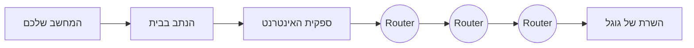
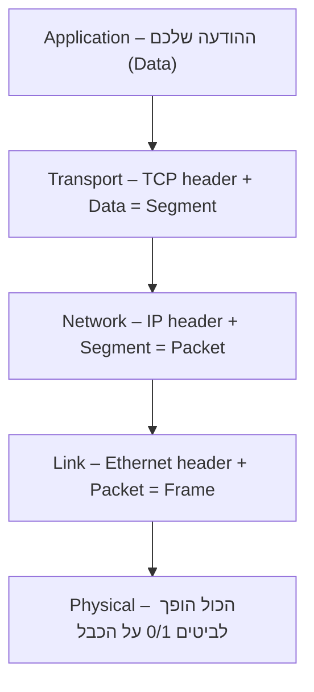

# מבוא לרשתות – שני שיעורים שיגרמו לכם לאהוב את זה

_סיפור, דוגמאות, והרבה ידיים על המקלדת (⁦Kali Linux)⁩_

> **מטרה:** להבין *איך רשת באמת עובדת* – לא בעל-פה, אלא בתחושת בטן  
> **איך:** נספר סיפור, ואז נריץ את זה בעצמנו בטרמינל של ⁦Kali⁩  
> **בסוף:** תמצית מרוכזת לחלק א' של הבגרות (שאלון ⁦735001)⁩

> 📘 **איך בנוי הפרק הזה – קראו לפני שמתחילים**
>
> הרבה תלמידים חושבים שרשתות זה נושא "יבש" ומלא ראשי תיבות. זו טעות – רשת היא אחד הדברים הכי מגניבים שיש, ואתם מוקפים בה כל שנייה. לכן חילקנו את המבוא לשניים:
>
> - **שיעור ⁦1⁩ – המסע של הודעה אחת:** מה קורה מהרגע שאתם לוחצים "שלח" ועד שהחבר מקבל את ההודעה בצד השני של העולם.
> - **שיעור ⁦2⁩ – בואו נהיה האינטרנט:** תבנו במו ידיכם צ'אט קטן ותדברו עם אתר אינטרנט "בעל פה", בלי דפדפן.

בכל צעד יש קופסת **🧪 מעבדה** – פקודה קצרה שתריצו ב-⁦Kali⁩ ותראו את החומר קורה מול העיניים. בסוף יש תמצית מרוכזת לחזרה לבגרות. **לא צריך רקע קודם.** כל מונח מוסבר בעברית, ולידו השם באנגלית שתפגשו בבחינה ובעולם.

## שיעור ⁦1⁩ · המסע של הודעה אחת

דמיינו שאתם שולחים לחבר הודעת "היי" בוואטסאפ. לחצתם "שלח", וחצי שנייה אחר כך זה מופיע אצלו בטלפון – גם אם הוא נמצא ביפן. זה נראה כמו קסם. זה לא. זו רשת, ואחרי השיעור הזה תבינו בדיוק מה קרה שם באמצע. בואו נעקוב אחרי ה"היי" הזה, צעד-צעד.

### ⁦1.⁩ מה זו בכלל "רשת"?

רשת (⁦Network)⁩ היא פשוט **שני מכשירים או יותר שיודעים להעביר זה לזה מידע**. זהו. חשבו על כיתה שבה מעבירים פתק: כל אחד יכול להעביר את הפתק לשכן, ובעזרת כמה העברות הפתק מגיע מהשורה הראשונה לשורה האחרונה. האינטרנט הוא בדיוק זה – בקנה מידה של כל כדור הארץ, ובמקום ילדים יש מכשירים שנקראים **נתבים (⁦Routers)⁩** שמעבירים את הפתק הלאה.

כל מכשיר ברשת נקרא **מארח (⁦Host)⁩** – זה יכול להיות טלפון, מחשב, שרת, מדפסת, ואפילו מקרר חכם. אם הוא מחובר ויודע "לדבר", הוא ⁦Host.⁩

### ⁦2.⁩ לכל מכשיר יש כתובת – בדיוק כמו לבית שלכם

כדי לשלוח פתק למישהו, אתם צריכים לדעת *לאן*. לכן לכל מכשיר ברשת יש **כתובת ⁦IP (IP Address)⁩** – משהו כמו `⁦10.0.2.15⁩`. זו הכתובת שאומרת "לאיזה בית להביא את המידע". בלי כתובת אין תקשורת, בדיוק כמו שאי אפשר לשלוח מכתב בלי כתובת על המעטפה.

יש עוד כתובת, נסתרת יותר: **כתובת ⁦MAC (MAC Address)⁩** – מספר סידורי ייחודי ש"צרוב" בכרטיס הרשת של המכשיר עוד מהמפעל, למשל `⁦08:00:27:ab:cd:ef⁩`. אפשר לחשוב עליה כמו מספר תעודת הזהות של המכשיר: כתובת ה-⁦IP⁩ יכולה להשתנות (בבית כתובת אחת, בבית קפה כתובת אחרת), אבל ה-⁦MAC⁩ נשאר תמיד אותו דבר. נחזור לזה בשיעור ⁦2⁩ ובפרק ⁦6.⁩

> 🧪 **מעבדה ⁦1⁩: מי אני ברשת?**
>
> פתחו טרמינל ב-⁦Kali⁩ ובקשו מהמחשב להציג את הכתובות של עצמו. הפקודה `⁦ip addr⁩` מראה כל כרטיס רשת שיש לכם:

<pre dir="ltr" align="left">
$ ip addr
2: eth0: &lt;BROADCAST,MULTICAST,UP&gt; mtu 1500 ...
    link/ether 08:00:27:ab:cd:ef          # your MAC address (the device ID)
    inet 10.0.2.15/24 ...                  # your IP address (the delivery address)
</pre>

רואים את שתי הכתובות? ה-`⁦link/ether⁩` היא ה-⁦MAC⁩, וה-`⁦inet⁩` היא ה-⁦IP.⁩ הרגע גיליתם מי אתם ברשת. אגב, ה-`/⁦24⁩` שבסוף אומר "כמה מהכתובת שייך לרשת שלי" – על זה נדבר בתמצית לבגרות.

### ⁦3. "⁩האם החבר בבית?" – שולחים דפיקה ומחכים להד

לפני ששולחים הודעה גדולה, נחמד לבדוק שהצד השני בכלל חי ומגיב. לזה יש כלי מקסים בשם **⁦ping⁩**. הוא עובד כמו צוללת בסרטים: שולח "פינג" קטן, ומחכה ל"פונג" חוזר. אם חזר – הצד השני שם, ואפשר גם למדוד *כמה זמן* לקח לאות ללכת ולחזור.

> 🧪 **מעבדה ⁦2⁩: לשלוח הד לצד השני של העולם**
>
> נשלח שלוש דפיקות לשרת של גוגל (הכתובת `⁦8.8.8.8⁩` קלה לזכירה – זה שרת ה-⁦DNS⁩ הציבורי של גוגל):

<pre dir="ltr" align="left">
$ ping -c 3 8.8.8.8
64 bytes from 8.8.8.8: icmp_seq=1 ttl=115 time=12.3 ms
64 bytes from 8.8.8.8: icmp_seq=2 ttl=115 time=11.8 ms
64 bytes from 8.8.8.8: icmp_seq=3 ttl=115 time=12.1 ms
</pre>

ה-`⁦time=12.3 ms⁩` הוא הזמן שלקח לאות ללכת עד גוגל ולחזור – ⁦12⁩ אלפיות השנייה. בזמן הזה האור עשה מסע של אלפי קילומטרים דרך כבלים. תנסו לעשות `⁦ping⁩` לאתר בחו"ל ולאתר בישראל ותראו את ההבדל בזמנים. זה כבר לא ספר לימוד – זה קורה עכשיו.

> 📖 **מאיפה בכלל בא השם "⁦ping"⁩?**
>
> המילה נלקחה מצליל הסונאר בצוללות. מי שהמציא את הכלי ב-⁦1983⁩, מהנדס בשם ⁦Mike Muuss⁩, קרא לו כך כי הוא עושה בדיוק את זה: שולח אות ומקשיב להד. עד היום, כשמשהו ברשת לא עובד, הדבר הראשון שכל טכנאי בעולם עושה הוא "לעשות פינג". אתם עכשיו רשמית טכנאים.

### ⁦4.⁩ אבל אני לא זוכר מספרים! – פנקס הטלפונים של האינטרנט (⁦DNS)⁩

אף אחד לא מקליד `⁦142.250.185.78⁩` כדי להיכנס לגוגל. אנחנו מקלידים `⁦google.com⁩`. אבל למחשבים אכפת רק ממספרים (כתובות ⁦IP).⁩ מי מתרגם בין השניים? שירות בשם **⁦DNS (Domain Name System)⁩** – פנקס הטלפונים הענק של האינטרנט. אתם נותנים לו שם, הוא מחזיר מספר.

> 🧪 **מעבדה ⁦3⁩: לפתוח את פנקס הטלפונים**
>
> הכלי `⁦dig⁩` שואל את שרת ה-⁦DNS "⁩מה הכתובת של השם הזה?". ה-`+⁦short⁩` מבקש רק את התשובה הקצרה:

<pre dir="ltr" align="left">
$ dig +short google.com
142.250.185.78

$ dig +short wikipedia.org
198.35.26.96
</pre>

הרגע ראיתם איך שם הופך למספר. כשאתם מקלידים כתובת בדפדפן, הדבר הראשון שקורה מאחורי הקלעים הוא בדיוק השאילתה הזו. אין ⁦DNS⁩ – אין אינטרנט שאפשר לזכור.

### ⁦5.⁩ המסע עצמו: איך פתק אחד קופץ בין נתבים עד יפן

עכשיו החלק היפה. ההודעה שלכם לא "עפה" ישר ליעד. היא עוברת ממכשיר למכשיר, כמו הפתק בכיתה, כשכל תחנה בדרך היא **נתב (⁦Router)⁩** שמסתכל על כתובת היעד ומחליט לאן להעביר הלאה. הנה איך זה נראה:

יש כלי שמראה לכם את *כל התחנות* בדרך, אחת-אחת. הוא נקרא **⁦traceroute⁩** ("עקוב אחרי המסלול"). זה כנראה הרגע שבו הכי הרבה תלמידים מתאהבים ברשתות.

> 🧪 **מעבדה ⁦4⁩: לראות את ההודעה קופצת ברחבי העולם 🌍**
>
> הריצו ⁦traceroute⁩ ליעד כלשהו. כל שורה שתחזור היא נתב אחד בדרך – תחנה במסע:

<pre dir="ltr" align="left">
$ traceroute google.com
 1  10.0.2.2        0.4 ms      # the home / classroom router
 2  62.90.x.x       8 ms        # entry into your ISP
 3  212.143.x.x     9 ms        # deep inside the ISP's network
 6  108.170.x.x     22 ms       # already inside Google's network
 9  142.250.185.78  30 ms       # arrived! Google's server
</pre>

כל שורה היא מכשיר אמיתי, בבניין אמיתי, אולי במדינה אחרת. ההודעה שלכם עברה דרך כולם ב-⁦30⁩ אלפיות השנייה. תריצו את זה לאתר יפני או אוסטרלי – תראו יותר תחנות וזמנים גדולים יותר, ותוכלו ממש "לראות" את המרחק הפיזי בעולם. זה לא קסם. זו רשת.

### ⁦6.⁩ רגע – איך המחשב יודע לאן לשלוח את הצעד הראשון?

למחשב שלכם יש שני "פנקסים" קטנים שעוזרים לו להתחיל את המסע:

- **טבלת הניתוב (⁦Routing Table)⁩:** אומרת "לכל מה שלא ברשת שלי – שלח דרך השער (⁦Gateway)".⁩ השער הוא הנתב בבית.
- **טבלת ה-⁦ARP⁩:** ממפה כתובת ⁦IP⁩ של שכן ברשת המקומית לכתובת ה-⁦MAC⁩ שלו. זה ה"מי מכיר את מי" בתוך הרשת שלכם.

> 🧪 **מעבדה ⁦5⁩: הפנקסים הפנימיים של המחשב**
>
> נציץ בשני הפנקסים:

<pre dir="ltr" align="left">
$ ip route
default via 10.0.2.2 dev eth0        # default route - the gateway for any remote destination

$ ip neigh
10.0.2.2 dev eth0 lladdr 52:54:00:12:35:02 REACHABLE   # ARP table - maps an IP address to a MAC address
</pre>

שימו לב: כדי לדבר עם השער, המחשב חייב לדעת גם את ה-⁦IP⁩ שלו (מטבלת הניתוב) וגם את ה-⁦MAC⁩ שלו (מטבלת ה-⁦ARP).⁩ שתי הכתובות עובדות יחד – וזה בדיוק המקום שבו, בפרק ⁦6⁩, נראה איך תוקף יכול "לשקר" בטבלת ה-⁦ARP⁩ ולהאזין לכל התעבורה.

### ⁦7.⁩ איך הודעה אחת "נארזת" למסע – שכבות ומעטפות

עד עכשיו דיברנו על כתובות. אבל איך ההודעה עצמה נארזת? כאן נכנס הרעיון הכי חשוב ברשתות: **שכבות (⁦Layers)⁩**. במקום שמכשיר אחד יעשה הכול, מחלקים את העבודה לשכבות, כשכל שכבה אחראית לדבר אחד ו"עוטפת" את המידע במעטפה משלה. התהליך נקרא **אנקפסולציה (⁦Encapsulation)⁩**:

חשבו על מכתב: הדף (ההודעה) נכנס למעטפה (עם כתובת), המעטפה נכנסת לשקית דואר, השקית לארגז משלוח. בכל שלב מוסיפים "כותרת" עם מידע חדש. בצד המקבל פותחים הכול בסדר הפוך. זו הסיבה שכתובת ה-⁦IP⁩ (שכבה ⁦3)⁩ וכתובת ה-⁦MAC⁩ (שכבה ⁦2)⁩ יושבות ב*כותרות שונות* של אותה חבילה: ה-⁦IP⁩ אומרת "לאיזה בית בעולם", וה-⁦MAC⁩ אומרת "לאיזה כרטיס רשת כאן ברשת המקומית".

המודל המסודר של השכבות נקרא **מודל ⁦OSI⁩** (שבע שכבות) או **⁦TCP/IP⁩** (גרסה מקוצרת). את הטבלה המלאה תמצאו בתמצית לבגרות בסוף הפרק – אבל עכשיו, אחרי המסע, היא כבר תיראה לכם הגיונית ולא כמו רשימה לשינון.

> 💡 **מה לקחנו משיעור ⁦1⁩**
>
> כל מכשיר הוא **⁦Host⁩** עם כתובת **⁦IP⁩** (למשלוח) וכתובת **⁦MAC⁩** (תעודת זהות). **⁦DNS⁩** מתרגם שם למספר, **⁦ping⁩** בודק אם מישהו חי, ו-**⁦traceroute⁩** מראה את המסע דרך ה**נתבים**. ההודעה נארזת ב**שכבות** (אנקפסולציה) עם כתובת בכל שכבה. כל אחד מהשלבים האלה הוא גם מקום שבו אפשר לתקוף – וזה כל הקורס.

## שיעור ⁦2⁩ · בואו נהיה האינטרנט

בשיעור הקודם היינו הצופים במסע. עכשיו נהיה השחקנים. בסוף השיעור הזה תבנו צ'אט קטן משלכם ותדברו עם אתר אינטרנט אמיתי בלי דפדפן – ותבינו שכל האינטרנט בנוי מלבנה אחת פשוטה שחוזרת שוב ושוב.

### ⁦1.⁩ הסוד הגדול: כל אתר הוא רק תוכנה שמחכה ליד דלת

מה זה בעצם "שרת"? זה נשמע כמו מפלצת בחדר סודי. האמת הרבה יותר פשוטה: **שרת (⁦Server)⁩** הוא סתם תוכנה שרצה על מחשב ו*מחכה* שמישהו יפנה אליה. **לקוח (⁦Client)⁩** הוא מי שפונה. הלקוח שואל, השרת עונה. הדפדפן שלכם הוא לקוח; המחשב של גוגל מריץ תוכנת שרת.

ואיפה בדיוק "מחכה" השרת? ב**פורט (⁦Port)⁩** – "דלת" ממוספרת בתוך המכשיר. לכל מכשיר יש עשרות אלפי דלתות כאלה, ולכל שירות יש דלת קבועה: דלת `⁦80⁩` לאתרים, `⁦443⁩` לאתרים מאובטחים, `⁦22⁩` לניהול מרחוק. השרת "יושב" ליד דלת מסוימת ומקשיב; הלקוח דופק על אותה דלת בדיוק.

ואיך הם מבינים זה את זה? ב**פרוטוקול (⁦Protocol)⁩** – "שפה" של כללים מוסכמים. כמו שבטלפון אומרים "הלו" ומחכים לתשובה, כך ⁦HTTP⁩ הוא השפה שבה דפדפנים ואתרים מדברים. הלקוח והשרת חייבים לדבר את אותה שפה מראש.

### ⁦2.⁩ נבנה צ'אט ב-⁦30⁩ שניות – אתם והחבר לידכם

הכלי **⁦netcat⁩** (בקיצור `⁦nc⁩`) הוא "סכין שוויצרי" שמאפשר לפתוח דלת ולדבר דרכה. תלמיד אחד יהיה השרת (יפתח דלת ויקשיב), והשני יהיה הלקוח (יתחבר לדלת). מה שאחד מקליד – השני רואה. זה, פשוטו כמשמעו, וואטסאפ בגרסת מיני שבניתם בעצמכם.

> 🧪 **מעבדה ⁦6⁩: הצ'אט הראשון שלכם 💬**
>
> **תלמיד א' (השרת)** פותח דלת מספר ⁦4444⁩ ומקשיב. הדגל `-⁦l⁩` = ⁦listen⁩ (הקשב), `-⁦v⁩` = ⁦verbose⁩ (הסבר), `-⁦n⁩` = בלי ⁦DNS⁩, `-⁦p⁩` = הפורט:

<pre dir="ltr" align="left">
# student A - the server, listens and waits for a connection
$ nc -lvnp 4444
listening on [any] 4444 ...
</pre>

<pre dir="ltr" align="left">
# student B - the client, connects to student A's address
$ nc 10.0.2.15 4444
hey! my first message over the network :)
</pre>

ברגע שתלמיד ב' מקליד שורה ולוחץ ⁦Enter⁩ – היא מופיעה מיד על המסך של תלמיד א', ולהפך. בניתם ערוץ תקשורת דו-כיווני בין שני מחשבים, בשורה אחת. זה כל מה שיש מתחת ל"קסם" של כל אפליקציית צ'אט בעולם: לקוח, שרת, ודלת.

> ⚠️ **אם זה לא עבד – זה חלק מהלמידה**
>
> לא מתחבר? כמעט תמיד זו אחת משתיים: (⁦1)⁩ הקלדתם כתובת ⁦IP⁩ לא נכונה – בדקו שוב עם `⁦ip addr⁩` אצל תלמיד א'; (⁦2)⁩ שניכם לא באותה רשת. נסו קודם `⁦ping⁩` מתלמיד ב' לכתובת של תלמיד א' – אם ה-⁦ping⁩ עובד וה-⁦nc⁩ לא, הבעיה בפורט (אולי חומת אש חוסמת). זה בדיוק אבחון תקלות אמיתי, בדיוק כמו טכנאי.

### ⁦3.⁩ נהיה דפדפן – נדבר עם אתר "בעל פה"

עכש⁦i⁩ו הפוך: נראה מה הדפדפן *באמת* שולח כשאתם נכנסים לאתר. נשתמש ב-⁦netcat⁩ כ"שרת" מדומה, ונשלח אליו בקשה עם `⁦curl⁩` (כלי שהוא בעצם "דפדפן בלי מסך"). מה שהשרת יקבל – זו בדיוק הבקשה שהדפדפן שלכם שולח מיליון פעם ביום.

> 🧪 **מעבדה ⁦7⁩: מה הדפדפן באמת אומר?**
>
> בטרמינל אחד נפתח "שרת" שמקשיב, ובשני נשלח אליו בקשה עם ⁦curl⁩:

<pre dir="ltr" align="left">
# terminal 1 - a mock server listening on port 8080
$ nc -lvnp 8080
</pre>

<pre dir="ltr" align="left">
# terminal 2 - the client knocks on that port
$ curl http://localhost:8080/hello
</pre>

ברגע ש-⁦curl⁩ רץ, בטרמינל של השרת יופיע הטקסט הבא – זו הבקשה, בשפת ⁦HTTP⁩, מילה במילה:

<pre dir="ltr" align="left">
GET /hello HTTP/1.1          # request - give me the hello page
Host: localhost:8080
User-Agent: curl/8.5.0        # who sends the request (here, curl)
Accept: */*
</pre>

זהו זה. אין שום קסם. אתר אינטרנט זה בסך הכול לקוח ששולח `⁦GET⁩` ושרת שמחזיר טקסט. עכשיו נעשה את זה מול אתר אמיתי:

<pre dir="ltr" align="left">
$ curl -v https://example.com
&gt; GET / HTTP/2                 # what we (the client) send
&gt; host: example.com
&lt; HTTP/2 200                   # server's reply - code 200 means success
&lt; content-type: text/html
&lt;!doctype html&gt; ...            # this is the content page, exactly as the browser would draw it
</pre>

ה-`⁦200⁩` הזה הוא "קוד תשובה" מפורסם. פגשתם פעם `⁦404⁩`? זה פשוט השרת שאומר "לא מצאתי את הדף". עכשיו אתם יודעים מאיפה זה בא.

### ⁦4.⁩ שתי שפות משלוח: שיחת טלפון מול גלויה (⁦TCP⁩ ו-⁦UDP)⁩

בשכבת התעבורה (⁦Transport)⁩ יש שתי דרכים לשלוח מידע, וההבדל ביניהן נשאל כמעט בכל בגרות:

- **⁦TCP⁩** – כמו שיחת טלפון: קודם "מתקשרים ומוודאים שיש קו" (לחיצת יד), ואז כל מילה מגיעה בסדר הנכון, ואם משהו התפספס – שולחים שוב. **אמין**, אבל קצת יותר איטי. משמש לאתרים, מיילים, קבצים.
- **⁦UDP⁩** – כמו לזרוק גלויה לתיבה: מהיר, בלי לוודא שהגיע, בלי סדר מובטח. מצוין לשיחות וידאו ומשחקים, שבהם עדיף להפסיד פריים אחד מאשר לחכות.

ה"לחיצת היד" של ⁦TCP⁩ נקראת **⁦Three-Way Handshake⁩**: הלקוח אומר `⁦SYN⁩` ("בא לי לדבר"), השרת עונה `⁦SYN-ACK⁩` ("סבבה, גם לי"), והלקוח מסיים ב-`⁦ACK⁩` ("יאללה"). שלוש הודעות ואז מתחילים. בפרק ⁦1⁩ נראה איך תוקף מנצל בדיוק את הלחיצה הזו כדי להפיל שרת (התקפת ⁦SYN Flood)⁩ – אז שווה להבין אותה עכשיו.

### ⁦5.⁩ הדלתות שכדאי להכיר בעל-פה

לכל שירות יש דלת (פורט) קבועה. אלו הפורטים שחוזרים בבגרות ובעבודה – שווה לזכור אותם, ועכשיו יש לכם הקשר אמיתי אליהם:

| **שירות** | **פורט** | **⁦TCP/UDP⁩** | **מה זה עושה** |
| --- | --- | --- | --- |
| ⁦SSH⁩ | ⁦22⁩ | ⁦TCP⁩ | ניהול מרחוק **מוצפן** |
| ⁦Telnet⁩ | ⁦23⁩ | ⁦TCP⁩ | ניהול מרחוק **לא מוצפן** (מסוכן!) |
| ⁦DNS⁩ | ⁦53⁩ | ⁦UDP/TCP⁩ | תרגום שם ⇄ כתובת (פנקס הטלפונים) |
| ⁦DHCP⁩ | ⁦67/68⁩ | ⁦UDP⁩ | חלוקת כתובות ⁦IP⁩ אוטומטית |
| ⁦HTTP / HTTPS⁩ | ⁦80 / 443⁩ | ⁦TCP⁩ | גלישה (⁦443⁩ = מוצפן) |

> 💡 **מה לקחנו משיעור ⁦2⁩**
>
> כל שירות ברשת = **שרת** (תוכנה שמקשיבה ב**פורט**) + **לקוח** שדופק, שמדברים ב**פרוטוקול** משותף. בניתם צ'אט עם `⁦nc⁩`, ראיתם בקשת ⁦HTTP⁩ אמיתית עם `⁦curl⁩`, והבנתם את ההבדל בין **⁦TCP⁩** האמין ל-**⁦UDP⁩** המהיר. כל דלת פתוחה היא גם דלת שתוקף יכול לדפוק עליה – ולכן פרקים ⁦4⁩ (חומות אש) ו-⁦5 (IDS/IPS)⁩ עוסקים בדיוק בשאלה איזו דלת להשאיר פתוחה ולמי.

> 📖 **למה זה גורם לאנשים להתאהב בהאקינג (הלגיטימי!)**
>
> הרגע שבו תלמיד מבין ש"אתר" זה סתם טקסט ש-⁦curl⁩ יכול לקרוא, ו"צ'אט" זה שתי שורות ⁦nc⁩ – משהו נפתח בראש. פתאום האינטרנט מפסיק להיות קופסה שחורה קסומה והופך למשהו שאתם *שולטים* בו. זו בדיוק התחושה שמניעה אנשי אבטחת מידע, בודקי חדירה (⁦Penetration Testers)⁩ וחוקרים. אתם רק התחלתם, וכבר דיברתם עם מכונה בשפה שלה.

## תמצית לבגרות – חזרה מרוכזת (חלק א' של שאלון ⁦735001)⁩

עכשיו, אחרי שהבנתם את התמונה, זו רשימת ה"עובדות היבשות" לשינון מהיר לפני הבחינה. החומר הזה נלמד בהרחבה בקורס הרשתות; כאן הוא מרוכז לחזרה.

### א. מודל ⁦OSI⁩ ו-⁦TCP/IP⁩

| **שכבה ⁦OSI⁩** | **#** | **יחידה** | **פרוטוקולים / התקנים** |
| --- | --- | --- | --- |
| ⁦Application / Presentation / Session⁩ | ⁦7⁩–⁦5⁩ | ⁦Data⁩ | ⁦HTTP, HTTPS, DNS, DHCP, FTP, SMTP, IMAP, SSH, Telnet, SNMP⁩ |
| ⁦Transport⁩ | ⁦4⁩ | ⁦Segment⁩ | **⁦TCP⁩** (אמין, מספרי רצף, לחיצת יד), **⁦UDP⁩** (מהיר, ללא חיבור) |
| ⁦Network⁩ | ⁦3⁩ | ⁦Packet⁩ | ⁦IP, ICMP, OSPF⁩; **נתב (⁦Router)⁩** |
| ⁦Data Link⁩ | ⁦2⁩ | ⁦Frame⁩ | ⁦Ethernet, ARP, STP⁩; **מתג (⁦Switch)⁩**, כתובות ⁦MAC⁩ |
| ⁦Physical⁩ | ⁦1⁩ | ⁦Bits⁩ | כבלים, חשמל |

> 📝 **נשאל בבגרות (נכון/לא נכון)**
>
> ⁦TCP⁩ פועל בשכבה ⁦4⁩ (לא ⁦3⁩!) · ⁦IMAP⁩ מקבל דוא"ל (נכון) · ⁦UDP⁩ **אינו** יוצר תקשורת אמינה (לא נכון – זה ⁦TCP).⁩

### ב. בסיסי ספירה: בינארי · הקסדצימלי · אוקטלי

- ⁦1⁩ ספרה הקסדצימלית = ⁦4⁩ ביטים; ⁦1⁩ ספרה אוקטלית = ⁦3⁩ ביטים.
- המרה: הקס → בינארי (כל ספרה ל-⁦4⁩ ביט), ואז לקבץ ל-⁦3⁩ לאוקטלי.

> 📝 **דוגמה (כמו בבגרות): ⁦BA3F⁩ בהקס**
>
> ⁦B=1011, A=1010, 3=0011, F=1111⁩ ⇒ **בינארי:** ⁦1011 1010 0011 1111⁩  
>  לאוקטלי מקבצים ⁦3⁩ ביטים מימין: ⁦1 011 101 000 111 111⁩ ⇒ **אוקטלי:** ⁦135077⁩

### ג. כתובות ⁦IPv4⁩, סאבנטים ו-⁦Wildcard⁩

|  |  |
| --- | --- |
| כתובות פרטיות | ⁦10.0.0.0/8⁩ · ⁦172.16.0.0/12⁩ · ⁦192.168.0.0/16⁩ |
| מספר מארחים שמישים | ⁦2⁩^(⁦32⁩−⁦prefix)⁩ − ⁦2⁩ (פחות כתובת רשת ו-⁦broadcast)⁩ |
| ⁦Wildcard⁩ | ⁦255.255.255.255⁩ − ⁦subnet mask⁩ |

| **⁦Prefix⁩** | **⁦Subnet mask⁩** | **גודל בלוק** | **מארחים שמישים** | **⁦Wildcard⁩** |
| --- | --- | --- | --- | --- |
| /⁦24⁩ | ⁦255.255.255.0⁩ | ⁦256⁩ | ⁦254⁩ | ⁦0.0.0.255⁩ |
| /⁦25⁩ | ⁦255.255.255.128⁩ | ⁦128⁩ | ⁦126⁩ | ⁦0.0.0.127⁩ |
| /⁦26⁩ | ⁦255.255.255.192⁩ | ⁦64⁩ | ⁦62⁩ | ⁦0.0.0.63⁩ |
| /⁦27⁩ | ⁦255.255.255.224⁩ | ⁦32⁩ | ⁦30⁩ | ⁦0.0.0.31⁩ |
| /⁦28⁩ | ⁦255.255.255.240⁩ | ⁦16⁩ | ⁦14⁩ | ⁦0.0.0.15⁩ |
| /⁦30⁩ | ⁦255.255.255.252⁩ | ⁦4⁩ | ⁦2⁩ | ⁦0.0.0.3⁩ |

> 📝 **דוגמאות מהבגרות**
>
> • מספר מארחים שמישים ב-`⁦172.16.16.16/28⁩` ⇒ ⁦2⁩^⁦4⁩−⁦2⁩ = **⁦14⁩**.  
>  • `⁦135.8.x/26⁩` ⇒ ⁦Subnet mask⁩ = **⁦255.255.255.192⁩** · ⁦Wildcard⁩ = **⁦0.0.0.63⁩**.  
>  • מציאת הרשת: לכתובת עם /⁦30⁩, הבלוקים הם ⁦0,4,8⁩… ⇒ `⁦10.10.2.20/30⁩` ⟵ רשת .⁦20⁩, מארחים שמישים .⁦21⁩–.⁦22, broadcast .23.⁩

### ד. ⁦IPv6⁩ – קיצור וסוגי כתובות

- משמיטים אפסים מובילים בכל בלוק (`⁦0000⁩`→`⁦0⁩`).
- `::` מחליף רצף אחד של בלוקי אפסים (פעם אחת בלבד בכתובת).

> 📝 **דוגמה מהבגרות**
>
> `⁦3001:0000:130F:0000:0000:0000:0001:133B⁩` ⇒ **`⁦3001:0:130F::1:133B⁩`**

| **סוג כתובת** | **תחילית** | **תפקיד** |
| --- | --- | --- |
| **⁦Global Unicast⁩** | ⁦2000::/3⁩ | ניתובה באינטרנט (כמו כתובת ציבורית) |
| **⁦Link-Local⁩** | ⁦FE80::/10⁩ | תקשורת בקו/רשת מקומית בלבד; לא עוברת נתב |
| **⁦Unique Local (ULA)⁩** | ⁦FC00::/7 (FD00::/8)⁩ | **תקשורת בין תתי-רשתות פנימיות, לא ניתובה באינטרנט** (מקביל לכתובת פרטית) |
| **⁦Multicast⁩** | ⁦FF00::/8⁩ | שידור לקבוצה |

> 📝 **נשאל בבגרות**
>
> "סוג כתובת המספק תקשורת בין תתי-רשתות אך שאינו ניתוב באינטרנט" ⇒ **⁦Unique Local⁩**.

### ה. פרוטוקולים ופורטים חשובים

| **פרוטוקול** | **פורט** | **⁦TCP/UDP⁩** | **תפקיד** |
| --- | --- | --- | --- |
| ⁦FTP⁩ | ⁦20/21⁩ | ⁦TCP⁩ | העברת קבצים |
| ⁦SSH⁩ | ⁦22⁩ | ⁦TCP⁩ | ניהול מרחוק מוצפן |
| ⁦Telnet⁩ | ⁦23⁩ | ⁦TCP⁩ | ניהול מרחוק (לא מוצפן!) |
| ⁦SMTP⁩ | ⁦25⁩ | ⁦TCP⁩ | שליחת דוא"ל |
| ⁦DNS⁩ | ⁦53⁩ | ⁦UDP/TCP⁩ | תרגום שם ⇄ כתובת |
| ⁦DHCP⁩ | ⁦67/68⁩ | ⁦UDP⁩ | הקצאת כתובות אוטומטית |
| ⁦HTTP / HTTPS⁩ | ⁦80 / 443⁩ | ⁦TCP⁩ | גלישה |
| ⁦IMAP / POP3⁩ | ⁦143 / 110⁩ | ⁦TCP⁩ | קבלת דוא"ל |
| ⁦SNMP⁩ | ⁦161⁩ | ⁦UDP⁩ | ניטור ציוד |
| ⁦Syslog⁩ | ⁦514⁩ | ⁦UDP⁩ | יומן אירועים |

### ו. ניתוב: מרחק ניהולי, ניתוב סטטי ו-⁦DHCP Relay⁩

**מרחק ניהולי (⁦Administrative Distance)⁩** – "עד כמה סומכים על מקור המידע" (נמוך = עדיף):

| **מקור** | **⁦AD⁩** |
| --- | --- |
| ⁦Connected⁩ (מחובר ישירות) | ⁦0⁩ |
| ניתוב סטטי (⁦Static)⁩ | ⁦1⁩ |
| ⁦External BGP⁩ | ⁦20⁩ |
| ⁦Internal EIGRP⁩ | ⁦90⁩ |
| ⁦OSPF⁩ | ⁦110⁩ |
| ⁦RIP⁩ | ⁦120⁩ |

<pre dir="ltr" align="left">
! static route: to the destination network, via the next-hop
R1(config)# ip route 10.10.2.20 255.255.255.252 10.10.255.1
! default route (to the internet / as a backup)
R1(config)# ip route 0.0.0.0 0.0.0.0 200.1.1.1
! backup (floating static) - AD higher than OSPF so it won't override the dynamic route
R1(config)# ip route 10.0.0.0 255.0.0.0 200.1.1.2 120
</pre>

> 📝 **⁦DHCP Relay⁩ – כשהשרת ברשת אחרת**
>
> בקשת ⁦DHCP⁩ היא ⁦broadcast⁩ ואינה עוברת נתב. מגדירים על הממשק של הלקוח את כתובת שרת ה-⁦DHCP⁩:
>
> <pre dir="ltr" align="left">
> R1(config)# interface g0/0
> R1(config-if)# ip helper-address 192.50.100.100   ! DHCP server address
> </pre>

### ז. מיתוג: ⁦VLAN, Trunk⁩ ו-⁦Router-on-a-Stick⁩

- **⁦VLAN⁩** – מפצל מתג לרשתות לוגיות מבודדות. מעבר בין ⁦VLAN⁩ים דורש ניתוב.
- **⁦Trunk (802.1Q)⁩** – קישור שנושא כמה ⁦VLAN⁩ים בין מתגים; מוסיף תג של מספר ה-⁦VLAN.⁩
- **⁦Router-on-a-Stick⁩** – נתב עם תת-ממשקים (⁦subinterfaces)⁩, אחד לכל ⁦VLAN⁩, לניתוב ביניהם.

<pre dir="ltr" align="left">
! inter-VLAN routing on a single physical interface
R1(config)# interface g0/0/1.10
R1(config-subif)# encapsulation dot1Q 10
R1(config-subif)# ip address 172.18.1.254 255.255.0.0
R1(config)# interface g0/0/1.20
R1(config-subif)# encapsulation dot1Q 20
R1(config-subif)# ip address 172.18.2.254 255.255.0.0
! check the switch MAC table
S1# show mac address-table
</pre>

### ח. ⁦STP⁩ ו-⁦OSPF⁩ – כללי הבחירה (נשאלים כמעט תמיד)

> 📘 **⁦STP⁩ – בחירת ⁦Root Bridge⁩**
>
> ⁦Bridge ID⁩ = **⁦Priority⁩** (ברירת מחדל ⁦32768)⁩ + **⁦MAC⁩**.  
>  מנצח: ה-⁦Priority⁩ **הנמוך**; בתיקו – ה-**⁦MAC⁩ הנמוך**.  
>  ⁦STP⁩ פועל בשכבה **⁦2⁩** ומונע לולאות ע"י **חסימת יציאות** (⁦port blocking).⁩

> 📘 **⁦OSPF⁩ – בחירת ⁦DR / BDR⁩**
>
> מנצח: ה-**⁦Priority⁩ הגבוה**; בתיקו – ה-**⁦Router-ID⁩ הגבוה**.  
>  **שימו לב – הפוך מ-⁦STP⁩:** ב-⁦STP⁩ נמוך מנצח, ב-⁦OSPF⁩ גבוה מנצח.

> 📝 **דוגמאות מהבגרות**
>
> • ⁦4⁩ מתגים, ⁦priority⁩ זהה, ⁦MAC⁩ הנמוך ⇒ אותו מתג הופך ל-⁦root.⁩  
>  • ⁦OSPF: R1(pri 2, RID 1.1.1.1), R3(pri 2, RID 3.3.3.3)⁩ ⇒ בין בעלי ⁦priority 2⁩ מנצח ⁦R3 (RID⁩ גבוה) כ-**⁦DR⁩**, ו-⁦R1⁩ כ-**⁦BDR⁩**.

### ט. פקודות ⁦CLI⁩ ואבחון תקלות

| **מצב** | **הנחיה** |
| --- | --- |
| ⁦User EXEC⁩ | `⁦Router>⁩` – פקודות ⁦show⁩ בסיסיות, ⁦ping⁩ |
| ⁦Privileged EXEC⁩ | `⁦Router⁩#` – `⁦enable⁩` |
| ⁦Global config⁩ | `⁦Router(config)⁩#` – `⁦configure terminal⁩` |
| ⁦Interface⁩ | `⁦Router(config-if)⁩#` |

<pre dir="ltr" align="left">
Switch(config)# hostname R1
R1(config)# interface g0/1
R1(config-if)# no switchport          ! turns a switchport into L3 (a routed port)
R1(config-if)# ip address 10.100.20.42 255.255.255.0
R1(config-if)# no shutdown
! common checks
R1# show ip interface brief
R1# show ip route
R1# show running-config
</pre>

**אבחון תקלות בשיטת ⁦Top-Down⁩:** בודקים מהשכבה העליונה כלפי מטה – גישה לאפליקציה/שירות ⟶ הגדרות רשת (⁦IP/gateway/DNS)⁩ ⟶ חיבור פיזי (כבל, נורית).

> 💡 **גשר בין המעבדות לבגרות: אותן פקודות, שתי מערכות**
>
> בבגרות מופיעות פקודות ⁦Windows⁩, אבל ב-⁦Kali (Linux)⁩ עשיתם בדיוק את אותם דברים. שווה להכיר את שתי העמודות:
>
> | **מה בודקים** | **⁦Windows⁩ (בבגרות)** | **⁦Linux / Kali⁩ (במעבדה)** |
> | --- | --- | --- |
> | הכתובות שלי (⁦IP, MAC, gateway)⁩ | `⁦ipconfig /all⁩` | `⁦ip addr⁩` · `⁦ip route⁩` |
> | לבדוק אם יעד חי | `⁦ping⁩` | `⁦ping⁩` |
> | לעקוב אחרי המסלול | `⁦tracert⁩` | `⁦traceroute⁩` |
> | לתרגם שם לכתובת (⁦DNS)⁩ | `⁦nslookup⁩` | `⁦dig⁩` |
> | טבלת ⁦ARP (IP⁩ ↔ ⁦MAC)⁩ | `⁦arp -a⁩` | `⁦ip neigh⁩` |
>
> פקודות מטמון ה-⁦DNS⁩ ב-⁦Windows⁩: `⁦ipconfig /displaydns⁩` (הצגה) ו-`⁦ipconfig /flushdns⁩` (איפוס).

> 📝 **⁦CDP⁩**
>
> פרוטוקול **⁦CDP⁩** מאפשר לזהות התקנים סמוכים של סיסקו ברשת המקומית (`⁦show cdp neighbors⁩`). מטעמי אבטחה מכבים אותו על פורטי קצה (`⁦no cdp enable⁩`).

## תרגילי חזרה

> ✏️ **תרגיל ⁦1⁩ – בסיסי רשת**
>
> א. כמה מארחים שמישים ב-`/⁦27⁩`? ב. מהי ה-⁦wildcard⁩ של `⁦10.20.0.0/16⁩`? ג. באיזו שכבה פועל ⁦TCP⁩?
>
> **תשובה:** א. ⁦30⁩ ב. ⁦0.0.255.255⁩ ג. שכבה ⁦4 (Transport)⁩

> ✏️ **תרגיל ⁦2⁩ – ⁦IPv6⁩**
>
> קצרו: `⁦2001:0DB8:0000:0000:0000:00FF:0000:0001⁩`
>
> **תשובה:** `⁦2001:DB8::FF:0:1⁩`

> ✏️ **תרגיל ⁦3⁩ – ניתוב**
>
> לנתב יש מסלול ⁦OSPF (AD 110)⁩ ומסלול סטטי (⁦AD 1)⁩ לאותה רשת. איזה ייבחר ולמה?
>
> **תשובה:** הסטטי – ה-⁦AD⁩ הנמוך יותר מעיד על מקור מהימן/מועדף.

> ✏️ **תרגיל ⁦4⁩ – ⁦DHCP Relay⁩**
>
> מנהל רוצה ששרת ⁦DHCP⁩ ברשת אחרת יקצה כתובות ללקוחות ברשת של ⁦R1.⁩ איזו פקודה נדרשת ועל איזה ממשק?
>
> **תשובה:** `⁦ip helper-address <IP⁩ של שרת ה-⁦DHCP>⁩` על הממשק של ⁦R1⁩ הפונה ללקוחות.

> ✏️ **תרגיל ⁦5⁩ – מהמעבדה**
>
> הרצתם `⁦traceroute⁩` לאתר בישראל וקיבלתם ⁦5⁩ שורות, ולאתר באוסטרליה ⁦14⁩ שורות עם זמנים גדולים פי ⁦10.⁩ הסבירו למה.
>
> **תשובה:** כל שורה היא נתב בדרך. אוסטרליה רחוקה פיזית יותר, ולכן החבילה עוברת דרך יותר נתבים ומסלול ארוך יותר – יותר תחנות וזמן הלוך-חזור (⁦RTT)⁩ גדול יותר. ⁦traceroute⁩ למעשה "מצייר" את המרחק ברשת.

> ✏️ **תרגיל ⁦6⁩ – מהמעבדה**
>
> בנית צ'אט עם `⁦nc -lvnp 4444⁩` אצל תלמיד א', אך תלמיד ב' לא מצליח להתחבר, למרות ש-`⁦ping⁩` ביניהם עובד. מה כנראה הבעיה, ובאיזה מושג משיעור ⁦2⁩ מדובר?
>
> **תשובה:** ה-⁦ping⁩ (שכבה ⁦3)⁩ עובד, אז יש קישוריות רשת. הבעיה בשכבת התעבורה: כנראה חומת אש חוסמת את **הפורט** ⁦4444⁩, או שתלמיד א' לא באמת מאזין. המושג: פורט/שרת מאזין. זו בדיוק העבודה של חומת אש שנלמד בפרק ⁦4.⁩

