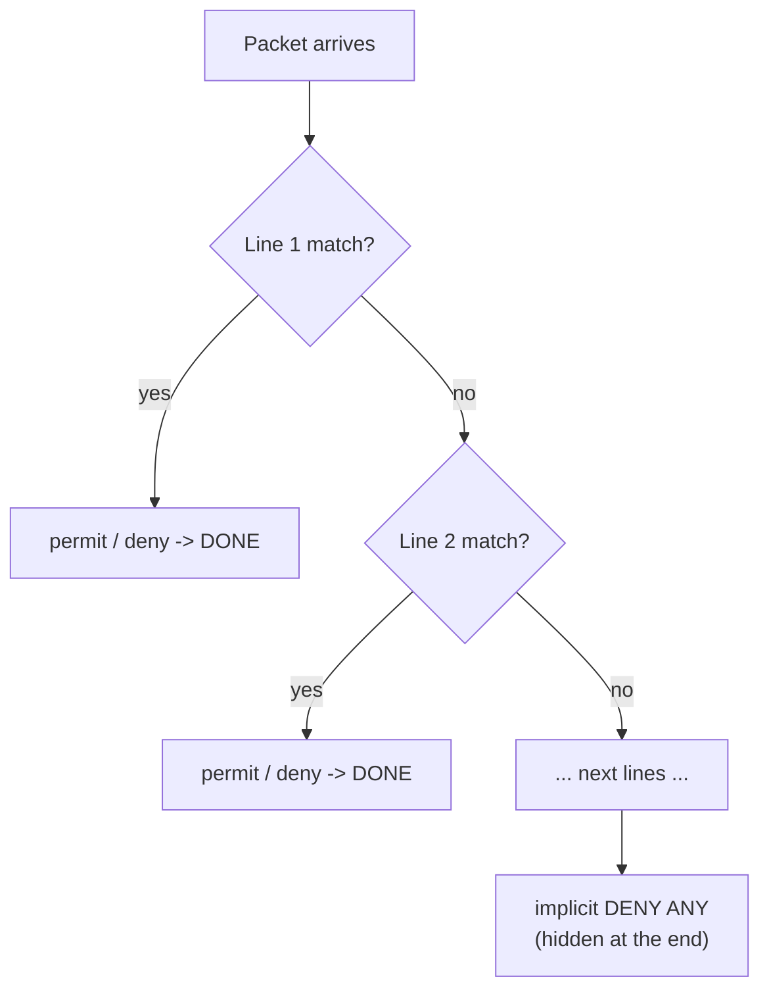
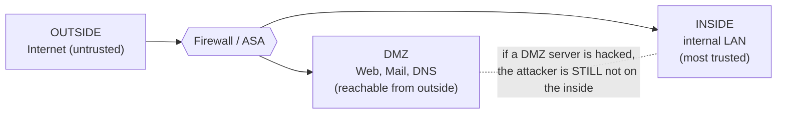

<div dir="rtl" align="right">

# פרק ⁦4⁩ – חומות אש ברשת הבינונית והרחבה

_⁦11⁩ שעות עיוני + ⁦2⁩ מעשי · שבועות ⁦10⁩–⁦12⁩_

> **מטרות:** ⁦ACL⁩ סטנדרטי/מורחב · ⁦ACL⁩ מבוסס זמן · עצירת התקפות ב-⁦ACL⁩ · ⁦CBAC⁩ · ⁦ZPF⁩  
> **בבגרות:** ⁦ACL⁩ סטנדרטי (חסימת רשת), מיקום ⁦ACL⁩ וכיוון ⁦in/out, ACL⁩ מורחב עם ⁦host⁩

> 📘 **לפני שמתחילים – איך תעבורה "עוברת" בנתב? (למי שאין רקע)**
>
> חומת אש מחליטה אילו חבילות לעבור. כדי להבין זאת צריך שני מושגים: 
> - **כיוון תעבורה** – לכל ממשק (פורט) בנתב יש שני כיוונים: **⁦in⁩** = חבילות שנכנסות לנתב דרך הפורט, **⁦out⁩** = חבילות שיוצאות מהנתב דרך הפורט. תמיד חושבים מנקודת המבט של **הנתב**, לא של המשתמש.
> - **סינון לפי כותרת החבילה** – כל חבילה נושאת בכותרת שלה: כתובת מקור, כתובת יעד, סוג פרוטוקול (⁦TCP/UDP/ICMP)⁩, ופורט. חומת אש קוראת את הכותרת ומחליטה ⁦permit⁩ (לעבור) או ⁦deny⁩ (לחסום).
> - **⁦Wildcard mask⁩** – דרך לומר "התאם רק חלק מהכתובת". נסביר לעומק בהמשך; רק דעו שזה ההפך ממסכת רשת רגילה: ⁦0 = "⁩בדוק את הביט הזה", ⁦1 = "⁩לא אכפת לי". **אנלוגיה:** חומת אש היא כמו שומר בכניסה לבניין עם רשימה. כל אדם (חבילה) שמגיע – השומר בודק ברשימה (⁦ACL)⁩ לפי הזהות שלו (כתובת/פורט), ומחליט להכניס או לא. הרשימה נבדקת **מלמעלה למטה**, והשומר עוצר בהתאמה הראשונה.

## ⁦4.1⁩ מהי חומת אש

**חומת אש** (⁦Firewall)⁩ היא מערכת – חומרה, תוכנה או שילוב – שעומדת בין רשתות ברמות אמון שונות ומחליטה לפי מדיניות אילו חבילות לעבור ואילו לחסום. המונח מגיע מקיר בטון שמונע התפשטות שריפה בין דירות. המאפיינים: **עמידה בפני התקפות** (היא עצמה מוקשחת), **נקודת מעבר יחידה** (כל התעבורה חייבת לעבור דרכה – אחרת אין טעם), ו**אכיפת מדיניות**.

> 📖 **סיפור מהחיים: הקזינו שנפרץ דרך האקווריום (⁦2017)⁩**
>
> קזינו בלאס וגאס התקין אקווריום חכם עם חיישן טמפרטורה המחובר לאינטרנט. התוקפים פרצו לחיישן (סיסמת ברירת מחדל), ומכיוון שהאקווריום היה מחובר לאותה רשת של שאר הקזינו – עברו ממנו למסד הנתונים של "השחקנים הגדולים" ושאבו ⁦10GB⁩ החוצה דרך… החיישן. אם היה ⁦ACL⁩ אחד שאומר "מהאקווריום מותר רק לשרת הבקרה שלו" – הסיפור היה נגמר בחיישן. חומת אש היא לא רק בין "הפנים" ל"אינטרנט"; היא גם בין חלקי הפנים.

## ⁦4.2⁩ סוגי חומות אש

| **סוג** | **איך זה עובד** | **יתרונות** | **חסרונות** |
| --- | --- | --- | --- |
| **סינון חבילות** (⁦Packet filtering, stateless)⁩ – ⁦ACL⁩ | בודקת כל חבילה לבד לפי כותרות שכבה ⁦3⁩–⁦4: IP⁩ מקור/יעד, פרוטוקול, פורט | מהיר, זול, בכל נתב | לא מבינה "שיחה": כדי לאפשר תשובות חייבים לפתוח פורטים לכיוון פנימה; ניתנת לעקיפה ב-⁦spoofing⁩ |
| **⁦Stateful⁩** (בדיקת מצב) | שומרת טבלת חיבורים (⁦state table).⁩ תעבורה שיוצאת מהפנים נרשמת; רק התשובות שתואמות לרשומה מורשות להיכנס | מאובטחת הרבה יותר, פשוטה להגדרה; הסטנדרט היום (⁦ASA, ZPF, CBAC)⁩ | לא מבינה את תוכן האפליקציה; ⁦UDP/ICMP "⁩חסרי מצב" מטופלים לפי ⁦timeout⁩ |
| **⁦Application gateway / Proxy⁩** | מסיימת את החיבור, קוראת את תוכן שכבה ⁦7 (HTTP, FTP)⁩ ופותחת חיבור חדש ליעד | מבינה תוכן, יכולה לסנן ⁦URL⁩, וירוסים | איטית, צריך ⁦proxy⁩ לכל פרוטוקול |
| **⁦NAT⁩** כ"חומת אש" | מסתירה כתובות פנימיות | חינם | אינה חומת אש אמיתית – רק מסתירה |
| **⁦NGFW⁩** (דור הבא) | ⁦Stateful⁩ + זיהוי אפליקציה (⁦Facebook⁩ מול ⁦YouTube⁩ על אותו פורט ⁦443) + IPS⁩ + זהות משתמש + בדיקת ⁦TLS⁩ | מקיפה | יקרה, דורשת כוונון |
| **⁦Host-based** (Windows Firewall)⁩ | על המחשב עצמו | מגנה גם מפני מחשבים באותה רשת | מנוהלת בנפרד בכל מחשב |
| **⁦Transparent⁩** | בשכבה ⁦2⁩ – ללא כתובת ⁦IP, "⁩שקופה" | מוסיפים בלי לשנות כתובות |  |

## ⁦4.3 ACL⁩ – רשימות בקרת גישה

**⁦ACL** (Access Control List)⁩ היא רשימה סדורה של משפטי ⁦permit/deny⁩ שהנתב עובר עליה **מלמעלה למטה** עבור כל חבילה; ב**התאמה הראשונה** הוא מבצע את הפעולה ומפסיק. אם אף שורה לא תואמת – יש **⁦deny any⁩ סמוי (⁦implicit deny)⁩** בסוף כל ⁦ACL.⁩ שלושת החוקים האלה מסבירים ⁦90⁩% מהטעויות.

> 📘 **⁦ACL⁩ יכולה לשמש לא רק לסינון**
>
> גם לזהות תעבורה עבור ⁦NAT, QoS, route-map, VPN⁩ (פרק ⁦8)⁩, ו-`⁦access-class⁩` על קווי ⁦VTY.⁩ בפרק זה – סינון.

### מסכת ⁦wildcard⁩ – הדבר שתלמידים הכי מתבלבלים בו

ב-⁦ACL⁩ לא כותבים ⁦subnet mask⁩ אלא **⁦wildcard mask⁩**: ביט **⁦0⁩ = חייב להתאים**, ביט **⁦1⁩ = לא אכפת לי**. במסכת רשת רגילה זה הפוך. הדרך המהירה: **⁦wildcard = 255.255.255.255⁩ − ⁦subnet mask**.⁩

| **רשת** | **⁦Subnet mask** | **Wildcard⁩** | **משמעות** |
| --- | --- | --- | --- |
| ⁦192.168.1.0/24 | 255.255.255.0 | **0.0.0.255** | 3⁩ האוקטטים הראשונים חייבים להתאים |
| ⁦172.16.16.0/28 | 255.255.255.240 | **0.0.0.15** | 172.16.16.0⁩–⁦172.16.16.15⁩ |
| ⁦10.0.0.0/8 | 255.0.0.0 | **0.255.255.255⁩** | כל מה שמתחיל ב-⁦10⁩ |
| מארח בודד ⁦10.1.1.7 | /32 | **0.0.0.0⁩** = `⁦host 10.1.1.7⁩` | הכול חייב להתאים |
| כל כתובת | – | **⁦255.255.255.255⁩** = `⁦any⁩` | ⁦0.0.0.0 255.255.255.255⁩ |
| רשתות זוגיות ⁦192.168.0.0, .2.0, .4.0⁩… |  | ⁦192.168.0.0 **0.0.254.255⁩** | ביט אחרון באוקטט השלישי חייב ⁦0⁩ – טריק לבחינות |

> 📝 **בבגרות (חלק א, שאלה ⁦1⁩ט)**
>
> "נתונה ⁦135.8.267/26"⁩ – מהי ה-⁦subnet mask⁩ ומהי ה-⁦wildcard⁩? ⁦Subnet: 255.255.255.192⁩ · ⁦Wildcard: 0.0.0.63.⁩ (שימו לב: ⁦267⁩ אינו אוקטט חוקי – טעות בשאלון; מתעלמים.)

### ⁦ACL⁩ סטנדרטית – רק לפי מקור

מספרים **⁦1⁩–⁦99⁩** ו-⁦1300⁩–⁦1999.⁩ בודקת **רק את כתובת המקור**. לכן ממקמים אותה **קרוב ליעד** – אחרת היא תחסום את המקור מלהגיע גם ליעדים שלא התכוונו אליהם.

```
R1(config)# access-list 10 deny 20.20.20.0 0.0.0.255    ! בבגרות שאלה 4ד – חסימת רשת /24
R1(config)# access-list 10 permit any                 ! בלי זה – הכול נחסם (implicit deny)
R1(config)# interface g0/1
R1(config-if)# ip access-group 10 out
```

### ⁦ACL⁩ מורחבת – מקור, יעד, פרוטוקול ופורט

מספרים **⁦100⁩–⁦199⁩** ו-⁦2000⁩–⁦2699.⁩ תחביר: `⁦access-list N⁩ {⁦permit|deny⁩} ⁦PROTOCOL SRC SRC-WC [op PORT] DST DST-WC [op PORT] [established] [log]⁩`. ממקמים **קרוב למקור** – כדי לא להעביר תעבורה שתיחסם ממילא דרך כל הרשת.

```
! רשת IT (172.18.1.0/24) רשאית ל-DNS ול-DHCP, אך לא ל-web 10.0.0.190 – בבגרות חלק א שאלה 3ה
R1(config)# access-list 101 deny ip 172.18.1.0 0.0.0.255 host 10.0.0.190
R1(config)# access-list 101 permit ip any any
R1(config)# interface g0/0/1
R1(config-if)# ip access-group 101 in
! דוגמאות לפורטים
R1(config)# access-list 110 permit tcp 192.168.1.0 0.0.0.255 any eq 80
R1(config)# access-list 110 permit tcp 192.168.1.0 0.0.0.255 any eq 443
R1(config)# access-list 110 permit udp 192.168.1.0 0.0.0.255 host 8.8.8.8 eq 53
R1(config)# access-list 110 deny icmp any any echo            ! חסימת ping
R1(config)# access-list 110 permit tcp any any established      ! רק תשובות (ACK/RST דלוק) – "stateful לעניים"
R1(config)# access-list 110 deny ip any any log                 ! רשום מה נחסם (רק בסוף!)
```

אופרטורים: `⁦eq⁩` שווה, `⁦neq⁩`, `⁦gt⁩`, `⁦lt⁩`, `⁦range 20 21⁩`. פורטים ניתן לכתוב בשם (`⁦eq www⁩`, `⁦eq ftp⁩`, `⁦eq domain⁩`).

### ⁦ACL⁩ בשם (⁦Named)⁩ – הדרך המומלצת

```
R1(config)# ip access-list extended BLOCK-WEB
R1(config-ext-nacl)# remark IT may not reach the web server
R1(config-ext-nacl)# 10 deny tcp 172.18.1.0 0.0.0.255 host 10.0.0.190 eq 80
R1(config-ext-nacl)# 20 permit ip any any
R1(config-ext-nacl)# exit
R1(config)# interface g0/0/1
R1(config-if)# ip access-group BLOCK-WEB in
! עריכה: מוחקים/מוסיפים שורה לפי מספר רצף – בלי למחוק את כל הרשימה
R1(config)# ip access-list extended BLOCK-WEB
R1(config-ext-nacl)# no 10
R1(config-ext-nacl)# 15 deny tcp 172.18.1.0 0.0.0.255 host 10.0.0.190 eq 443
! סטנדרטית בשם – זה מה שמופיע בבגרות (config-std-nacl)
R1(config)# ip access-list standard BLOCK_LAN2
R1(config-std-nacl)# deny 192.168.2.0 0.0.0.255
R1(config-std-nacl)# permit any
```

### כיוון: ⁦in⁩ או ⁦out⁩?

הכיוון הוא **מנקודת מבטו של הנתב** על ממשק מסוים. **⁦in⁩** = חבילות שנכנסות לנתב דרך הממשק הזה (לפני ניתוב). **⁦out⁩** = חבילות שיוצאות מהנתב דרך הממשק הזה (אחרי ניתוב). ⁦ACL⁩ אחת לכל ממשק, לכל כיוון, לכל פרוטוקול.

> 📝 **בבגרות (שאלה ⁦7⁩ה) – הדוגמה המושלמת**
>
> ⁦R1⁩ עם שלוש רשתות: ⁦G0/0⁩→⁦192.168.1.0, G0/1⁩→⁦192.168.2.0, G0/2⁩→⁦192.168.3.0 (Restricted).⁩ חוסמים את ⁦192.168.2.0⁩ ל-⁦192.168.3.0⁩ בלבד. ⁦ACL⁩ סטנדרטית ⇒ קרוב ליעד ⇒ **⁦G0/2**.⁩ כיוון: התעבורה *יוצאת* מהנתב לרשת ⁦3⁩ ⇒ **⁦out**.⁩ סדר: `⁦deny 192.168.2.0⁩` ואז `⁦permit any⁩`. תשובה ⁦2.⁩ אם היינו שמים `⁦in⁩` על ⁦G0/1⁩ – רשת ⁦2⁩ הייתה נחסמת גם לרשת ⁦1⁩ ולאינטרנט. אם ⁦permit any⁩ היה ראשון – ה-⁦deny⁩ לעולם לא היה מגיע.

> ⚠️ **טעויות נפוצות ב-⁦ACL⁩**
>
> • שוכחים `⁦permit⁩` בסוף ⇒ הכול נחסם. תלמידים מגדירים "⁦deny X"⁩ ומתפלאים שאין אינטרנט.  
>  • סדר הפוך – שורה כללית לפני ספציפית.  
>  • ⁦wildcard⁩ כ-⁦subnet mask (255.255.255.0⁩ במקום ⁦0.0.0.255).⁩  
>  • ⁦ACL⁩ מוגדרת אך לא הוחלה על ממשק (`⁦ip access-group⁩`) – ב-`⁦show ip interface⁩` רואים "⁦Outgoing access list is not set".⁩  
>  • ⁦ACL⁩ סטנדרטית שממוקמת קרוב למקור – חוסמת הרבה יותר מהמתוכנן.  
>  • ⁦ACL⁩ על ⁦VTY⁩: לא `⁦ip access-group⁩` אלא `⁦access-class 10 in⁩` תחת ⁦line vty.⁩  
>  • ה-⁦ACL⁩ לא בודקת תעבורה *שהנתב עצמו יוצר* (⁦ping⁩ מהנתב) – רק תעבורה שעוברת דרכו.

### וריפיקציה

```
R1# show access-lists                ! כולל מונה התאמות (matches) לכל שורה – הכלי הכי טוב לדיבוג
R1# show ip access-lists 101
R1# show ip interface g0/1           ! איזו ACL מוחלת ובאיזה כיוון
R1# show running-config | section access-list
R1# clear access-list counters
```

## ⁦4.4 ACL⁩ מורכבות: מבוססות זמן, דינמיות ורפלקסיביות

### ⁦Time-based ACL⁩

מאפשרת כלל שתקף רק בזמנים מסוימים. דורש שעון נכון (⁦NTP⁩ – פרק ⁦2).⁩

```
R1(config)# time-range WORK-HOURS
R1(config-time-range)# periodic weekdays 8:00 to 17:00
R1(config-time-range)# exit
R1(config)# access-list 120 permit tcp 192.168.1.0 0.0.0.255 any eq 80 time-range WORK-HOURS
R1(config)# access-list 120 deny ip any any
! אפשרויות: periodic Monday Wednesday 9:00 to 12:00 / absolute start 08:00 1 Jan 2026 end 17:00 31 Jan 2026
```

### ⁦Dynamic ACL (Lock-and-Key)⁩

המשתמש מבצע ⁦Telnet/SSH⁩ לנתב ומזדהה; רק אז נפתחת לו דלת זמנית דרך הנתב. "מנעול ומפתח".

```
R1(config)# username student password 0 pass
R1(config)# access-list 101 permit tcp any host 10.0.0.1 eq telnet
R1(config)# access-list 101 dynamic OPEN-DOOR timeout 15 permit ip any any
R1(config)# interface g0/0
R1(config-if)# ip access-group 101 in
R1(config)# line vty 0 4
R1(config-line)# login local
R1(config-line)# autocommand access-enable host timeout 5
```

### ⁦Reflexive ACL⁩

"מראה": כשתעבורה יוצאת החוצה, הנתב יוצר אוטומטית שורה זמנית שמאפשרת *רק את התשובה* (⁦IP/⁩פורט הפוכים) להיכנס. זה מנגנון ⁦stateful⁩ פשוט ב-⁦ACL⁩, ועדיף על `⁦established⁩` כי עובד גם ל-⁦UDP⁩ ו-⁦ICMP.⁩

```
R1(config)# ip access-list extended OUTBOUND
R1(config-ext-nacl)# permit tcp any any reflect TCP-TRAFFIC
R1(config-ext-nacl)# permit udp any any reflect UDP-TRAFFIC
R1(config)# ip access-list extended INBOUND
R1(config-ext-nacl)# evaluate TCP-TRAFFIC
R1(config-ext-nacl)# evaluate UDP-TRAFFIC
R1(config-ext-nacl)# deny ip any any
R1(config)# interface s0/0/0
R1(config-if)# ip access-group OUTBOUND out
R1(config-if)# ip access-group INBOUND in
```

### 📊 תרשים: איך ⁦ACL⁩ בודק חבילה (עד ההתאמה הראשונה)



_ה-⁦ACL⁩ נבדק מלמעלה למטה ועוצר בהתאמה הראשונה. מה שלא הותר במפורש — נחסם על ידי ה-⁦deny⁩ הנסתר._

## ⁦4.5⁩ עצירת התקפות בעזרת ⁦ACL⁩

### ⁦Anti-spoofing⁩ – מה לחסום בכניסה מהאינטרנט (⁦ingress)⁩

```
R1(config)# ip access-list extended ANTI-SPOOF
! כתובות פרטיות (RFC 1918) לא אמורות להגיע מהאינטרנט – מישהו מזייף
R1(config-ext-nacl)# deny ip 10.0.0.0 0.255.255.255 any
R1(config-ext-nacl)# deny ip 172.16.0.0 0.15.255.255 any
R1(config-ext-nacl)# deny ip 192.168.0.0 0.0.255.255 any
! הרשת שלנו כמקור מבחוץ – זיוף ודאי
R1(config-ext-nacl)# deny ip 203.0.113.0 0.0.0.255 any
R1(config-ext-nacl)# deny ip 127.0.0.0 0.255.255.255 any     ! loopback
R1(config-ext-nacl)# deny ip 0.0.0.0 0.255.255.255 any
R1(config-ext-nacl)# deny ip 224.0.0.0 15.255.255.255 any    ! multicast
! ICMP – לאפשר רק מה שצריך, לחסום echo מבחוץ (נגד ping sweep ו-Smurf)
R1(config-ext-nacl)# permit icmp any any echo-reply
R1(config-ext-nacl)# permit icmp any any unreachable
R1(config-ext-nacl)# permit icmp any any time-exceeded      ! traceroute
R1(config-ext-nacl)# deny icmp any any
! שירותי ניהול לא נגישים מבחוץ
R1(config-ext-nacl)# deny tcp any any eq 23
R1(config-ext-nacl)# deny udp any any eq 161
! רק תשובות ל-TCP שהפנים פתח + שירותי DMZ
R1(config-ext-nacl)# permit tcp any any established
R1(config-ext-nacl)# permit tcp any host 203.0.113.10 eq 80
R1(config-ext-nacl)# permit tcp any host 203.0.113.10 eq 443
R1(config-ext-nacl)# deny ip any any log
R1(config)# interface g0/0
R1(config-if)# ip access-group ANTI-SPOOF in
```

**⁦Egress filtering⁩** – גם ביציאה: לאפשר רק את כתובות המקור שלנו; כך הרשת שלנו לא תשמש ל-⁦DDoS⁩ עם כתובות מזויפות.

## ⁦4.6 CBAC⁩ – ⁦Context-Based Access Control⁩ (חומת אש "קלאסית" ב-⁦IOS)⁩

⁦ACL⁩ היא ⁦stateless. **CBAC⁩** (נקראת גם ⁦Classic Firewall)⁩ מוסיפה מצב: היא *בוחנת* (⁦inspect)⁩ תעבורה שיוצאת מהפנים, זוכרת את השיחה בטבלת ⁦state⁩, ופותחת **אוטומטית וזמנית** חור ב-⁦ACL⁩ הנכנסת לתשובות בלבד. היא גם מבינה פרוטוקולים עם פורטים דינמיים (⁦FTP active)⁩ ומגנה מ-⁦SYN flood (TCP intercept-like).⁩

```
! 1. ACL שחוסמת הכול מבחוץ (התשובות ייפתחו על ידי CBAC)
R1(config)# ip access-list extended OUTSIDE-IN
R1(config-ext-nacl)# permit icmp any any echo-reply
R1(config-ext-nacl)# deny ip any any
R1(config)# interface s0/0/0
R1(config-if)# ip access-group OUTSIDE-IN in
! 2. כלל בדיקה
R1(config)# ip inspect name FW tcp
R1(config)# ip inspect name FW udp
R1(config)# ip inspect name FW http
R1(config)# ip inspect name FW ftp
! 3. החלה בכיוון שבו התעבורה "מתחילה" – יוצאת החוצה
R1(config)# interface s0/0/0
R1(config-if)# ip inspect FW out
R1# show ip inspect sessions
R1# show ip inspect config
```

⁦CBAC⁩ היא "מבוססת ממשק": ככל שיש יותר ממשקים, ההגדרה מסתבכת. לכן סיסקו החליפה אותה ב-⁦ZPF.⁩

## ⁦4.7 ZPF⁩ – ⁦Zone-Based Policy Firewall⁩

הגישה המודרנית ב-⁦IOS⁩: במקום לחשוב על ממשקים, מגדירים **אזורים** (⁦zones)⁩ ומדיניות **בין זוגות אזורים** (⁦zone-pair)⁩, בכיוון אחד. חוקים:

- ממשק שייך לאזור אחד לכל היותר.
- תעבורה בין ממשקים **באותו אזור** – מותרת תמיד.
- תעבורה בין ממשק באזור לממשק שלא באזור – **נחסמת**.
- תעבורה בין שני אזורים – **נחסמת כברירת מחדל**, אלא אם יש ⁦zone-pair⁩ עם מדיניות.
- אזור מיוחד **⁦self⁩** = הנתב עצמו (תעבורה אל הנתב וממנו – ⁦SSH, OSPF).⁩ ברירת המחדל ל-⁦self⁩: הכול מותר.

### שלוש פעולות

| **פעולה** | **משמעות** |
| --- | --- |
| **⁦inspect⁩** | בדיקה ⁦stateful⁩ – מאפשר את התעבורה *ואת התשובות* חזרה אוטומטית. זה מה שרוצים כמעט תמיד. |
| **⁦pass⁩** | מאפשר את התעבורה בכיוון הזה בלבד, בלי מעקב (כמו ⁦permit⁩ ב-⁦ACL).⁩ לתשובה צריך ⁦pass⁩ בזוג ההפוך. |
| **⁦drop⁩** | חוסם (ברירת מחדל, אפשר להוסיף ⁦log).⁩ |

### ההגדרה – ⁦C3PL (Cisco Common Classification Policy Language)⁩ בחמישה שלבים

```
! 1. אזורים
R1(config)# zone security INSIDE
R1(config)# zone security OUTSIDE
! 2. class-map – איזו תעבורה (match-any = מספיק תנאי אחד; match-all = כולם)
R1(config)# class-map type inspect match-any WEB-DNS
R1(config-cmap)# match protocol http
R1(config-cmap)# match protocol https
R1(config-cmap)# match protocol dns
R1(config-cmap)# match protocol icmp
R1(config-cmap)# exit
! (אפשר גם match access-group 101 – לשלב ACL)
! 3. policy-map – מה עושים עם התעבורה
R1(config)# policy-map type inspect IN-TO-OUT
R1(config-pmap)# class type inspect WEB-DNS
R1(config-pmap-c)# inspect
R1(config-pmap-c)# exit
R1(config-pmap)# class class-default          ! כל השאר
R1(config-pmap-c)# drop log
R1(config-pmap-c)# exit
! 4. zone-pair – מקור, יעד, ומדיניות
R1(config)# zone-pair security IN-OUT source INSIDE destination OUTSIDE
R1(config-sec-zone-pair)# service-policy type inspect IN-TO-OUT
R1(config-sec-zone-pair)# exit
! 5. שיוך ממשקים לאזורים – ברגע זה החסימה מתחילה!
R1(config)# interface g0/1
R1(config-if)# zone-member security INSIDE
R1(config)# interface s0/0/0
R1(config-if)# zone-member security OUTSIDE
! וריפיקציה
R1# show zone security
R1# show zone-pair security
R1# show policy-map type inspect zone-pair IN-OUT sessions
R1# show class-map type inspect
```

> ❓ **שאלת תלמיד: "הגדרתי ⁦INSIDE⁩→⁦OUTSIDE⁩ עם ⁦inspect.⁩ איך התשובות חוזרות, הרי אין ⁦zone-pair OUTSIDE⁩→⁦INSIDE⁩?"**
>
> זה בדיוק מה ש-⁦inspect⁩ עושה: הנתב רושם את השיחה בטבלת ⁦state⁩, וכשמגיעה תשובה מ-⁦OUTSIDE⁩ שתואמת לשיחה קיימת – היא עוברת, בלי צורך ב-⁦zone-pair⁩ הפוך. תעבורה *חדשה* מ-⁦OUTSIDE⁩ (למשל מישהו מבחוץ מנסה ⁦SSH⁩ למחשב פנימי) – נחסמת. אם היינו משתמשים ב-`⁦pass⁩` במקום ⁦inspect⁩, התשובות היו נחסמות.

> ❓ **שאלת תלמיד: "אחרי שהגדרתי ⁦ZPF⁩, אני לא מצליח לעשות ⁦SSH⁩ לנתב מבחוץ / ⁦OSPF⁩ נפל"**
>
> תעבורה אל הנתב עצמו שייכת לאזור **⁦self**.⁩ ברירת המחדל ל-⁦self⁩ היא ⁦permit⁩, אז ⁦SSH⁩ אמור לעבוד. אם הגדרתם ⁦zone-pair⁩ שמערב ⁦self⁩ עם מדיניות – עכשיו רק מה שהוגדר עובר. יש להוסיף ⁦class⁩ ל-⁦SSH/OSPF⁩ עם ⁦pass/inspect.⁩ גם בדקו ש-⁦CBAC⁩ (`⁦ip inspect⁩`) לא מוגדרת על אותו ממשק – אסור לשלב.

### 📊 תרשים: שלושת האזורים — ⁦Inside, DMZ, Outside⁩



_שרתים נגישים מבחוץ יושבים ב-⁦DMZ⁩, מבודדים מהרשת הפנימית. פריצה ל-⁦DMZ⁩ ≠ פריצה לפנים._

## ⁦4.8⁩ תכנון חומת אש ברשת – שיטות עבודה

- **⁦DMZ⁩**: שלושה אזורים – ⁦INSIDE, DMZ, OUTSIDE.⁩ מדיניות: ⁦INSIDE⁩→⁦OUTSIDE inspect; INSIDE⁩→⁦DMZ inspect; OUTSIDE⁩→⁦DMZ⁩ – רק ⁦http/https/smtp⁩ אל השרתים; ⁦DMZ⁩→⁦INSIDE⁩ – **כלום** (אם שרת ה-⁦web⁩ נפרץ – התוקף לא ממשיך פנימה). ⁦OUTSIDE⁩→⁦INSIDE⁩ – כלום.
- **מינימום הרשאות** (⁦least privilege)⁩: מתחילים מ-⁦deny all⁩ ופותחים רק מה שיש לו הצדקה עסקית.
- **תיעוד**: כל שורת ⁦ACL⁩ עם `⁦remark⁩`; מי ביקש, מתי, למה.
- **ביקורת**: פעם ברבעון – `⁦show access-lists⁩`; שורות עם ⁦0 matches⁩ – כנראה מיותרות.
- **⁦Logging⁩** – `⁦log⁩` על ⁦deny⁩ בסוף, אבל לא על ⁦permit⁩ (עומס).

> 📖 **סיפור מהחיים: ⁦32⁩ מיליון שורות ⁦ACL⁩**
>
> בחברת ביטוח גדולה, בדיקת ביקורת מצאה חומת אש עם ⁦8,000⁩ כללים, מתוכם ⁦3,200⁩ שלא התאימו לאף חבילה במשך שנה – "כללים זומבי" שאף אחד לא העז למחוק כי "אולי משהו ישבר". בין הזומבים: כלל מ-⁦2009⁩ שפתח ⁦RDP⁩ לכל האינטרנט לשרת שכבר לא קיים – אך הכתובת שלו הוקצתה מחדש לשרת ⁦HR.⁩ הלקח: חומת אש שלא מתחזקים היא לא חומת אש; והשוואת מוני ⁦matches⁩ היא לא רק לדיבוג.

## ⁦4.9⁩ מדריך פקודות מרוכז – פרק ⁦4⁩

| **פקודה** | **תפקיד** |
| --- | --- |
| `⁦access-list 1-99⁩ {⁦permit⁩\|⁦deny⁩} ⁦SRC WC⁩` | ⁦ACL⁩ סטנדרטית ממוספרת |
| `⁦access-list 100-199⁩ {⁦permit⁩\|⁦deny⁩} ⁦PROTO SRC WC [eq P] DST WC [eq P]⁩` | ⁦ACL⁩ מורחבת ממוספרת |
| `⁦ip access-list⁩ {⁦standard⁩\|⁦extended⁩} ⁦NAME⁩` | ⁦ACL⁩ בשם, עם מספרי רצף |
| `⁦ip access-group N⁩ {⁦in⁩\|⁦out⁩}` (ממשק) | החלת ⁦ACL⁩ |
| `⁦access-class N in⁩` (⁦line vty) | ACL⁩ על גישת ניהול |
| `⁦host A⁩` / `⁦any⁩` | קיצורים ל-⁦wildcard 0.0.0.0 / 255.255.255.255⁩ |
| `⁦established⁩`, `⁦log⁩`, `⁦time-range⁩`, `⁦reflect⁩`/`⁦evaluate⁩`, `⁦dynamic⁩` | מילות מפתח מתקדמות |
| `⁦show access-lists⁩`, `⁦show ip interface⁩` | וריפיקציה |
| `⁦ip inspect name N PROTO⁩` + `⁦ip inspect N out⁩` | ⁦CBAC⁩ |
| `⁦zone security⁩` → `⁦class-map type inspect⁩` → `⁦policy-map type inspect⁩` → `⁦zone-pair security⁩` → `⁦zone-member security⁩` | ⁦ZPF⁩, בסדר הזה |
| `⁦show zone-pair security⁩`, `⁦show policy-map type inspect zone-pair sessions⁩` | וריפיקציה ⁦ZPF⁩ |

## ⁦4.10⁩ תרגילים לתלמידים

> ✏️ **תרגיל ⁦1⁩ – ⁦wildcard⁩**
>
> כתבו את ה-⁦wildcard⁩: א. ⁦192.168.10.0/25⁩ ב. ⁦10.10.0.0/16⁩ ג. ⁦172.16.4.0/22⁩ ד. המארח ⁦8.8.8.8⁩ ה. כל הכתובות ⁦192.168.0.0⁩ עד ⁦192.168.7.255⁩
>
> **תשובה:** א. ⁦0.0.0.127⁩ ב. ⁦0.0.255.255⁩ ג. ⁦0.0.3.255⁩ ד. ⁦0.0.0.0 (host 8.8.8.8)⁩ ה. ⁦192.168.0.0 0.0.7.255⁩

> ✏️ **תרגיל ⁦2⁩ – מה עובר?**
>
> ```
> ⁦access-list 105 permit tcp 192.168.1.0 0.0.0.255 any eq 443⁩
> ⁦access-list 105 deny tcp 192.168.1.0 0.0.0.255 any eq 80⁩
> ⁦access-list 105 permit udp any host 8.8.8.8 eq 53⁩
> ⁦interface g0/0 (LAN 192.168.1.0/24)⁩
>  ⁦ip access-group 105 in⁩
> ``` עבור כל חבילה שנכנסת ב-⁦g0/0⁩ מ-⁦192.168.1.20⁩: א. ⁦HTTPS⁩ ל-⁦1.1.1.1⁩ ב. ⁦HTTP⁩ ל-⁦1.1.1.1⁩ ג. ⁦DNS⁩ ל-⁦8.8.8.8⁩ ד. ⁦DNS⁩ ל-⁦1.1.1.1⁩ ה. ⁦ping⁩ ל-⁦1.1.1.1⁩ ו. ⁦SSH⁩ לנתב עצמו
>
> **תשובה:** א. עובר (שורה ⁦1).⁩ ב. נחסם (שורה ⁦2).⁩ ג. עובר (⁦3).⁩ ד. נחסם (⁦implicit deny).⁩ ה. נחסם (⁦implicit deny⁩ – אין שורה ל-⁦icmp).⁩ ו. נחסם – גם תעבורה אל הנתב עוברת דרך ⁦ACL⁩ נכנסת. תלמידים רבים חושבים שרק "מה שכתוב ⁦deny"⁩ נחסם – זו הנקודה.

> ✏️ **תרגיל ⁦3⁩ – תכנון ⁦ACL⁩**
>
> נתב עם ⁦G0/0⁩→רשת תלמידים ⁦10.1.0.0/16, G0/1⁩→רשת מורים ⁦10.2.0.0/16, G0/2⁩→שרתים ⁦10.3.0.0/24⁩ (שרת ציונים ⁦10.3.0.10⁩, שרת קבצים ⁦10.3.0.20).⁩ דרישות: תלמידים לא ניגשים לשרת הציונים אך כן לשרת הקבצים; מורים ניגשים להכול; תלמידים לא רשאים ל-⁦Telnet/SSH⁩ לשום מקום. כתבו ⁦ACL⁩ מורחבת בשם, ובחרו ממשק וכיוון.
>
> **תשובה:** ⁦ip access-list extended STUDENTS deny ip 10.1.0.0 0.0.255.255 host 10.3.0.10 deny tcp 10.1.0.0 0.0.255.255 any eq 22 deny tcp 10.1.0.0 0.0.255.255 any eq 23 permit ip any any interface g0/0 ip access-group STUDENTS in⁩מורחבת ⇒ קרוב למקור ⇒ ⁦G0/0 in.⁩ מורים לא מופיעים – ⁦permit any⁩ מכסה אותם (הם ממילא לא נכנסים ב-⁦G0/0).⁩

> ✏️ **תרגיל ⁦4⁩ – ⁦ZPF⁩**
>
> ציירו טבלה של אזורים ⁦INSIDE / DMZ / OUTSIDE⁩ וכתבו לכל זוג (⁦6⁩ כיוונים) איזו מדיניות תגדירו ומדוע.
>
> **תשובה:** ⁦IN⁩→⁦OUT: inspect⁩ (הכול/רשימת פרוטוקולים). ⁦IN⁩→⁦DMZ: inspect. OUT⁩→⁦DMZ: inspect http, https, smtp⁩ בלבד (ל-⁦match access-group⁩ עם ה-⁦IP⁩ של השרתים). ⁦OUT⁩→⁦IN⁩: אין ⁦zone-pair (drop). DMZ⁩→⁦IN⁩: אין (⁦drop)⁩ – עיקרון "שרת נפרץ לא ממשיך פנימה". ⁦DMZ⁩→⁦OUT: inspect dns, ntp, http⁩ (עדכונים) בלבד – ולא הכול, כדי ששרת נפרץ לא ישמש ל-⁦DDoS.⁩

## ⁦4.11⁩ שאלות בסגנון בגרות

> 📝 **שאלה ⁦1⁩**
>
> איזו פקודה חוסמת את המארח ⁦10.5.5.5⁩ בלבד ב-⁦ACL⁩ סטנדרטית?  
> ⁦1.⁩ `⁦access-list 10 deny 10.5.5.5 255.255.255.255⁩` ⁦2.⁩ `⁦access-list 10 deny host 10.5.5.5⁩` ⁦3.⁩ `⁦access-list 100 deny 10.5.5.5 0.0.0.0⁩` ⁦4.⁩ `⁦access-list 10 deny 10.5.5.0 0.0.0.255⁩`
>
> **תשובה:** **⁦2.** (1⁩ – ⁦wildcard⁩ של ⁦any; 3⁩ – מספר של מורחבת ותחביר חסר; ⁦4⁩ – חוסם רשת שלמה.)

> 📝 **שאלה ⁦2⁩**
>
> מנהל הגדיר ⁦ACL⁩ עם שורה אחת: `⁦access-list 20 deny 192.168.5.0 0.0.0.255⁩` והחיל אותה. אף אחד לא מצליח לצאת. מדוע?
>
> **תשובה:** ⁦implicit deny any⁩ בסוף. חסר `⁦access-list 20 permit any⁩`.

> 📝 **שאלה ⁦3⁩**
>
> היכן נכון למקם ⁦ACL⁩ מורחבת – קרוב למקור או ליעד? ומדוע?
>
> **תשובה:** קרוב למקור – היא מזהה בדיוק את התעבורה (מקור+יעד+פורט), ולכן אפשר לחסום אותה מוקדם ולא לבזבז רוחב פס. סטנדרטית – קרוב ליעד, כי היא בודקת רק מקור ותחסום יותר מדי אם תמוקם קרוב אליו.

> 📝 **שאלה ⁦4⁩**
>
> ב-⁦ZPF⁩, ממשק ⁦G0/0⁩ באזור ⁦INSIDE⁩ וממשק ⁦G0/1⁩ לא שויך לאף אזור. מה יקרה לתעבורה ביניהם?
>
> **תשובה:** תיחסם. ממשק באזור לא מתקשר עם ממשק שאינו באזור.

> 📝 **שאלה ⁦5⁩**
>
> מה ההבדל בין הפעולות ⁦inspect⁩ ו-⁦pass⁩ ב-⁦ZPF⁩?
>
> **תשובה:** ⁦inspect⁩ – מעקב ⁦stateful⁩, התשובות מורשות אוטומטית. ⁦pass⁩ – מעבר בכיוון אחד בלבד ללא מעקב; לתשובות נדרש ⁦pass⁩ בזוג ההפוך.

> 📝 **שאלה ⁦6⁩**
>
> השלימו: `⁦R1(config)# access-list 101 deny ip ______ host⁩ ______` · `⁦R1(config)# access-list 101 permit⁩ ______` · `⁦R1(config-if)⁩# ______` – כך שמשתמשי ⁦IT (172.18.1.0/16⁩ לפי הטבלה) יקבלו ⁦DNS⁩ ו-⁦DHCP⁩ אך לא ⁦WEB (10.0.0.190).⁩
>
> **תשובה:** `⁦172.18.1.0 0.0.255.255⁩` (או לפי /⁦24⁩: `⁦0.0.0.255⁩`) · `⁦10.0.0.190⁩` · `⁦ip any any⁩` · `⁦ip access-group 101 in⁩`

## ⁦4.12⁩ מעבדה (⁦2⁩ שעות) – ⁦ACL⁩ ו-⁦ZPF⁩ ב-⁦Packet Tracer⁩

⁦1. **ACL⁩:** בנו את הטופולוגיה משאלה ⁦7⁩ה בבגרות (⁦R1⁩ עם ⁦3⁩ רשתות). הגדירו את ⁦BLOCK_LAN2⁩ והחילו ⁦out⁩ על ⁦G0/2.⁩ בדקו ⁦ping⁩ מרשת ⁦2⁩ לרשת ⁦3⁩ (נכשל) ולרשת ⁦1⁩ (מצליח). הריצו `⁦show access-lists⁩` וראו את המונים עולים.
⁦2.⁩ הזיזו את אותה ⁦ACL⁩ ל-⁦G0/1 in.⁩ מה נשבר? (רשת ⁦2⁩ מאבדת הכול.) הסבירו.
⁦3. **ACL⁩ מורחבת:** אפשרו לרשת ⁦2⁩ רק ⁦HTTP⁩ לשרת ברשת ⁦3⁩ וחסמו ⁦ping.⁩ בדקו בדפדפן של ה-⁦PC.⁩
⁦4. **ZPF⁩:** טופולוגיה ⁦INSIDE(PC)⁩–⁦R1⁩–⁦OUTSIDE(Server).⁩ הגדירו ⁦zones, class-map⁩ ל-⁦http+icmp, policy inspect, zone-pair IN-OUT.⁩ מה-⁦PC⁩: דפדפן לשרת עובד, ⁦ping⁩ עובד. מהשרת: ⁦ping⁩ ל-⁦PC⁩ נכשל. הריצו `⁦show policy-map type inspect zone-pair sessions⁩` תוך כדי גלישה.
⁦5.⁩ החליפו ⁦inspect⁩ ב-⁦pass.⁩ מה קרה לגלישה? הסבירו בעזרת מושג ה-⁦state.⁩

## ❓ חידון – בדקו את עצמכם

**⁦1.⁩** מהי חומת אש?
- א. אנטי-וירוס · ב. מכשיר/תוכנה שמסננת תעבורה בין רשתות לפי מדיניות · ג. שרת גיבוי · ד. פרוטוקול הצפנה

<details><summary>תשובה</summary>**ב** – שומר סף שבודק מי עובר, לפי כללים.</details>

**⁦2.⁩** ההבדל בין ⁦ACL⁩ סטנדרטית למורחבת:
- א. סטנדרטית מהירה יותר · ב. סטנדרטית מסננת לפי **מקור** בלבד; מורחבת לפי מקור, יעד, פרוטוקול ופורט · ג. מורחבת ישנה · ד. אין הבדל

<details><summary>תשובה</summary>**ב** – לכן סטנדרטית ממקמים קרוב ליעד, מורחבת קרוב למקור.</details>

**⁦3.⁩** מסכת ⁦Wildcard 0.0.0.255⁩ פירושה:
- א. התאם את כל הכתובת · ב. התאם ⁦3⁩ אוקטטים ראשונים, התעלם מהרביעי · ג. התעלם מהכול · ד. כתובת בודדת

<details><summary>תשובה</summary>**ב** – ⁦0⁩ = חייב להתאים, ⁦255 = "⁩לא אכפת לי". תואם /⁦24.⁩</details>

**⁦4.⁩** בסוף כל ⁦ACL⁩ יש כלל נסתר:
- א. `⁦permit any⁩` · ב. `⁦deny any⁩` (⁦implicit deny)⁩ · ג. אין · ד. `⁦permit ip⁩`

<details><summary>תשובה</summary>**ב** – מה שלא הותר במפורש – נחסם. לכן ⁦ACL⁩ בלי ⁦permit⁩ חוסם הכול.</details>

**⁦5.** ACL⁩ מורחבת ממוקמת בדרך כלל:
- א. קרוב ליעד · ב. קרוב למקור (כדי לחסום מוקדם ולחסוך רוחב פס) · ג. לא משנה · ד. רק על ה-⁦uplink⁩

<details><summary>תשובה</summary>**ב** – חוסמים את התעבורה הלא רצויה כמה שיותר קרוב למקור שלה.</details>

**⁦6.⁩** מהי התקפת ⁦Spoofing⁩ שחוסמים ב-⁦ingress ACL⁩ מהאינטרנט?
- א. חבילות שמתחזות לכתובת מקור פנימית/פרטית המגיעות מבחוץ · ב. וירוסים · ג. סיסמאות חלשות · ד. לולאות

<details><summary>תשובה</summary>**א** – חבילה מהאינטרנט עם כתובת מקור ⁦10.x⁩ או כתובת פנימית = מזויפת → לחסום.</details>

**⁦7.⁩** מה היתרון של ⁦ZPF (Zone-Based Firewall)⁩ על ⁦ACL⁩ רגיל?
- א. מהיר יותר · ב. מבוסס **אזורים** ומדיניות בין אזורים, כולל בדיקת מצב (⁦stateful)⁩ · ג. לא צריך הגדרה · ד. עובד רק ב-⁦IPv6⁩

<details><summary>תשובה</summary>**ב** – מגדירים אזורים (⁦inside/outside/dmz)⁩ ומדיניות ביניהם; בודק גם את מצב החיבור.</details>

**⁦8.⁩** חומת אש ⁦Stateful⁩ (מבוססת מצב) שונה מ-⁦Stateless⁩ בכך ש:
- א. היא איטית · ב. היא זוכרת חיבורים פעילים ומתירה תשובות אוטומטית · ג. היא לא מסננת · ד. היא רק ל-⁦Web⁩

<details><summary>תשובה</summary>**ב** – יודעת ש"תשובה" שייכת לחיבור יוצא שאושר, בלי כלל נפרד.</details>

**⁦9.⁩** מהו ⁦DMZ⁩?
- א. אזור מפורז – רשת ביניים לשרתים הנגישים מבחוץ (⁦Web, Mail)⁩, מבודדת מהרשת הפנימית · ב. סוג ⁦VPN⁩ · ג. פרוטוקול · ד. שרת ⁦DNS⁩

<details><summary>תשובה</summary>**א** – אם שרת ה-⁦DMZ⁩ נפרץ, התוקף עדיין לא ברשת הפנימית.</details>

**⁦10.⁩** באיזה כיוון (⁦in/out) ACL⁩ נבדק ביחס לממשק?
- א. תמיד ⁦in⁩ · ב. `⁦in⁩` = תעבורה שנכנסת לממשק, `⁦out⁩` = יוצאת ממנו · ג. תמיד ⁦out⁩ · ד. לא משנה

<details><summary>תשובה</summary>**ב** – מנקודת המבט של הנתב. בחירה נכונה של כיוון קריטית.</details>

## בנק שאלות שתלמידים שואלים – ותשובות מוכנות

שאלות נפוצות בפרק חומות האש וה-⁦ACL⁩, עם תשובות מוכנות.

### הבנת ⁦ACL⁩

**ש: "הגדרתי רק שורת `⁦deny⁩` אחת ופתאום שום דבר לא עובד. למה?"**  
ת: בגלל ה-**⁦deny any⁩ הסמוי** בסוף כל ⁦ACL.⁩ ברגע שיש ⁦ACL⁩, כל מה שלא הותר במפורש – נחסם. חייבים להוסיף `⁦permit⁩` מפורש למה שרוצים לאפשר, אחרת הכול נחסם.

**ש: "למה ⁦wildcard⁩ הפוך ממסכת רשת רגילה? זה מבלבל."**  
ת: כי הוא עונה על שאלה אחרת. מסכת רשת אומרת "איזה חלק הוא הרשת". ⁦Wildcard⁩ אומרת ל-⁦ACL "⁩אילו ביטים לבדוק": ⁦0⁩ = חייב להתאים, ⁦1⁩ = לא אכפת לי. טריק: ⁦wildcard = 255.255.255.255⁩ פחות מסכת הרשת.

**ש: "איך אני יודע אם ה-⁦ACL⁩ בכלל עובד?"**  
ת: `⁦show access-lists⁩` – ליד כל שורה יש **מונה התאמות** (⁦matches).⁩ אם שולחים תעבורה והמונה לא עולה, ה-⁦ACL⁩ לא נתפס (כנראה לא הוחל על ממשק, או בכיוון הלא נכון). זה כלי הדיבוג מספר ⁦1.⁩

**ש: "למה סטנדרטי קרוב ליעד, ומורחב קרוב למקור?"**  
ת: סטנדרטי בודק **רק מקור**, אז אם נמקם אותו קרוב למקור הוא יחסום את המקור מלהגיע לכל יעד – יותר מדי. לכן קרוב ליעד. מורחב מזהה בדיוק מקור+יעד+פורט, אז אפשר לחסום מוקדם (קרוב למקור) בלי לפגוע בתעבורה אחרת.

**ש: "מה ההבדל בין ⁦in⁩ ל-⁦out⁩? אני מתבלבל."**  
ת: תמיד מנקודת המבט של **הנתב**: **⁦in⁩** = נכנס לנתב דרך הממשק (לפני שהנתב מנתב). **⁦out⁩** = יוצא מהנתב דרך הממשק (אחרי הניתוב). ציירו נתב עם חצים – זה מתבהר מיד.

**ש: "האם ⁦ACL⁩ חוסם גם תעבורה שהנתב עצמו שולח (למשל ⁦ping⁩ מהנתב)?"**  
ת: לא. ⁦ACL⁩ בודק תעבורה ש**עוברת דרך** הנתב, לא תעבורה שהנתב עצמו יוצר. לכן ⁦ping⁩ מהנתב עצמו יעבור גם אם יש ⁦ACL⁩ חוסם.

### חומות אש מתקדמות

**ש: "מה ההבדל בין חומת אש ⁦stateless⁩ ל-⁦stateful⁩?"**  
ת: **⁦Stateless** (ACL⁩ רגיל) בודקת כל חבילה בנפרד – לא "זוכרת" שיחות, אז צריך לפתוח ידנית פורטים לתשובות. **⁦Stateful** (ZPF/CBAC)⁩ זוכרת שיחות שיצאו, ומאפשרת רק את התשובות התואמות להיכנס – בטוח וקל בהרבה.

**ש: "ב-⁦ZPF⁩ הגדרתי ⁦INSIDE⁩→⁦OUTSIDE⁩ עם ⁦inspect.⁩ איך התשובות חוזרות אם אין ⁦zone-pair⁩ בכיוון ההפוך?"**  
ת: זה בדיוק מה ש-`⁦inspect⁩` עושה: הנתב זוכר את השיחה בטבלת ⁦state⁩, וכשמגיעה תשובה תואמת – היא עוברת אוטומטית, בלי צורך ב-⁦zone-pair⁩ הפוך. תעבורה **חדשה** מבחוץ עדיין נחסמת.

**ש: "מה ההבדל בין ⁦inspect⁩ ל-⁦pass⁩ ב-⁦ZPF⁩?"**  
ת: `⁦inspect⁩` עוקב אחרי השיחה ומאפשר תשובות אוטומטית (⁦stateful).⁩ `⁦pass⁩` רק מעביר בכיוון אחד בלי מעקב – לתשובה צריך ⁦pass⁩ נפרד בכיוון ההפוך. כמעט תמיד רוצים ⁦inspect.⁩

**ש: "מה זה ⁦DMZ⁩ ולמה צריך אותו?"**  
ת: אזור "מפורז" בין הרשת הפנימית לאינטרנט, שבו יושבים השרתים הציבוריים (אתר, מייל). הרעיון: אם שרת ב-⁦DMZ⁩ נפרץ, התוקף עדיין לא נמצא ברשת הפנימית – יש חומת אש נוספת בין ה-⁦DMZ⁩ לפנים.

**ש: "אם יש לי חומת אש, אני מוגן לגמרי?"**  
ת: לא. חומת אש בודקת כתובות ופורטים, אבל התקפה יכולה להגיע בפורט שפתחת (⁦SQL injection⁩ דרך פורט ⁦80).⁩ לכן צריך גם ⁦IPS⁩ (פרק ⁦5)⁩ שבודק תוכן, וגם הגנות בשכבה ⁦2⁩ (פרק ⁦6). "⁩הגנה לעומק".

## מילון מונחים – הגדרות

הגדרות תמציתיות של המונחים המרכזיים בפרק. שימושי גם כדף עזר לבחינה.

| **מונח** | **הגדרה** |
| --- | --- |
| **חומת אש (⁦Firewall)⁩** | מערכת שמסננת תעבורה בין רשתות לפי מדיניות (⁦permit/deny).⁩ |
| **⁦ACL (Access Control List)⁩** | רשימה סדורה של כללי ⁦permit/deny⁩; נסרקת מלמעלה למטה, עצירה בהתאמה ראשונה. |
| **⁦implicit deny⁩** | חסימה סמויה של כל מה שלא הותר במפורש, בסוף כל ⁦ACL.⁩ |
| **⁦Stateless⁩** | סינון כל חבילה בנפרד, ללא זכירת שיחות (⁦ACL⁩ רגיל). |
| **⁦Stateful⁩** | זכירת שיחות שיצאו והתרת התשובות התואמות בלבד (⁦ZPF/CBAC/ASA).⁩ |
| **⁦ACL⁩ סטנדרטי** | מספרים ⁦1⁩–⁦99⁩; בודק רק כתובת מקור; ממקמים קרוב ליעד. |
| **⁦ACL⁩ מורחב** | מספרים ⁦100⁩–⁦199⁩; בודק מקור, יעד, פרוטוקול ופורט; ממקמים קרוב למקור. |
| **⁦Wildcard mask⁩** | מסכה הפוכה למסכת רשת: ⁦0⁩=חייב להתאים, ⁦1⁩=לא אכפת. = ⁦255.255.255.255⁩ פחות המסכה. |
| **⁦in / out⁩** | כיוון החלת ⁦ACL⁩ מנקודת מבט הנתב: נכנס לממשק (⁦in)⁩ או יוצא ממנו (⁦out).⁩ |
| **⁦host / any⁩** | קיצורי ⁦wildcard: host⁩=כתובת בודדת (⁦0.0.0.0), any⁩=כל כתובת (⁦255.255.255.255).⁩ |
| **⁦established⁩** | מילת מפתח ב-⁦ACL⁩ המתירה רק חבילות תשובה של חיבור ⁦TCP⁩ קיים. |
| **⁦Time-based ACL⁩** | כלל ⁦ACL⁩ שתקף רק בזמנים מוגדרים (דורש שעון ⁦NTP).⁩ |
| **⁦Reflexive ACL** | ACL '⁩מראה' שיוצר אוטומטית התר זמני לתשובות של תעבורה שיצאה. |
| **⁦Dynamic ACL (Lock-and-Key)⁩** | דלת זמנית שנפתחת רק לאחר שהמשתמש מזדהה בנתב. |
| **⁦CBAC⁩** | חומת אש ⁦stateful⁩ קלאסית ב-⁦IOS⁩; בוחנת תעבורה יוצאת ופותחת התר לתשובות. |
| **⁦ZPF (Zone-Based Firewall)⁩** | חומת אש מודרנית ב-⁦IOS⁩ מבוססת אזורים ומדיניות בין זוגות אזורים. |
| **⁦Zone / Zone-pair⁩** | אזור אבטחה שממשקים משויכים אליו; מדיניות מוגדרת בין זוג אזורים בכיוון אחד. |
| **⁦inspect / pass / drop⁩** | פעולות ⁦ZPF: inspect=stateful⁩ (תשובות אוטומטית), ⁦pass⁩=מעבר חד-כיווני, ⁦drop⁩=חסימה. |
| **⁦DMZ⁩** | אזור מפורז לשרתים ציבוריים, מבודד מהרשת הפנימית. |
| **⁦Anti-spoofing⁩** | חסימת כתובות מקור מזויפות (פרטיות/פנימיות) בכניסה מהאינטרנט. |

</div>
