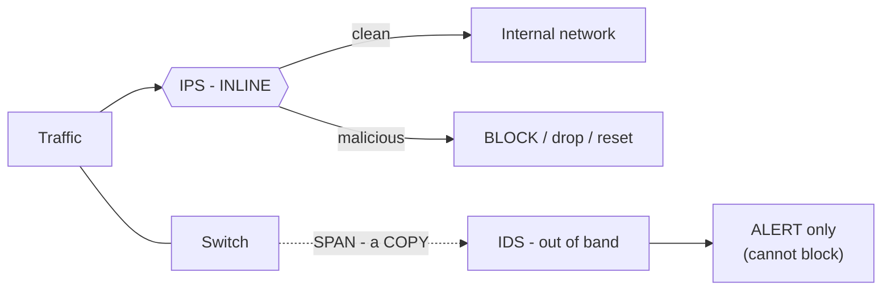

<div dir="rtl" align="right">

# פרק ⁦5⁩ – מניעת חדירה לרשת המקומית והרחבה (⁦IDS / IPS)⁩

_⁦11⁩ שעות עיוני + ⁦3⁩ מעשי · שבועות ⁦13⁩–⁦16⁩_

> **מטרות:** מערכות זיהוי פלישה (⁦IDS)⁩ · מערכות מניעת פלישה (⁦IPS)⁩ · הגדרה ב-⁦CLI⁩ · ניטור ופתרון תקלות  
> **בבגרות:** ההבדל ⁦IDS/IPS⁩ (ניטור+התראה מול ניטור+חסימה אוטומטית)

> 📘 **לפני שמתחילים – במה זה שונה מחומת אש? (למי שאין רקע)**
>
> - **חומת אש** (פרק ⁦4)⁩ בודקת **כתובות ופורטים** – "מי מדבר עם מי ובאיזו דלת". היא לא מסתכלת מה *בתוך* החבילה.
> - **⁦IDS/IPS⁩** מסתכלות על **התוכן** של החבילה ועל **ההתנהגות** – ומחפשות סימנים של התקפה, גם אם הפורט מותר. **אנלוגיה:** חומת אש = שומר שבודק תעודת זהות בכניסה. ⁦IDS/IPS⁩ = מצלמות אבטחה + מאבטח בתוך הבניין שמזהים התנהגות חשודה גם של מי שנכנס חוקית. 
> - **⁦IDS** (Detection)⁩ = מצלמה ש**מתריעה** אם רואה משהו חשוד (אבל לא עוצרת).
> - **⁦IPS** (Prevention)⁩ = מאבטח ש**גם עוצר** את החשוד במקום.
> - **חתימה (⁦Signature)** = "⁩תמונת מבוקש" – תבנית ידועה של התקפה שהמערכת מחפשת.

## ⁦5.1⁩ למה חומת אש לא מספיקה

חומת אש (פרק ⁦4)⁩ מחליטה לפי *כתובות ופורטים*. אבל התקפה יכולה להגיע בדיוק בפורט שפתחנו: ⁦SQL injection⁩ בתוך בקשת ⁦HTTP⁩ לפורט ⁦80⁩, ניצול חולשה בשרת המייל בפורט ⁦25⁩, או תולעת שמתפשטת דרך ⁦SMB⁩ שאנחנו מאפשרים בין סניפים. חומת האש רואה "⁦TCP 80⁩ ל-⁦web server⁩ – מותר" ולא מסתכלת מה *בתוך* החבילה. כאן נכנסות מערכות ⁦IDS/IPS⁩: הן מסתכלות על **התוכן** וההתנהגות ומחפשות סימנים של התקפה.

> 📖 **סיפור מהחיים: ⁦10⁩ דקות של ⁦Slammer (2003)⁩**
>
> תולעת ⁦SQL Slammer⁩ הייתה חבילת ⁦UDP⁩ *אחת* בגודל ⁦376⁩ בתים לפורט ⁦1434 (Microsoft SQL).⁩ כל שרת נגוע שלח אותה לכתובות אקראיות בקצב מרבי. תוך ⁦10⁩ דקות נדבקו ⁦75,000⁩ שרתים; כספומטים של ⁦Bank of America⁩ הפסיקו לעבוד, חלק מטיסות ⁦Continental⁩ בוטלו, ו-⁦911⁩ בסיאטל נפל. מי שהיה עם ⁦IPS⁩ מעודכן – חתימה אחת ("⁦UDP 1434⁩, גודל ⁦376⁩, המחרוזת הזו") חסמה את זה מיד. מי שהיה רק עם חומת אש שאיפשרה ⁦SQL⁩ בין הסניפים – נדבק. ומה שמדהים: מיקרוסופט פרסמה תיקון ⁦6⁩ חודשים קודם.

## ⁦5.2 IDS⁩ מול ⁦IPS⁩ – ההבדל המהותי

| **** | **⁦IDS⁩ – ⁦Intrusion Detection System** | **IPS⁩ – ⁦Intrusion Prevention System⁩** |
| --- | --- | --- |
| **הגדרה (כמו בבגרות)** | מערכת ניטור שנועדה **לספק התראות** בעת ניסיונות חדירה | מערכת ניטור שמאפשרת זיהוי **וחסימה אוטומטית** של ניסיונות חדירה |
| **מיקום** | **מחוץ לנתיב** (⁦out-of-band, promiscuous)⁩: מקבלת *עותק* של התעבורה דרך ⁦SPAN/TAP⁩ | **בתוך הנתיב** (⁦inline)⁩: התעבורה *עוברת דרכה*, חבילה אחר חבילה |
| **תגובה** | התראה (⁦syslog⁩, מייל), רישום; יכולה לבקש מחומת אש/נתב לחסום *אחרי* שהחבילה הראשונה כבר עברה, או לשלוח ⁦TCP reset⁩ | מפילה את החבילה הזדונית עוד לפני שהגיעה ליעד; חוסמת את החיבור/התוקף |
| **השפעה על הרשת** | אפס השהיה; אם ה-⁦IDS⁩ נופל – הרשת ממשיכה | מוסיפה השהיה (⁦latency)⁩; אם ה-⁦IPS⁩ נופל – או שהרשת נופלת (⁦fail-closed)⁩ או שעוברים ללא הגנה (⁦fail-open)⁩ |
| **מחיר של טעות (⁦false positive)⁩** | התראה מיותרת – מטריד | תעבורה לגיטימית נחסמת – פוגע בעסק. לכן ⁦IPS⁩ דורש כוונון קפדני |
| **מה היא רואה** | יכולה לפספס חבילות בעומס (עותק) | רואה הכול, כולל חבילות שהיא עצמה מפילה |
| **מקרי שימוש** | ניטור, ⁦forensics⁩, סביבה שלא סובלת חסימה בטעות | הגנה בזמן אמת בקצה ובין אזורים |

> ❓ **שאלת תלמיד: "אז למה שמישהו יבחר ⁦IDS⁩, אם ⁦IPS⁩ גם מזהה וגם חוסם?"**
>
> שלוש סיבות: (⁦1)⁩ **סיכון של ⁦false positive⁩** – בבית חולים או בבורסה, לחסום תעבורה לגיטימית בטעות גרוע יותר מלהחמיץ התקפה; מתחילים ב-⁦IDS⁩, מכווננים, ורק אז עוברים ל-⁦IPS. (2)⁩ **ביצועים** – ⁦IPS inline⁩ על קו ⁦100Gbps⁩ הוא ציוד יקר מאוד; ⁦IDS⁩ על עותק יכול לדגום. (⁦3)⁩ **נראות** – ⁦IDS⁩ פנימי (על ⁦SPAN⁩ של המתג המרכזי) רואה תנועה רוחבית בין מחשבים שלא עוברת דרך שום חומת אש. בפועל ארגונים מפעילים את שניהם. ורוב מוצרי ה-⁦IPS⁩ ניתנים להגדרה במצב ⁦IDS (monitor-only).⁩

### 📊 תרשים: ⁦IDS⁩ (מחוץ לנתיב) מול ⁦IPS⁩ (בתוך הנתיב)



_⁦IPS⁩ יושב בנתיב וחוסם (אך מוסיף השהיה ונקודת כשל). ⁦IDS⁩ מקבל עותק דרך ⁦SPAN⁩ — מתריע בלבד, בלי לגעת בזרימה._

## ⁦5.3⁩ מבוסס-מארח (⁦HIPS)⁩ מול מבוסס-רשת (⁦NIPS)⁩

| **** | **⁦HIPS⁩ – ⁦Host-based** | **NIPS⁩ – ⁦Network-based⁩** |
| --- | --- | --- |
| איפה | תוכנה על השרת/המחשב עצמו (⁦agent)⁩ | מכשיר/מודול בנתיב הרשת (⁦ASA⁩ עם מודול ⁦IPS, Firepower, IOS IPS, Snort/Suricata)⁩ |
| מה רואה | הכול במחשב: קריאות מערכת, קבצים, ⁦registry⁩, זיכרון, **ותעבורה מוצפנת אחרי הפענוח** | תעבורת רשת בלבד; לא רואה לתוך ⁦TLS⁩ בלי ⁦SSL inspection⁩ |
| יתרון | מגן גם כשהמחשב מחוץ לרשת (לפטופ בבית); מבין את ההקשר (איזו אפליקציה) | מכשיר אחד מגן על מאות מחשבים; לא צואך מערכת ההפעלה; רואה סריקות ו-⁦DoS⁩ |
| חיסרון | התקנה ותחזוקה בכל מחשב; צורך משאבים; תלוי במערכת ההפעלה | עיוור למה שקורה בתוך המארח ולתעבורה מוצפנת |
| דוגמה | **⁦Cisco Security Agent (CSA)⁩** – מוזכר בתכנית; הופסק ב-⁦2010.⁩ היום: ⁦Cisco Secure Endpoint (AMP), CrowdStrike, Microsoft Defender⁩ – התחום נקרא **⁦EDR** | Cisco Firepower NGIPS, Snort⁩ (קוד פתוח, שנרכש על ידי סיסקו), ⁦Suricata, Palo Alto Threat Prevention⁩ |

**⁦CSA⁩** עבד לפי גישה התנהגותית ולא לפי חתימות: הוא יירט קריאות מערכת (⁦system calls)⁩ ועצר התנהגות חשודה – "תוכנה שהגיעה במייל מנסה לשנות את ה-⁦registry⁩ ולפתוח פורט" – גם בלי להכיר את הנוזקה. זה הרעיון של ⁦HIPS⁩ מודרני.

## ⁦5.4⁩ שיטות זיהוי

| **שיטה** | **איך** | **יתרון** | **חיסרון** |
| --- | --- | --- | --- |
| **מבוססת חתימות** (⁦Signature / pattern)⁩ | השוואה לתבניות ידועות של התקפות (מחרוזת, רצף חבילות) | מדויקת, מעט ⁦false positive⁩, קלה להבנה | לא מזהה התקפה חדשה (⁦zero-day)⁩; דורשת עדכונים |
| **מבוססת אנומליה** (⁦Anomaly / profile)⁩ | לומדת "מה נורמלי" (⁦baseline)⁩ ומתריעה על חריגה – פתאום ⁦500⁩ חיבורי ⁦SSH⁩ בדקה | מזהה התקפות לא מוכרות | הרבה ⁦false positive⁩; אם ה-⁦baseline⁩ נלמד בזמן התקפה – היא "נורמלית" |
| **מבוססת מדיניות** (⁦Policy)⁩ | המנהל מגדיר כללים: "אסור ⁦Telnet⁩ מרשת ⁦X"⁩ | פשוט, מדויק לארגון | מוגבל למה שחשבו עליו |
| **מבוססת פיתיון** (⁦Honeypot)⁩ | מערכת "מזמינה" שאין לה שימוש לגיטימי – כל גישה אליה חשודה | אפס ⁦false positive⁩; לומדים על התוקף | לא מגן ישירות; דורש תחזוקה |
| **מוניטין** (⁦Reputation)⁩ | רשימות של ⁦IP/⁩דומיינים זדוניים ידועים (⁦Cisco Talos)⁩ | מהיר | תוקף חדש לא ברשימה |

## ⁦5.5⁩ חתימות (⁦Signatures)⁩

**חתימה** היא תיאור של תבנית התקפה שה-⁦IPS⁩ מחפש. חתימות מקובצות ב**קובץ חתימות** (⁦Signature package / SDF)⁩ שסיסקו מעדכנת; לכל חתימה מזהה (⁦ID)⁩ ותת-מזהה (⁦subsig)⁩, ולכל אחת **מנוע** (⁦micro-engine)⁩ שמתאים לסוג – ⁦atomic-ip, service-http, string-tcp, multi-string⁩ ועוד.

### אטומית מול מורכבת – נשאל בתכנית

| **** | **חתימה אטומית (⁦Atomic)⁩** | **חתימה מורכבת (⁦Composite / Stateful)⁩** |
| --- | --- | --- |
| מה בודקת | **חבילה אחת** ובודדת – למשל: "⁦ICMP echo⁩ עם גודל > ⁦1000"⁩ או "⁦TCP⁩ עם דגלי ⁦SYN+FIN⁩ יחד" (לא חוקי) | **רצף** של חבילות/אירועים לאורך זמן – למשל: "יותר מ-⁦100 SYN⁩ לפורטים שונים באותו מארח תוך ⁦5⁩ שניות" (⁦port scan)⁩, או מחרוזת שמפוצלת בין כמה חבילות |
| זיכרון/מצב | לא צריך לשמור מצב – מהיר וזול | חייבת לזכור (⁦state)⁩, עד "חלון אירועים" (⁦event horizon)⁩ |
| דוגמה | ⁦Ping of Death, LAND attack⁩ (מקור = יעד) | ⁦SYN flood⁩, סריקת פורטים, ⁦brute force⁩ |

### תכונות של חתימה

- **⁦Enabled / Disabled⁩** – פעילה או לא (מושבתת = טעונה בזיכרון אך לא בודקת).
- **⁦Retired / Unretired⁩** – בפנסיה = לא טעונה לזיכרון כלל (חוסך משאבים). כדי להשתמש בחתימה היא צריכה להיות ⁦unretired⁩ *וגם* ⁦enabled.⁩
- **⁦Severity⁩** – ⁦informational / low / medium / high.⁩
- **⁦Fidelity rating (SFR)⁩** – עד כמה החתימה מדויקת (⁦0⁩–⁦100).⁩
- **⁦Action⁩** – מה לעשות כשיש התאמה (ראו ⁦5.6).⁩
- **קטגוריות** – ב-⁦IOS IPS⁩: `⁦ios_ips basic⁩` (חתימות בסיסיות, לנתב עם זיכרון מועט) ו-`⁦ios_ips advanced⁩`.

## ⁦5.6⁩ פעולות (⁦Actions)⁩ ואזעקות (⁦Alarms)⁩

### מה ⁦IPS⁩ יכול לעשות כשחתימה תואמת

| **פעולה** | **משמעות** |
| --- | --- |
| **⁦produce-alert⁩** | שלח התראה (⁦syslog / SDEE).⁩ ברירת מחדל ברוב החתימות. |
| **⁦produce-verbose-alert⁩** | התראה + עותק של החבילה (לניתוח). |
| **⁦deny-packet-inline⁩** | הפל את החבילה הזו. |
| **⁦deny-connection-inline⁩** | הפל את כל החבילות של החיבור (⁦TCP flow)⁩ הזה. |
| **⁦deny-attacker-inline⁩** | הפל כל תעבורה מכתובת התוקף לזמן מוגדר – החזק ביותר, והמסוכן ביותר ב-⁦false positive.⁩ |
| **⁦reset-tcp-connection⁩** | שלח ⁦TCP RST⁩ לשני הצדדים – היחידה שגם ⁦IDS⁩ (מחוץ לנתיב) יכולה לבצע. |

### ארבעה סוגי תוצאות – חובה להבין

| **** | **הייתה התקפה** | **לא הייתה התקפה** |
| --- | --- | --- |
| **המערכת התריעה** | **⁦True Positive⁩** – מצוין | **⁦False Positive⁩** – אזעקת שווא; מטריד, וב-⁦IPS⁩ חוסם משהו לגיטימי |
| **המערכת שתקה** | **⁦False Negative⁩** – הכי גרוע: התקפה עברה בשקט | **⁦True Negative⁩** – מצוין |

> ❓ **שאלת תלמיד: "מה יותר גרוע – ⁦false positive⁩ או ⁦false negative⁩?"**
>
> תלוי במערכת. ב-**⁦IDS** false positive⁩ זה רק רעש; ⁦false negative⁩ זה פריצה שלא ראינו – גרוע. ב-**⁦IPS** false positive⁩ חוסם עסק (הזמנות לא נכנסות, טלפוניה נופלת) – זה מה שמפחיד מנהלים ולכן הם מעדיפים לפעמים לכבות חתימות; ואז מגיע ה-⁦false negative.⁩ האיזון נקרא **כוונון (⁦tuning)⁩** – מכבים חתימות לא רלוונטיות (חתימות ל-⁦IIS⁩ ברשת של ⁦Linux)⁩, מעלים סף, ומחריגים כתובות מהימנות. אין תשובה אחת; זה מה שעושים אנשי ⁦SOC⁩ כל היום.

## ⁦5.7⁩ ניטור ⁦IPS⁩

- **⁦Syslog⁩** – ההתראות נשלחות כהודעות (`%⁦IPS-4-SIGNATURE: Sig:2004 Subsig:0 Sev:25 ICMP Echo Request [10.1.1.5:0 -> 10.2.2.2:0]⁩`).
- **⁦SDEE** (Security Device Event Exchange)⁩ – פרוטוקול מבוסס ⁦HTTPS/XML⁩ שסיסקו יצרה כדי שתחנת ניהול תשלוף אירועים מה-⁦IPS (pull)⁩ בצורה מאובטחת. דורש `⁦ip http secure-server⁩`.
- **תחנות ניהול:** בעבר ⁦IEV / IME / MARS⁩ (מוזכרים בחומרים ישנים); היום ⁦Firepower Management Center (FMC)⁩, או ⁦SIEM⁩ כללי (⁦Splunk, QRadar, ELK)⁩ שמקבל ⁦syslog⁩ מכל המערכות ומבצע **קורלציה** – "אותו ⁦IP⁩ הופיע ב-⁦IPS⁩, בחומת האש וב-⁦AD⁩ תוך דקה".

## ⁦5.8⁩ הגדרת ⁦IOS IPS⁩ ב-⁦CLI⁩

נתב סיסקו יכול לתפקד כ-⁦IPS⁩ (מוגבל) בעצמו. התהליך המלא בציוד אמיתי:

⁦1.⁩ הורדת חבילת חתימות (`⁦IOS-Sxxx-CLI.pkg⁩`) ומפתח ציבורי (`⁦realm-cisco.pub.key.txt⁩`) מ-⁦Cisco.com.⁩
⁦2.⁩ יצירת תיקייה ב-⁦flash⁩ לחתימות.
⁦3.⁩ הגדרת המפתח הציבורי (כדי שהנתב יוודא שהחבילה חתומה על ידי סיסקו).
⁦4.⁩ הגדרת ⁦IPS⁩: שם, מיקום, התראות, קטגוריות.
⁦5.⁩ החלה על ממשק וטעינת החבילה.

```
! שלב 2 – תיקייה
R1# mkdir ipsdir
! שלב 3 – מפתח ציבורי של סיסקו (מעתיקים מהקובץ; קטע מקוצר)
R1(config)# crypto key pubkey-chain rsa
R1(config-pubkey-chain)# named-key realm-cisco.pub signature
R1(config-pubkey-key)# key-string
R1(config-pubkey)# 30820122 300D0609 2A864886 ...
R1(config-pubkey)# quit
! שלב 4 – הגדרת ה-IPS
R1(config)# ip ips config location flash:ipsdir
R1(config)# ip ips name MYIPS            ! אפשר: ip ips name MYIPS list 101 – רק תעבורה שתואמת ל-ACL
R1(config)# ip ips notify log            ! התראות ל-syslog
R1(config)# ip http secure-server
R1(config)# ip ips notify sdee           ! ולתחנת ניהול
R1(config)# ip ips signature-category
R1(config-ips-category)# category all
R1(config-ips-category-action)# retired true          ! קודם – הכול בפנסיה
R1(config-ips-category-action)# exit
R1(config-ips-category)# category ios_ips basic
R1(config-ips-category-action)# retired false         ! ואז – רק הבסיסיות פעילות
R1(config-ips-category-action)# exit
R1(config-ips-category)# exit
! שלב 5 – החלה על ממשק (בכיוון שממנו מגיעה התעבורה החשודה)
R1(config)# interface g0/0
R1(config-if)# ip ips MYIPS in
! טעינת חבילת החתימות (מ-TFTP/USB) – ב-Packet Tracer שלב זה לא קיים
R1# copy tftp://10.0.0.5/IOS-S416-CLI.pkg idconf
```

### שינוי חתימה בודדת – הדוגמה הקלאסית: התראה + חסימה על ⁦ping⁩

```
R1(config)# ip ips signature-definition
R1(config-sigdef)# signature 2004 0           ! 2004/0 = ICMP Echo Request
R1(config-sigdef-sig)# status
R1(config-sigdef-sig-status)# retired false
R1(config-sigdef-sig-status)# enabled true
R1(config-sigdef-sig-status)# exit
R1(config-sigdef-sig)# engine
R1(config-sigdef-sig-engine)# event-action produce-alert
R1(config-sigdef-sig-engine)# event-action deny-packet-inline
R1(config-sigdef-sig-engine)# exit
R1(config-sigdef-sig)# exit
R1(config-sigdef)# exit
Do you want to accept these changes? [confirm]
```

> 💡 **טיפ: מה עובד ב-⁦Packet Tracer⁩**
>
> ⁦Packet Tracer⁩ תומך בתת-קבוצה: `⁦ip ips config location⁩`, `⁦ip ips name⁩`, `⁦ip ips notify log⁩`, `⁦signature-category⁩` (⁦all retired / ios_ips basic)⁩, `⁦ip ips NAME in|out⁩`, ושינוי חתימה ⁦2004 0 (ICMP echo)⁩ עם ⁦produce-alert⁩ ו-⁦deny-packet-inline.⁩ אין טעינת חבילה ואין ⁦SDEE.⁩ תרגיל ה-⁦ping⁩ הוא התרגיל שעובד – ורואים בשרת ה-⁦syslog⁩ את ההתראה ואת ה-⁦ping⁩ נכשל. זה מספיק להמחשה.

## ⁦5.9⁩ וריפיקציה ופתרון תקלות

```
R1# show ip ips all                   ! סיכום: שם, ממשקים, קטגוריות, מספר חתימות טעונות
R1# show ip ips configuration
R1# show ip ips interfaces
R1# show ip ips signatures [count]      ! אילו חתימות פעילות
R1# show ip ips statistics            ! כמה חבילות נבדקו, כמה התראות
R1# clear ip ips statistics
R1# show ip ips sessions
R1# debug ip ips
```

| **תסמין** | **סיבה נפוצה ופתרון** |
| --- | --- |
| אין התראות בכלל | ה-⁦IPS⁩ לא מוחל על הממשק / בכיוון הלא נכון. תעבורה נכנסת מהאינטרנט ⇒ `⁦in⁩` על הממשק החיצוני. בדקו `⁦show ip ips interfaces⁩`. |
| "⁦0 signatures loaded"⁩ | קטגוריה ⁦all retired⁩ ולא ⁦unretired⁩ כלום; או חבילת חתימות לא נטענה (`⁦copy⁩ … ⁦idconf⁩`); או מפתח ציבורי חסר/שגוי – הנתב דוחה חבילה לא חתומה. |
| הנתב איטי / ⁦CPU 100⁩% | יותר מדי חתימות (⁦advanced⁩ על נתב קטן). השאירו ⁦ios_ips basic⁩, השתמשו ב-`⁦list ACL⁩` כדי לבדוק רק תעבורה רלוונטית. |
| יש התראה אך החבילה עוברת | ה-⁦action⁩ הוא ⁦produce-alert⁩ בלבד; הוסיפו ⁦deny-packet-inline.⁩ או שהחתימה ⁦enabled⁩ אך ⁦retired.⁩ |
| תעבורה לגיטימית נחסמת | ⁦false positive.⁩ זהו את החתימה ב-⁦syslog⁩ ובטלו/כווננו אותה; או השתמשו ב-`⁦ip ips name X list ACL⁩` להחריג. |

## ⁦5.10⁩ מדריך פקודות מרוכז – פרק ⁦5⁩

| **פקודה** | **תפקיד** |
| --- | --- |
| `⁦mkdir ipsdir⁩` | תיקייה לחתימות |
| `⁦crypto key pubkey-chain rsa⁩` → `⁦named-key realm-cisco.pub signature⁩` | מפתח לאימות חבילה |
| `⁦ip ips config location flash:ipsdir⁩` | מיקום |
| `⁦ip ips name NAME [list ACL]⁩` | כלל ⁦IPS⁩ |
| `⁦ip ips notify log⁩ \| ⁦sdee⁩` | יעד התראות |
| `⁦ip ips signature-category⁩` → `⁦category all⁩` → `⁦retired true⁩` | כיבוי כל החתימות |
| `⁦category ios_ips basic⁩` → `⁦retired false⁩` | הפעלת הבסיסיות |
| `⁦ip ips NAME in⁩\|⁦out⁩` (ממשק) | החלה |
| `⁦copy tftp://⁩…⁦pkg idconf⁩` | טעינת חתימות |
| `⁦ip ips signature-definition⁩` → `⁦signature ID SUB⁩` → `⁦status⁩`/`⁦engine⁩` | עריכת חתימה |
| `⁦show ip ips all⁩ \| ⁦configuration⁩ \| ⁦signatures⁩ \| ⁦statistics⁩` | וריפיקציה |

## ⁦5.11⁩ תרגילים לתלמידים

> ✏️ **תרגיל ⁦1⁩ – ⁦True/False Positive/Negative⁩**
>
> סווגו: א. ה-⁦IPS⁩ חסם עדכון ⁦Windows⁩ לגיטימי כי הוא "נראה כמו הורדת קובץ הרצה חשוד". ב. תולעת עברה דרך ה-⁦IDS⁩ בלי התראה כי החתימה לא עודכנה. ג. ה-⁦IDS⁩ התריע על סריקת ⁦Nmap⁩ שאכן בוצעה. ד. תעבורת ⁦Zoom⁩ עברה כרגיל ללא התראה.
>
> **תשובה:** א. ⁦False Positive⁩ ב. ⁦False Negative⁩ ג. ⁦True Positive⁩ ד. ⁦True Negative⁩

> ✏️ **תרגיל ⁦2⁩ – אטומית או מורכבת?**
>
> א. חבילת ⁦TCP⁩ עם כל ⁦6⁩ הדגלים דלוקים ("⁦Xmas scan").⁩ ב. ⁦50⁩ ניסיונות כניסה כושלים ל-⁦SSH⁩ מאותו ⁦IP⁩ תוך דקה. ג. חבילת ⁦IP⁩ שבה כתובת המקור שווה לכתובת היעד. ד. מחרוזת `/⁦etc/passwd⁩` שמפוצלת בין שתי חבילות ⁦HTTP.⁩
>
> **תשובה:** א. אטומית ב. מורכבת ג. אטומית (⁦LAND)⁩ ד. מורכבת (דורשת הרכבת זרם)

> ✏️ **תרגיל ⁦3⁩ – בחירת פעולה**
>
> לכל מצב בחרו את ה-⁦action⁩ המתאים ביותר ונמקו: א. חתימה עם ⁦fidelity 30⁩ (לא מדויקת) לפעילות חשודה קלה. ב. חתימה ל-⁦SQL injection⁩ ודאית (⁦fidelity 95)⁩ לשרת ה-⁦web.⁩ ג. תוקף ששולח ⁦10,000 SYN⁩ בשנייה. ד. ⁦IDS⁩ מחוץ לנתיב שזיהה ⁦session⁩ זדוני.
>
> **תשובה:** א. ⁦produce-alert⁩ בלבד – סיכון ⁦false positive⁩ גבוה. ב. ⁦deny-connection-inline⁩ (או ⁦deny-packet) + alert.⁩ ג. ⁦deny-attacker-inline⁩ – לחסום את המקור לזמן. ד. ⁦reset-tcp-connection⁩ – היחיד שזמין ל-⁦IDS⁩ מחוץ לנתיב.

> ✏️ **תרגיל ⁦4⁩ – תכנון פריסה**
>
> ציירו רשת: אינטרנט – נתב קצה – חומת אש – מתג מרכזי – (שרתים, משתמשים). סמנו היכן תמקמו ⁦IPS⁩ והיכן ⁦IDS⁩, ונמקו. היכן תתקינו ⁦HIPS⁩?
>
> **תשובה:** ⁦IPS inline⁩ בין חומת האש למתג המרכזי (או כמודול בחומת האש) – מגן על הכול מהאינטרנט. ⁦IDS⁩ על ⁦SPAN⁩ של המתג המרכזי – רואה תנועה רוחבית פנימית. ⁦HIPS/EDR⁩ על השרתים (בעיקר ⁦web, DB, DC)⁩ ועל מחשבי המשתמשים (ניידים).

## ⁦5.12⁩ שאלות בסגנון בגרות

> 📝 **שאלה ⁦1⁩**
>
> התאימו: מערכת ____ היא מערכת ניטור שמאפשרת זיהוי וחסימה אוטומטית של ניסיונות חדירה. מערכת ____ היא מערכת ניטור שנועדה לספק התראות בעת ניסיונות חדירה. (⁦IDS / IPS / DNS / RADIUS / TACACS)⁩
>
> **תשובה:** ⁦IPS⁩ · ⁦IDS⁩

> 📝 **שאלה ⁦2⁩**
>
> מהו ההבדל במיקום ברשת בין ⁦IDS⁩ ל-⁦IPS⁩, ומה המשמעות לגבי השהיה?
>
> **תשובה:** ⁦IDS⁩ – מחוץ לנתיב (⁦promiscuous)⁩, מקבל עותק ⇒ אין השהיה. ⁦IPS⁩ – בתוך הנתיב (⁦inline)⁩, התעבורה עוברת דרכו ⇒ מוסיף השהיה.

> 📝 **שאלה ⁦3⁩**
>
> מה ההבדל בין חתימה אטומית לחתימה מורכבת?
>
> **תשובה:** אטומית – בודקת חבילה בודדת, ללא שמירת מצב. מורכבת – בודקת רצף חבילות לאורך זמן, שומרת מצב.

> 📝 **שאלה ⁦4⁩**
>
> מנהל הגדיר ⁦IOS IPS⁩ ו-`⁦category all retired true⁩` בלבד. אילו חתימות פעילות?
>
> **תשובה:** אף אחת – חייבים לבצע ⁦unretire⁩ (`⁦retired false⁩`) לקטגוריה כלשהי, למשל ⁦ios_ips basic.⁩

> 📝 **שאלה ⁦5⁩**
>
> איזו מהפעולות הבאות אינה זמינה ל-⁦IDS⁩ שנמצא מחוץ לנתיב התעבורה? ⁦1. produce-alert 2. deny-packet-inline 3. reset-tcp-connection 4. produce-verbose-alert⁩
>
> **תשובה:** **⁦2⁩** – אי אפשר להפיל חבילה שכבר עברה; ה-⁦IDS⁩ רואה רק עותק.

> 📝 **שאלה ⁦6⁩**
>
> מהו ⁦HIPS⁩ ומה יתרונו המרכזי על פני ⁦IPS⁩ רשתי?
>
> **תשובה:** ⁦Host-based IPS⁩ – תוכנה על המארח עצמו. יתרון: רואה תעבורה מוצפנת אחרי הפענוח ואת ההתנהגות בתוך המחשב (קבצים, זיכרון), ומגן גם כשהמחשב מחוץ לרשת הארגון.

## ⁦5.13⁩ מעבדה (⁦3⁩ שעות) – ⁦IOS IPS⁩ ב-⁦Packet Tracer⁩

⁦1.⁩ טופולוגיה: ⁦PC-A (10.1.1.10)⁩ — ⁦R1⁩ — ⁦PC-B (10.2.2.10)⁩; שרת ⁦Syslog⁩ ברשת של ⁦PC-B.⁩ הגדירו ⁦logging⁩ לשרת.
⁦2.⁩ ב-⁦R1⁩: `⁦mkdir ipsdir⁩`, `⁦ip ips config location flash:ipsdir⁩`, `⁦ip ips name IOSIPS⁩`, `⁦ip ips notify log⁩`, קטגוריות: ⁦all retired, ios_ips basic unretired.⁩
⁦3.⁩ שנו חתימה ⁦2004 0: retired false, enabled true, event-action produce-alert + deny-packet-inline.⁩
⁦4.⁩ החילו `⁦ip ips IOSIPS out⁩` על הממשק לכיוון ⁦PC-B⁩ (או ⁦in⁩ על הממשק מ-⁦PC-A).⁩
⁦5.⁩ מ-⁦PC-A: ping⁩ ל-⁦PC-B⁩ ⇒ נכשל. בשרת ה-⁦syslog⁩: הודעת `%⁦IPS-4-SIGNATURE: Sig:2004⁩`. מ-⁦PC-B ping⁩ ל-⁦PC-A⁩ ⇒ מצליח (הכיוון!). הסבירו.
⁦6.⁩ הסירו את ⁦deny-packet-inline⁩ והשאירו ⁦produce-alert. ping⁩ עובר אך יש התראה – זו התנהגות ⁦IDS.⁩ דונו בהבדל.
⁦7.⁩ `⁦show ip ips all⁩`, `⁦show ip ips statistics⁩` – כמה חבילות נבדקו?

## ❓ חידון – בדקו את עצמכם

**⁦1.⁩** ההבדל המהותי בין ⁦IDS⁩ ל-⁦IPS⁩:
- א. ⁦IPS⁩ ישן יותר · ב. ⁦IDS⁩ **מזהה ומתריע** (מחוץ לנתיב); ⁦IPS⁩ **מזהה וחוסם** (בתוך הנתיב) · ג. אין הבדל · ד. ⁦IDS⁩ חוסם

<details><summary>תשובה</summary>**ב** – ⁦IDS⁩ = מצלמת אבטחה (מתריעה); ⁦IPS⁩ = שומר (עוצר).</details>

**⁦2.⁩** מדוע חומת אש לא מספיקה, וצריך גם ⁦IPS⁩?
- א. חומת אש איטית · ב. חומת אש בודקת אם החיבור **מותר**; ⁦IPS⁩ בודק אם **התוכן** של תעבורה מותרת הוא זדוני · ג. אין צורך ב-⁦IPS⁩ · ד. חומת אש ישנה

<details><summary>תשובה</summary>**ב** – פורט ⁦443⁩ מותר, אבל בתוכו יכולה לעבור התקפה. ⁦IPS⁩ בודק את התוכן.</details>

**⁦3.** HIPS⁩ מותקן על:
- א. הנתב · ב. המחשב/השרת (מבוסס-מארח) · ג. המתג · ד. חומת האש

<details><summary>תשובה</summary>**ב** – ⁦Host-based. NIPS⁩ מבוסס-רשת, בנקודת מעבר.</details>

**⁦4.⁩** זיהוי מבוסס-חתימות (⁦Signature)⁩ מזהה:
- א. כל דבר חדש · ב. התקפות **מוכרות** לפי דפוס ידוע · ג. רק וירוסים · ד. תעבורה מוצפנת

<details><summary>תשובה</summary>**ב** – מהיר ומדויק לאיומים ידועים, אך עיוור ל-⁦Zero-Day.⁩</details>

**⁦5.⁩** זיהוי מבוסס-אנומליה (⁦Anomaly)⁩ יתרונו:
- א. מדויק תמיד · ב. יכול לזהות התקפות **חדשות** לפי סטייה מהתנהגות רגילה · ג. מהיר · ד. לא מתריע לשווא

<details><summary>תשובה</summary>**ב** – מזהה ⁦Zero-Day⁩, אך נוטה ליותר התראות שווא (⁦False Positive).⁩</details>

**⁦6.** "⁩התראת שווא" שבה ⁦IPS⁩ מתריע על תעבורה **תקינה** נקראת:
- א. ⁦False Negative⁩ · ב. ⁦False Positive⁩ · ג. ⁦True Positive⁩ · ד. ⁦True Negative⁩

<details><summary>תשובה</summary>**ב** – ⁦False Positive.⁩ הגרוע יותר הוא **⁦False Negative⁩** – התקפה אמיתית שלא זוהתה.</details>

**⁦7.⁩** מדוע מחברים ⁦IDS⁩ דרך ⁦SPAN⁩ ולא בתוך הנתיב?
- א. כדי לחסום · ב. כדי לנטר בלי להוסיף השהיה או נקודת כשל – הוא מקבל **עותק** של התעבורה · ג. אין ברירה · ד. כדי להצפין

<details><summary>תשובה</summary>**ב** – ⁦IDS⁩ מחוץ לנתיב; אם נכניס אותו ⁦inline⁩ הוא הופך ל-⁦IPS⁩ עם סיכון להשהיה/כשל.</details>

**⁦8.⁩** מהי התקפת ⁦Zero-Day⁩?
- א. התקפה ישנה · ב. ניצול פרצה שעדיין **לא ידועה/לא תוקנה** – אין לה חתימה · ג. התקפה שנכשלה · ד. וירוס איטי

<details><summary>תשובה</summary>**ב** – לכן זיהוי מבוסס-אנומליה חשוב: חתימות עדיין לא קיימות.</details>

**⁦9.⁩** פעולה של ⁦IPS⁩ כשחתימה תואמת יכולה להיות:
- א. רק להתריע · ב. להתריע, לחסום את החבילה, לאפס את החיבור (⁦reset)⁩, או לחסום את המקור · ג. רק לחסום · ד. לכבות את הרשת

<details><summary>תשובה</summary>**ב** – מגוון פעולות, מהתראה בלבד ועד חסימת התוקף.</details>

**⁦10.⁩** חתימה **אטומית** (⁦Atomic)⁩ לעומת **מורכבת** (⁦Composite)⁩:
- א. אטומית = חבילה בודדת; מורכבת = רצף חבילות/מצב לאורך זמן · ב. אין הבדל · ג. מורכבת מהירה · ד. אטומית ישנה

<details><summary>תשובה</summary>**א** – אטומית מזוהה בחבילה אחת; מורכבת דורשת מעקב אחר מספר חבילות.</details>

## בנק שאלות שתלמידים שואלים – ותשובות מוכנות

שאלות נפוצות בפרק ⁦IDS/IPS⁩, עם תשובות מוכנות.

**ש: "אם ⁦IPS⁩ גם מזהה וגם חוסם, למה שמישהו יבחר ⁦IDS⁩?"**  
ת: שלוש סיבות: (⁦1)⁩ סיכון של **⁦false positive⁩** – בבית חולים או בבורסה, לחסום תעבורה לגיטימית בטעות גרוע מלהחמיץ התקפה. (⁦2)⁩ ביצועים – ⁦IPS inline⁩ על קו מהיר יקר מאוד. (⁦3) IDS⁩ פנימי (על ⁦SPAN)⁩ רואה תנועה רוחבית בין מחשבים שלא עוברת בשום חומת אש. בפועל מפעילים את שניהם.

**ש: "מה ההבדל בין ⁦IDS/IPS⁩ לאנטי-וירוס?"**  
ת: אנטי-וירוס מגן על **קבצים במחשב אחד**. ⁦IPS⁩ מגן על **תעבורת הרשת** בין מחשבים. ⁦HIPS (host-based)⁩ מטשטש את הגבול – הוא ⁦IPS⁩ שרץ על המחשב עצמו.

**ש: "מה יותר גרוע – ⁦false positive⁩ או ⁦false negative⁩?"**  
ת: תלוי במערכת. ב-⁦IDS, false positive⁩ הוא רק רעש; ⁦false negative⁩ (התקפה שעברה בשקט) גרוע יותר. ב-⁦IPS, false positive⁩ **חוסם עסק** (הזמנות לא נכנסות) – ולכן מנהלים לפעמים מכבים חתימות, וזה מוביל ל-⁦false negatives.⁩ האיזון הזה נקרא "כוונון" (⁦tuning)⁩ וזו עבודת ה-⁦SOC.⁩

**ש: "מה ההבדל בין חתימה אטומית למורכבת?"**  
ת: אטומית בודקת **חבילה אחת** (למשל ⁦Ping of Death⁩ – חבילה גדולה מדי) – מהירה, בלי זיכרון. מורכבת בודקת **רצף** של חבילות לאורך זמן (למשל סריקת פורטים או ⁦SYN flood)⁩ – חייבת לזכור מצב.

**ש: "אם ⁦IPS⁩ מבוסס חתימות, איך הוא תופס התקפה חדשה שאין לה חתימה?"**  
ת: הוא לא, אם הוא רק מבוסס-חתימות – זו החולשה. לכן קיימות שיטות נוספות: זיהוי **אנומליה** (חריגה מ"נורמלי") ו**מוניטין** (רשימות ⁦IP⁩ זדוניים). מערכות מודרניות משלבות כמה שיטות.

**ש: "מה זה ⁦SPAN⁩ ולמה ⁦IDS⁩ צריך אותו?"**  
ת: ⁦SPAN⁩ הוא "שיקוף פורט" – המתג מעתיק את כל התעבורה לפורט שאליו מחובר ה-⁦IDS.⁩ כך ה-⁦IDS⁩ מקבל **עותק** של הכול בלי לשבת בנתיב עצמו – ולכן אם ה-⁦IDS⁩ נופל, הרשת ממשיכה לעבוד.

**ש: "אילו פעולות ⁦IPS⁩ יכול לבצע כשהוא מזהה התקפה?"**  
ת: מ-⁦alert⁩ בלבד (⁦produce-alert)⁩, דרך הפלת החבילה (⁦deny-packet-inline)⁩, הפלת כל החיבור (⁦deny-connection-inline)⁩, חסימת התוקף לזמן (⁦deny-attacker-inline)⁩, ועד שליחת ⁦TCP reset⁩ – הפעולה היחידה שגם ⁦IDS⁩ מחוץ לנתיב יכול לבצע.

**ש: "מה זה ⁦CSA⁩ שמופיע בתכנית?"**  
ת: ⁦Cisco Security Agent⁩ – תוכנת ⁦HIPS⁩ ישנה שהותקנה על תחנות קצה וזיהתה התנהגות חשודה (לא רק חתימות). היא הופסקה ב-⁦2010⁩; היום התחום נקרא ⁦EDR⁩ (כמו ⁦Microsoft Defender, CrowdStrike).⁩

## מילון מונחים – הגדרות

הגדרות תמציתיות של המונחים המרכזיים בפרק. שימושי גם כדף עזר לבחינה.

| **מונח** | **הגדרה** |
| --- | --- |
| **⁦IDS (Intrusion Detection System)⁩** | מערכת שמנטרת ומתריעה על ניסיונות חדירה, אך אינה חוסמת. |
| **⁦IPS (Intrusion Prevention System)⁩** | מערכת שמזהה וגם חוסמת אוטומטית ניסיונות חדירה. |
| **⁦inline / out-of-band** | IPS⁩ יושב בנתיב התעבורה (⁦inline); IDS⁩ מקבל עותק מחוץ לנתיב (⁦out-of-band).⁩ |
| **⁦HIPS** | IPS⁩ מבוסס-מארח – תוכנה על המחשב/שרת עצמו; רואה גם תעבורה מוצפנת. |
| **⁦NIPS** | IPS⁩ מבוסס-רשת – מכשיר בנתיב שמגן על מארחים רבים. |
| **⁦CSA (Cisco Security Agent)⁩** | תוכנת ⁦HIPS⁩ ישנה של סיסקו; היום התחום נקרא ⁦EDR.⁩ |
| **חתימה (⁦Signature)⁩** | תבנית ידועה של התקפה שהמערכת מחפשת בתעבורה. |
| **חתימה אטומית** | בודקת חבילה בודדת, ללא שמירת מצב (למשל ⁦Ping of Death).⁩ |
| **חתימה מורכבת** | בודקת רצף חבילות לאורך זמן, שומרת מצב (למשל סריקת פורטים). |
| **זיהוי מבוסס-אנומליה** | זיהוי חריגה מ'התנהגות נורמלית' שנלמדה (⁦baseline).⁩ |
| **⁦Honeypot⁩** | מערכת פיתיון שאין לה שימוש לגיטימי; כל גישה אליה חשודה. |
| **⁦False Positive⁩** | אזעקת שווא – התראה על תעבורה לגיטימית. |
| **⁦False Negative⁩** | החמצה – התקפה אמיתית שלא זוהתה (המצב הגרוע ביותר). |
| **⁦True Positive / Negative⁩** | זיהוי נכון של התקפה (⁦positive)⁩ או של תעבורה תקינה (⁦negative).⁩ |
| **⁦Tuning⁩ (כוונון)** | התאמת חתימות והחרגות כדי לצמצם ⁦false positives⁩; עבודת ה-⁦SOC.⁩ |
| **⁦Action⁩ (פעולה)** | מה שה-⁦IPS⁩ עושה בהתאמה: ⁦alert, deny-packet/connection/attacker, TCP reset.⁩ |
| **⁦SDEE⁩** | פרוטוקול מאובטח (⁦HTTPS/XML)⁩ שדרכו תחנת ניהול שולפת אירועי ⁦IPS.⁩ |
| **⁦SPAN⁩** | שיקוף פורט – העתקת תעבורה לפורט שאליו מחובר ⁦IDS/⁩מנתח. |

</div>
