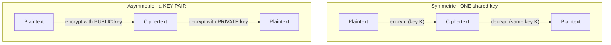
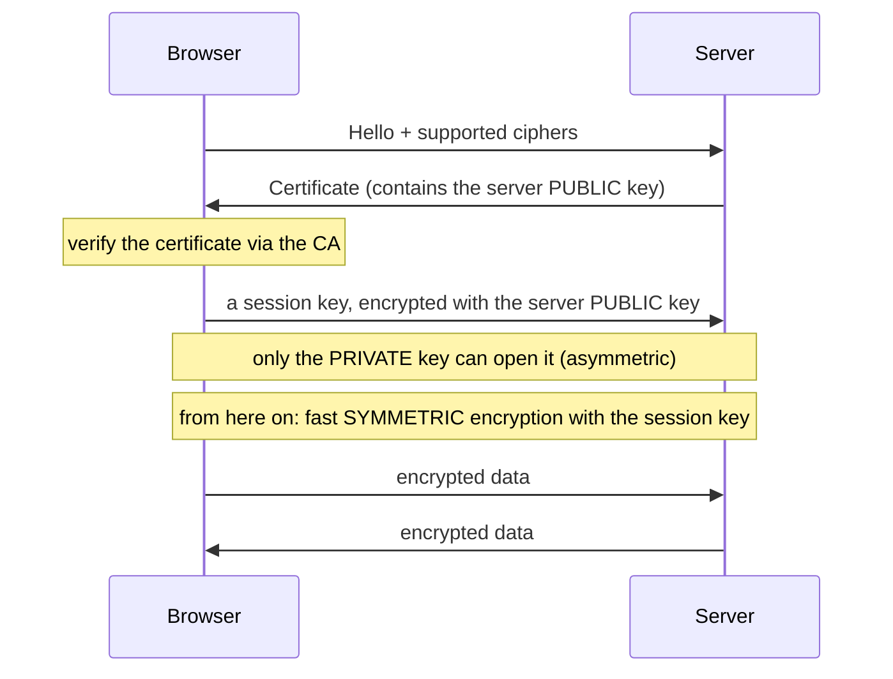

# פרק ⁦7⁩ – מערכות הצפנה וקריפטולוגיה

_⁦11⁩ שעות עיוני + ⁦3⁩ מעשי · שבועות ⁦20⁩–⁦23⁩_

> **מטרות:** קריפטולוגיה · הצפנה, קידוד, ⁦hashing⁩ · סימטרי מול א-סימטרי · חתימה דיגיטלית · ⁦PKI⁩  
> **בבגרות:** ⁦Diffie-Hellman⁩, צופן קיסר ו-⁦mod 26⁩, מפתח ציבורי/פרטי, ⁦AES⁩ מול ⁦hash⁩ (סודיות)

> 📘 **לפני שמתחילים – שלושה מושגים שמבלבלים (למי שאין רקע)**
>
> כל הפרק בנוי על הבחנה בין שלושה דברים שנראים דומים אבל שונים לגמרי: 
> - **קידוד (⁦Encoding)⁩** – שינוי **צורת הכתיבה** של מידע לנוחות, **בלי סוד**. כל אחד יכול להחזיר. דוגמה: מורס, ⁦Base64.⁩ **זו אינה אבטחה.**
> - **הצפנה (⁦Encryption)⁩** – ערבוב המידע בעזרת **מפתח סודי**, כך שרק מי שיש לו המפתח יכול לפענח. הפיך **עם המפתח**. מטרה: **סודיות**.
> - **גיבוב (⁦Hashing)⁩** – "טביעת אצבע" של המידע: פונקציה **חד-כיוונית** שאי אפשר להפוך. מטרה: לבדוק ש**המידע לא שונה (שלמות)**. **אנלוגיה:** קידוד = לכתוב מילה הפוך (כל אחד קורא). הצפנה = כספת עם מפתח (רק בעל המפתח פותח). גיבוב = לטחון פרי לשייק (אי אפשר להחזיר את הפרי, אבל אותו פרי תמיד נותן אותו שייק).   
> **מושג מפתח:** "מפתח" (⁦Key)⁩ בהצפנה = מספר/מחרוזת סודית שקובעת איך המידע יעורבב. בלי המפתח הנכון, המידע המוצפן נראה כג'יבריש.

## ⁦7.1⁩ מושגי יסוד – ולמה קידוד אינו הצפנה

|  |  |
| --- | --- |
| קריפטוגרפיה | מדע כתיבת ההצפנות (יצירת צפנים) |
| קריפטואנליזה | מדע שבירת ההצפנות |
| קריפטולוגיה | שם כולל לשתיהן |
| ⁦Plaintext⁩ | הטקסט הגלוי, לפני הצפנה |
| ⁦Ciphertext⁩ | הטקסט המוצפן |
| ⁦Cipher /⁩ אלגוריתם | שיטת ההצפנה (קיסר, ⁦AES)⁩ |
| ⁦Key⁩ (מפתח) | הסוד שמשנה את פעולת האלגוריתם |

> 📘 **שלושה מושגים שמבלבלים – חשוב מאוד להבחין**
>
> **קידוד (⁦Encoding)⁩** – המרת ייצוג לנוחות/תאימות, **ללא סוד**. ⁦Base64, ASCII, Morse.⁩ כל אחד יכול לפענח – זו לא אבטחה!  
>  **הצפנה (⁦Encryption)⁩** – המרה **הפיכה** בעזרת מפתח סודי; רק מי שיש לו המפתח מפענח. מטרה: **סודיות**.  
>  **גיבוב (⁦Hashing)⁩** – פונקציה **חד-כיוונית**, ללא מפתח, פלט קבוע-אורך. אי אפשר להפוך. מטרה: **שלמות**.

> ⚠️ **טעות נפוצה מסוכנת**
>
> תלמידים (ומתכנתים!) חושבים ש-⁦Base64⁩ היא "הצפנה". `⁦btoa("password")⁩` אינו מאבטח דבר. אם רואים "==" בסוף מחרוזת – זה כמעט תמיד ⁦Base64⁩ (קידוד), ופענוח לוקח שנייה. השאלה המבחינה: "האם צריך סוד כדי לחזור?" קידוד – לא. הצפנה – כן.

### עקרון קרקהופס (⁦Kerckhoffs)⁩

"מערכת צריכה להיות מאובטחת גם אם **הכול ידוע חוץ מהמפתח**." המשמעות: לא סומכים על סודיות האלגוריתם ("⁦security through obscurity"⁩ זה רע), אלא על סודיות המפתח בלבד. לכן ⁦AES⁩ פורסם לכל העולם – וזו דווקא הסיבה שסומכים עליו: מיליוני מומחים ניסו לשבור ולא הצליחו.

## ⁦7.2⁩ היסטוריה – מקיסר עד אניגמה

### צופן קיסר (⁦Caesar)⁩ – נשאל בבגרות

הזזת כל אות במספר קבוע. יוליוס קיסר השתמש בהזזה של ⁦3: A⁩→⁦D, B⁩→⁦E⁩… הנוסחה (עבור אנגלית, ⁦26⁩ אותיות, ⁦A=0)⁩:

> 📘 **הצפנה: ⁦C = (P + K) mod 26⁩ · פענוח: ⁦P = (C⁩ − ⁦K) mod 26⁩**
>
> דוגמה עם ⁦K=10⁩: האות ⁦H (=7)⁩ ⇒ ⁦C = (7+10) mod 26 = 17 = R.⁩ האות ⁦Z (=25)⁩ ⇒ ⁦C = (25+10) mod 26 = 35 mod 26 = 9 = J.⁩ ה-⁦mod "⁩מגלגל" חזרה להתחלה.

> 📝 **בבגרות (שאלה ⁦5⁩ג)**
>
> "בצופן קיסר ⁦C=P+10 (mod 26).⁩ מה תפקידו של ⁦mod 26⁩?" – **מספר האותיות (האפשרויות) בשפה האנגלית**; ה-⁦mod⁩ מבטיח שהתוצאה תישאר בטווח ⁦0⁩–⁦25⁩ ו"תתגלגל" מ-⁦Z⁩ חזרה ל-⁦A.⁩ *לא* מספר הפעולות ולא גרסת האלגוריתם.

### צפנים היסטוריים נוספים

| **צופן** | **סוג** | **רעיון** | **חולשה** |
| --- | --- | --- | --- |
| ⁦Caesar / ROT13⁩ | החלפה (⁦substitution)⁩, חד-אלפביתי | הזזה קבועה | ⁦26⁩ מפתחות בלבד; ניתוח תדירות |
| ⁦Monoalphabetic⁩ | החלפה | כל אות ↔ אות אחרת (⁦26⁩! מפתחות) | ניתוח תדירות אותיות (⁦E⁩ הכי נפוצה) |
| ⁦Vigen⁩è⁦re⁩ | החלפה רב-אלפביתית | קיסר עם מפתח מתחלף לפי מילה | נשבר (⁦Kasiski)⁩ אך חזק בהרבה |
| ⁦Transposition (Rail Fence)⁩ | שחלוף | שינוי סדר האותיות | סדר בלבד – ניתן לניתוח |
| ⁦Enigma⁩ | רוטורי | מכונת רוטורים גרמנית (⁦WWII)⁩ | נשברה ע"י טיורינג בבלצ'לי פארק |
| ⁦One-Time Pad | XOR⁩ עם מפתח אקראי באורך ההודעה | המפתח היחיד שהוכח מתמטית כבלתי שביר | לא מעשי – מפתח באורך ההודעה, פעם אחת |

> 📖 **סיפור מהחיים: אלן טיורינג ואניגמה**
>
> בזמן מלחמת העולם השנייה הצי הגרמני הצפין הודעות במכונת ⁦Enigma⁩ – ⁦158⁩ מיליון מיליון מיליון הגדרות אפשריות. אלן טיורינג וצוותו בבלצ'לי פארק בנו מכונה חשמלית ("⁦The Bombe")⁩ שניצלה חולשה: אות לעולם לא מוצפנת לעצמה, ומילים צפויות ("⁦Wetter"⁩=מזג אוויר) הופיעו כל בוקר. ההערכה: שבירת ⁦Enigma⁩ קיצרה את המלחמה בכשנתיים. הלקח לכיתה: אלגוריתם עם מרחב מפתחות ענק עדיין נשבר אם יש בו חולשה מבנית או שימוש לא נכון – בדיוק העיקרון של קרקהופס.

## ⁦7.3⁩ מטרות האבטחה ואיזה כלי קריפטוגרפי נותן מה

| **מטרה** | **הכלי הקריפטוגרפי** |
| --- | --- |
| **סודיות** (⁦Confidentiality)⁩ | הצפנה – סימטרית (⁦AES)⁩ או א-סימטרית (⁦RSA)⁩ |
| **שלמות** (⁦Integrity) | Hash (SHA-256)⁩ |
| **אימות** (⁦Authentication)⁩ + שלמות עם מפתח משותף | ⁦HMAC⁩ |
| **אימות + אי-הכחשה** (⁦Non-repudiation)⁩ | חתימה דיגיטלית (⁦hash⁩ מוצפן במפתח פרטי) |

> 📝 **בבגרות (שאלה ⁦5⁩ה)**
>
> "איזה אלגוריתם מבטיח סודיות של מידע מוצפן?" ⁦1. MD5 2. WPA-2 3. AES 4. HASH⁩ – התשובה **⁦3. AES**. MD5⁩ ו-⁦HASH⁩ נותנים שלמות (לא סודיות); ⁦WPA-2⁩ הוא פרוטוקול אבטחת ⁦Wi-Fi⁩, לא אלגוריתם הצפנה.

## ⁦7.4⁩ גיבוב (⁦Hashing)⁩

פונקציית גיבוב מקבלת קלט בכל אורך ומחזירה פלט קבוע (⁦digest).⁩ תכונות נדרשות: **חד-כיווניות** (אי אפשר לשחזר קלט), **דטרמיניסטיות** (אותו קלט → אותו פלט), **אפקט מפולת** (שינוי ביט אחד → פלט שונה לגמרי), **עמידות להתנגשויות** (קשה למצוא שני קלטים עם אותו ⁦hash).⁩

| **אלגוריתם** | **אורך פלט** | **מצב** |
| --- | --- | --- |
| **⁦MD5** | 128⁩ ביט | **שבור** – התנגשויות ידועות. לא לאבטחה. (מוזכר בתכנית) |
| **⁦SHA-1** | 160⁩ ביט | **שבור** (⁦2017, "SHATTERED").⁩ לא לשימוש. (מוזכר בתכנית) |
| **⁦SHA-2** (SHA-256/512) | 256/512⁩ ביט | הסטנדרט הנוכחי |
| **⁦SHA-3⁩** | משתנה | חלופה מודרנית |

### שימושים

- **שלמות קבצים** – מורידים ⁦ISO⁩ ומשווים ⁦SHA-256⁩ לזה שבאתר; אם שונה – הקובץ שונה/פגום.
- **אחסון סיסמאות** – שומרים ⁦hash⁩, לא את הסיסמה. בכניסה מגבבים ומשווים. חובה **⁦salt⁩** (מלח – ערך אקראי לכל סיסמה) נגד ⁦rainbow tables⁩, ופונקציה איטית (⁦bcrypt/Argon2/PBKDF2)⁩ נגד ⁦brute force.⁩
- בסיס ל-⁦HMAC⁩ ולחתימה דיגיטלית.

> ❓ **שאלת תלמיד: "אם ⁦hash⁩ חד-כיווני, איך אתרים 'שוברים' ⁦MD5⁩?"**
>
> הם לא "הופכים" אותו – הם מנחשים. מחשבים מראש ⁦hash⁩ של מיליארדי סיסמאות נפוצות (⁦rainbow table)⁩ ומחפשים התאמה. לכן: (⁦1) salt⁩ – הופך כל טבלה מוכנה ללא רלוונטית; (⁦2)⁩ פונקציה איטית – אם כל ניחוש לוקח ⁦0.5⁩ שנייה, מיליארד ניחושים = ⁦15⁩ שנה. ⁦MD5⁩ מהיר מדי בדיוק בגלל זה.

## ⁦7.5⁩ הצפנה סימטרית

**מפתח אחד** משמש גם להצפנה וגם לפענוח, ומשותף לשני הצדדים.

`[⁦Plaintext]⁩ → 🔑 → [⁦Ciphertext]⁩ → 🔑(אותו) → [⁦Plaintext]⁩`

| **אלגוריתם** | **אורך מפתח** | **הערכה** |
| --- | --- | --- |
| **⁦DES** | 56⁩ ביט | שבור (מפתח קצר מדי, נפרץ ב-⁦1998⁩ ביום) |
| **⁦3DES** | 112/168⁩ ביט | מיושן אך נסבל; ⁦DES⁩ שלוש פעמים |
| **⁦AES** | 128/192/256⁩ | **הסטנדרט העולמי** (⁦Rijndael, 2001).⁩ מהיר, מאובטח, בחומרה |
| ⁦RC4⁩ | משתנה (זרם) | שבור – היה ב-⁦WEP/SSL⁩ |
| ⁦SEAL, Blowfish⁩ |  | מוזכרים בתכנית; פחות בשימוש היום |

שני סוגים: **⁦block cipher** (AES⁩ – מצפין בלוקים של ⁦128⁩ ביט; מצבי פעולה ⁦CBC, GCM)⁩ ו-**⁦stream cipher** (RC4⁩ – ביט אחר ביט).

| **יתרונות סימטרי** | **חסרונות סימטרי** |
| --- | --- |
| מהיר מאוד (פי ⁦1000⁩ מא-סימטרי); מתאים לכמויות מידע גדולות; מפתחות קצרים יחסית | **בעיית חלוקת המפתח** – איך מעבירים את המפתח בבטחה? **בעיית מדרגיות** – ל-⁦N⁩ משתמשים צריך ⁦N(N⁩−⁦1)/2⁩ מפתחות (⁦100⁩ איש = ⁦4,950⁩ מפתחות) |

## ⁦7.6⁩ הצפנה א-סימטרית (מפתח ציבורי)

לכל צד **זוג מפתחות** מתמטית קשורים: **ציבורי** (מפרסמים לכולם) ו**פרטי** (סוד מוחלט). מה שאחד מצפין – רק השני מפענח. זה פותר את בעיית חלוקת המפתח.

> 📘 **שני שימושים הפוכים – חובה להבין**
>
> **לסודיות:** מצפינים ב**ציבורי של הנמען** ⇒ רק הנמען (בעל הפרטי) יפענח. (בבגרות ⁦4⁩ו + ⁦5⁩ד)  
>  **לחתימה/אימות:** מצפינים ב**פרטי של השולח** ⇒ כל אחד מפענח בציבורי שלו, ובכך מוכיח שהשולח אכן שלח (רק לו יש את הפרטי).

> 📝 **בבגרות (שאלה ⁦5⁩ד)**
>
> "האלגוריתם הא-סימטרי משתמש במפתח הציבורי להצפנה – איזה מפתח לפענוח?" – **⁦1.⁩ מפתח פרטי**.

| **אלגוריתם** | **שימוש** |
| --- | --- |
| **⁦RSA⁩** | הצפנה + חתימה; הנפוץ ביותר. בנתב סיסקו: מפתחות ⁦RSA⁩ ל-⁦SSH⁩ (פרק ⁦2⁩!) |
| **⁦Diffie-Hellman (DH)⁩** | **החלפת מפתחות** – מסכימים על מפתח סודי משותף בערוץ ציבורי, בלי לשלוח אותו |
| **⁦DSA⁩** | חתימה דיגיטלית בלבד (מוזכר בתכנית) |
| **⁦ECC⁩** | עקומים אליפטיים – אבטחה זהה במפתח קצר בהרבה (מודרני) |

> 📘 **⁦Diffie-Hellman⁩ במשל הצבעים (הכי טוב לכיתה)**
>
> אליס ובוב רוצים סוד משותף מול מאזין. ⁦1.⁩ מסכימים בפומבי על צבע בסיס (צהוב). ⁦2.⁩ כל אחד בוחר צבע סודי ומערבב עם הצהוב. ⁦3.⁩ מחליפים את התערובות **בפומבי** (המאזין רואה אותן). ⁦4.⁩ כל אחד מוסיף את הסוד *שלו* לתערובת שקיבל. שניהם מגיעים לאותו צבע סופי – **אבל המאזין לא יכול**, כי הפרדת צבעים היא "בלתי הפיכה" (כמו לוגריתם דיסקרטי במתמטיקה). זה בדיוק ⁦DH.⁩

> 📝 **בבגרות (שאלה ⁦4⁩ו)**
>
> "איזה אלגוריתם מאפשר לצדדים להסכים על מפתח פרטי על גבי ערוץ ציבורי?" – **⁦2. Diffie-Hellman**. (NOBLE, Dijkstra, Caesar⁩ – מסיחים; ⁦Dijkstra⁩ הוא אלגוריתם מסלולים, לא הצפנה.)

### 📊 תרשים: הצפנה סימטרית לעומת א-סימטרית

_סימטרי: מהיר, אך בעיית הפצת המפתח. א-סימטרי: פותר הפצה, אך איטי. ⁦TLS⁩ משלב את שניהם ↓_

## ⁦7.7⁩ הצפנה היברידית – איך זה באמת עובד (⁦TLS/HTTPS)⁩

המערכות האמיתיות משלבות: א-סימטרי לפתיחה, סימטרי לתעבורה – "טוב משני העולמות".

> 📘 **⁦HTTPS⁩ – מה קורה כשנכנסים לאתר בנק**
>
> ⁦1.⁩ הדפדפן והשרת מבצעים **⁦DH⁩** (או שהדפדפן מצפין מפתח ב-⁦RSA⁩ הציבורי של השרת) כדי להסכים על **מפתח סימטרי (⁦session key)**. 2.⁩ השרת מציג **תעודה** חתומה על ידי ⁦CA⁩ שמוכיחה שהוא באמת הבנק (⁦7.9). 3.⁩ מכאן כל התעבורה מוצפנת ב-**⁦AES⁩** (מהיר) עם ה-⁦session key.⁩ הא-סימטרי שימש רק לשנייה הראשונה. זו הסיבה שרואים 🔒.

### 📊 תרשים: לחיצת יד היברידית ב-⁦TLS/HTTPS (Sequence)⁩

_א-סימטרי (איטי) רק כדי להעביר מפתח סימטרי בבטחה, ואז סימטרי (מהיר) לכל הנתונים._

## ⁦7.8 HMAC⁩ וחתימה דיגיטלית

### ⁦HMAC (Hash-based Message Authentication Code)⁩

⁦hash⁩ לבדו נותן שלמות, אבל תוקף ⁦MITM⁩ יכול לשנות גם את ההודעה וגם את ה-⁦hash. **HMAC** = hash⁩ של (ההודעה + מפתח סודי משותף). עכשיו רק מי שיש לו המפתח יכול לחשב ⁦HMAC⁩ תקין ⇒ **שלמות + אימות מקור**. משמש ב-⁦IPsec⁩ (פרק ⁦8)⁩, ב-⁦API⁩, ו-⁦JWT.⁩

### חתימה דיגיטלית

> 📘 **התהליך**
>
> **חתימה (השולח):** ⁦1.⁩ מחשב ⁦hash⁩ של המסמך. ⁦2.⁩ מצפין את ה-⁦hash⁩ ב**מפתח הפרטי שלו** = החתימה. שולח מסמך + חתימה.  
>  **אימות (המקבל):** ⁦1.⁩ מפענח את החתימה ב**מפתח הציבורי של השולח** ⇒ מקבל את ה-⁦hash⁩ המקורי. ⁦2.⁩ מחשב ⁦hash⁩ של המסמך שקיבל. ⁦3.⁩ משווה. תואם ⇒ המסמך לא שונה (שלמות) **וגם** נשלח באמת על ידו (אימות + אי-הכחשה – רק לו יש את הפרטי).

למה מצפינים את ה-⁦hash⁩ ולא את כל המסמך? כי א-סימטרי איטי; ה-⁦hash⁩ קטן וקבוע.

## ⁦7.9 PKI⁩ ותעודות דיגיטליות

בעיית ⁦DH⁩ ו-⁦RSA⁩: איך אני יודע שהמפתח הציבורי "של הבנק" באמת שייך לבנק ולא לתוקף ⁦MITM⁩? הפתרון: **⁦PKI** (Public Key Infrastructure)⁩ – מערכת של גורמים מהימנים שמאשרים "מפתח ציבורי ⁦X⁩ שייך לישות ⁦Y".⁩

|  |  |
| --- | --- |
| תעודה דיגיטלית (⁦Certificate)⁩ | מסמך שקושר זהות למפתח ציבורי, **חתום דיגיטלית על ידי ⁦CA**.⁩ תקן: ⁦X.509.⁩ |
| ⁦CA (Certificate Authority)⁩ | הגורם המהימן שמנפיק וחותם תעודות (⁦DigiCert, Let's Encrypt).⁩ |
| ⁦RA (Registration Authority)⁩ | מאמת את זהות המבקש לפני הנפקה. |
| ⁦CRL / OCSP⁩ | רשימת/בדיקת תעודות שבוטלו (למשל אם מפתח פרטי נגנב). |
| ⁦Root CA⁩ | ה-⁦CA⁩ העליון; התעודה שלו מובנית במערכת ההפעלה/דפדפן ("⁦trust anchor").⁩ |

> 📘 **שרשרת אמון (⁦Chain of Trust)⁩ – היררכיה**
>
> ⁦Root CA⁩ (סומכים עליו מראש) → חותם על → ⁦Intermediate CA⁩ → חותם על → תעודת השרת (⁦bank.com).⁩ הדפדפן בודק את השרשרת עד ל-⁦root⁩ שהוא מכיר. אם חוליה חסרה או פגה – אזהרה. זו ה"היררכיית סטנדרטים ואישורי סטנדרטים" שבתכנית.

> 📖 **סיפור מהחיים: ⁦DigiNotar⁩ – כש-⁦CA⁩ נפרץ (⁦2011)⁩**
>
> תוקף פרץ ל-⁦CA⁩ ההולנדי ⁦DigiNotar⁩ והנפיק לעצמו תעודה מזויפת ל-*.⁦google.com.⁩ עם התעודה הזו, המודיעין האיראני (ככל הנראה) ביצע ⁦MITM⁩ על ⁦Gmail⁩ של ⁦300,000⁩ אזרחים איראנים – הדפדפן שלהם הציג 🔒 ירוק ולא חשד בכלום, כי התעודה הייתה "חתומה כדין". כשהתגלה, הדפדפנים הסירו את ⁦DigiNotar⁩ מרשימת ה-⁦root⁩ המהימנים, והחברה פשטה רגל תוך חודש. הלקח: כל מודל האמון של האינטרנט נשען על כך שה-⁦CA⁩-ים ישרים ומאובטחים – חוליה אחת שבורה מפילה הכול.

## ⁦7.10⁩ חוזק מפתחות ומדיניות ⁦NSA/NIST⁩

- **מפתח ארוך = מרחב חיפוש גדול יותר**. סימטרי ⁦128⁩ ביט = ⁦2⁩^⁦128⁩ אפשרויות – מעבר להישג יד גם למחשבי-על. אבל אורך מפתח א-סימטרי אינו בר-השוואה ישירה: ⁦RSA 2048⁩ ≈ ⁦AES 112⁩ בערך.
- המלצות (⁦NIST SP 800): AES-128⁩ ומעלה, ⁦RSA-2048⁩ ומעלה (רצוי ⁦3072), SHA-256⁩ ומעלה, ⁦ECC-256.⁩
- **⁦Suite B⁩** של ה-⁦NSA⁩ (מוזכר "חוקי ⁦NSA"): AES, ECDH, ECDSA, SHA-2⁩ – לתקשורת ממשלתית.
- **ניהול מפתחות** (הנושא "ניהול מפתחות ע"י שינוי אחסון וריפיקציה"): יצירה, אחסון מאובטח (⁦HSM)⁩, החלפה תקופתית (⁦rotation)⁩, ביטול, גיבוי. מפתח שנחשף = כל מה שהוצפן בו חשוף.
- איום עתידי: **מחשוב קוונטי** יאיים על ⁦RSA/DH⁩ ⇒ קריפטוגרפיה פוסט-קוונטית (⁦NIST⁩ בחר אלגוריתמים ב-⁦2024).⁩

## ⁦7.11⁩ תרגילים לתלמידים

> ✏️ **תרגיל ⁦1⁩ – צופן קיסר**
>
> עם ⁦K=3⁩: הצפינו את המילה `⁦NET⁩`. עם ⁦K=5⁩: פענחו את `⁦MJQQT⁩`. (⁦A=0⁩…⁦Z=25)⁩
>
> **תשובה:** ⁦NET: N(13)⁩→⁦Q, E(4)⁩→⁦H, T(19)⁩→⁦W = **QHW**.⁩ פענוח ⁦MJQQT⁩ עם ⁦K=5: M(12)-5=H, J(9)-5=E, Q(16)-5=L, Q⁩→⁦L, T(19)-5=O = **HELLO**.⁩

> ✏️ **תרגיל ⁦2⁩ – איזה כלי לאיזו מטרה**
>
> לכל דרישה בחרו: ⁦hash /⁩ הצפנה סימטרית / א-סימטרית / ⁦HMAC /⁩ חתימה דיגיטלית.  
>  א. לוודא שקובץ שהורד לא שונה. ב. להצפין ⁦10GB⁩ גיבוי במהירות. ג. לשלוח מפתח סודי דרך האינטרנט בבטחה. ד. לוודא שעדכון תוכנה הגיע באמת מהיצרן. ה. לאחסן סיסמאות במסד נתונים.
>
> **תשובה:** א. ⁦hash⁩ ב. סימטרית (⁦AES)⁩ ג. א-סימטרית / ⁦DH⁩ ד. חתימה דיגיטלית ה. ⁦hash + salt⁩ (פונקציה איטית)

> ✏️ **תרגיל ⁦3⁩ – ציבורי או פרטי?**
>
> דנה רוצה לשלוח ליוסי הודעה סודית, ולחתום עליה. איזה מפתח היא משתמשת בכל שלב?  
>  א. להצפין את ההודעה כך שרק יוסי יקרא. ב. לחתום כדי שיוסי ידע שזה ממנה. ואצל יוסי: ג. לפענח את ההודעה. ד. לאמת את החתימה.
>
> **תשובה:** א. הציבורי של יוסי ב. הפרטי של דנה ג. הפרטי של יוסי ד. הציבורי של דנה

> ✏️ **תרגיל ⁦4⁩ – קידוד/הצפנה/גיבוב**
>
> סווגו כל אחד: א. `⁦btoa⁩` ל-⁦Base64.⁩ ב. ⁦SHA-256.⁩ ג. ⁦AES-256-CBC.⁩ ד. ⁦Morse.⁩ ה. ⁦bcrypt.⁩
>
> **תשובה:** א. קידוד ב. גיבוב ג. הצפנה ד. קידוד ה. גיבוב (איטי, לסיסמאות)

> ✏️ **תרגיל ⁦5⁩ – דיון: התנגשות**
>
> הסבירו במילים שלכם מדוע "עמידות להתנגשויות" חשובה לחתימה דיגיטלית. מה תוקף יכול לעשות אם הוא מוצא שני מסמכים עם אותו ⁦hash⁩?
>
> **תשובה:** בחתימה חותמים על ה-⁦hash.⁩ אם התוקף מוצא מסמך זדוני עם אותו ⁦hash⁩ כמו מסמך תמים שנחתם – החתימה "תקפה" גם על הזדוני, והוא יכול להחליף אותם. בדיוק בגלל זה ⁦MD5⁩ ו-⁦SHA-1⁩ פסולים לחתימה.

## ⁦7.12⁩ שאלות בסגנון בגרות

> 📝 **שאלה ⁦1⁩**
>
> איזה אלגוריתם מבטיח סודיות של מידע מוצפן? ⁦MD5 / WPA-2 / AES / HASH⁩
>
> **תשובה:** **⁦AES**.⁩ השאר: ⁦MD5/HASH⁩ – שלמות; ⁦WPA-2⁩ – פרוטוקול.

> 📝 **שאלה ⁦2⁩**
>
> בצופן ⁦C=(P+K) mod 26⁩, מה תפקיד ה-⁦mod 26⁩?
>
> **תשובה:** מספר האותיות בשפה; "מגלגל" את התוצאה חזרה לטווח ⁦0⁩–⁦25.⁩

> 📝 **שאלה ⁦3⁩**
>
> כאשר האלגוריתם הא-סימטרי מצפין במפתח ציבורי – באיזה מפתח מפענחים?
>
> **תשובה:** במפתח הפרטי (של הנמען).

> 📝 **שאלה ⁦4⁩**
>
> איזה אלגוריתם מאפשר לשני צדדים להסכים על מפתח סודי משותף מעל ערוץ ציבורי?
>
> **תשובה:** ⁦Diffie-Hellman.⁩

> 📝 **שאלה ⁦5⁩**
>
> מהו ההבדל העיקרי בין הצפנה סימטרית לא-סימטרית מבחינת מפתחות, ומהו החיסרון המרכזי של כל אחת?
>
> **תשובה:** סימטרית – מפתח אחד משותף; חיסרון: חלוקת המפתח ומדרגיות. א-סימטרית – זוג מפתחות (ציבורי/פרטי); חיסרון: איטית מאוד.

> 📝 **שאלה ⁦6⁩**
>
> מדוע נדרשת ⁦PKI⁩, ומה תפקיד ה-⁦CA⁩?
>
> **תשובה:** כדי לוודא שמפתח ציבורי אכן שייך לישות שהוא טוען (נגד ⁦MITM).⁩ ה-⁦CA⁩ הוא גורם מהימן שמנפיק וחותם תעודות שמקשרות זהות למפתח ציבורי.

## ⁦7.13⁩ מעבדה (⁦3⁩ שעות)

⁦1.⁩ **קיסר:** באתר ⁦cryptii.com⁩ הצפינו ופענחו; בדקו כמה מהר ⁦brute force⁩ על ⁦25⁩ מפתחות שובר אותו.
⁦2. **Hash⁩:** באתר (או `⁦echo -n "password" | sha256sum⁩`) חשבו ⁦SHA-256⁩ של "⁦hello"⁩ ושל "⁦Hello"⁩ – ראו את אפקט המפולת. שנו ביט אחד וראו פלט שונה לגמרי.
⁦3.⁩ **שלמות:** הורידו קובץ, שנו בו תו אחד, חשבו ⁦hash⁩ לפני ואחרי – הראו שהשתנה.
⁦4.⁩ **סיסמאות:** הראו ⁦rainbow table⁩ אונליין ששובר ⁦MD5⁩ של "⁦123456"⁩, ואיך ⁦salt⁩ מסכל אותו.
⁦5.⁩ **תעודות:** בדפדפן, לחצו על 🔒 של אתר בנק, הציגו את התעודה, את ה-⁦CA⁩ ואת שרשרת האמון ותוקף התעודה.
⁦6. **RSA⁩ ל-⁦SSH⁩ (קישור לפרק ⁦2)⁩:** ב-⁦Packet Tracer⁩ צרו מפתחות ⁦RSA⁩ בנתב והתחברו ב-⁦SSH⁩ – הדגישו שאלה בדיוק הא-סימטרי בפעולה.

## ❓ חידון – בדקו את עצמכם

**⁦1.⁩** מה ההבדל בין קידוד (⁦Encoding)⁩ להצפנה (⁦Encryption)⁩?
- א. אין הבדל · ב. קידוד הפיך לכל אחד (⁦Base64)⁩; הצפנה דורשת **מפתח** סודי · ג. קידוד בטוח יותר · ד. הצפנה ישנה

תשובה
**ב** – ⁦Base64⁩ אינו אבטחה. בלי מפתח סודי אין סודיות.

**⁦2.⁩** עקרון קרקהופס (⁦Kerckhoffs)⁩ אומר:
- א. המפתח צריך להיות ארוך · ב. הביטחון צריך להישען על סודיות ה**מפתח** בלבד, לא על סודיות ה**אלגוריתם** · ג. אין להשתמש בהצפנה · ד. האלגוריתם סודי

תשובה
**ב** – "אבטחה דרך עמימות" (⁦Security by Obscurity)⁩ היא רעה. האלגוריתם יכול להיות פומבי.

**⁦3.⁩** גיבוב (⁦Hashing)⁩ מספק:
- א. סודיות · ב. שלמות (⁦Integrity)⁩ – טביעת אצבע חד-כיוונית · ג. זמינות · ד. אימות משתמש

תשובה
**ב** – משנים ביט אחד → הגיבוב משתנה לגמרי. חד-כיווני: אי אפשר לשחזר.

**⁦4.⁩** הצפנה **סימטרית** משתמשת ב:
- א. שני מפתחות שונים · ב. **אותו מפתח** להצפנה ולפענוח (⁦AES)⁩ · ג. גיבוב · ד. ללא מפתח

תשובה
**ב** – מהירה, אך בעיית **הפצת המפתח**: איך מעבירים אותו בבטחה?

**⁦5.⁩** הצפנה **א-סימטרית** משתמשת ב:
- א. אותו מפתח · ב. זוג מפתחות: **ציבורי** (מצפין) ו**פרטי** (מפענח) · ג. ללא מפתח · ד. שלושה מפתחות

תשובה
**ב** – מה שהוצפן במפתח הציבורי נפתח רק בפרטי, ולהיפך. פותר הפצת מפתח.

**⁦6.⁩** מדוע ⁦TLS/HTTPS⁩ משתמש בהצפנה **היברידית**?
- א. לגיוון · ב. א-סימטרית (איטית) להעברת מפתח סימטרי בבטחה, ואז סימטרית (מהירה) לנתונים · ג. כי סימטרית לא בטוחה · ד. מקרי

תשובה
**ב** – משלב את הבטיחות של הא-סימטרית עם המהירות של הסימטרית.

**⁦7.⁩** חתימה דיגיטלית מספקת:
- א. סודיות בלבד · ב. אימות, שלמות ואי-הכחשה (מצפינים גיבוב במפתח הפרטי של השולח) · ג. זמינות · ד. מהירות

תשובה
**ב** – רק בעל המפתח הפרטי יכול לחתום; כולם מאמתים במפתח הציבורי שלו.

**⁦8.⁩** מהי תעודה דיגיטלית (⁦Certificate)⁩ ומי מנפיק אותה?
- א. סיסמה; המשתמש · ב. קושרת זהות למפתח ציבורי; מונפקת ונחתמת על ידי **⁦CA⁩** (רשות אישורים) · ג. וירוס; תוקף · ד. גיבוי; השרת

תשובה
**ב** – ה-⁦CA⁩ ערב לכך שהמפתח הציבורי באמת שייך לאתר. הבסיס ל-⁦PKI.⁩

**⁦9.** Diffie-Hellman⁩ משמש ל:
- א. הצפנת קבצים · ב. **החלפת מפתחות** בבטחה על גבי ערוץ לא מאובטח · ג. גיבוב · ד. חתימה

תשובה
**ב** – שני צדדים מסכימים על מפתח סודי משותף בלי לשלוח אותו.

**⁦10.⁩** מדוע ⁦MD5⁩ ו-⁦SHA-1⁩ כבר לא מומלצים?
- א. הם איטיים · ב. נמצאו בהם **התנגשויות** (⁦Collisions)⁩ – שני קלטים שונים עם אותו גיבוב · ג. הם ארוכים מדי · ד. הם של ⁦Cisco⁩

תשובה
**ב** – משתמשים ב-⁦SHA-256⁩ ומעלה. התנגשות שוברת את הבטחת השלמות.

## בנק שאלות שתלמידים שואלים – ותשובות מוכנות

שאלות נפוצות בפרק ההצפנה, עם תשובות מוכנות.

**ש: "אם גיבוב הוא חד-כיווני, איך אתרים 'שוברים' סיסמאות ⁦MD5⁩?"**  
ת: הם לא הופכים את הגיבוב – הם **מנחשים**. מחשבים מראש את הגיבוב של מיליארדי סיסמאות נפוצות (טבלת ⁦rainbow)⁩ ומחפשים התאמה. לכן: מוסיפים **⁦salt⁩** (ערך אקראי לכל סיסמה) שהופך טבלה מוכנה לחסרת ערך, ומשתמשים בפונקציה **איטית** (⁦bcrypt)⁩ שהופכת ניחוש המוני לבלתי מעשי.

**ש: "אז ⁦Base64⁩ זו הצפנה?"**  
ת: לא! ⁦Base64⁩ הוא **קידוד** – שינוי צורת כתיבה בלי סוד. כל אחד מפענח אותו בשנייה (רמז: מחרוזת שמסתיימת ב-'=='). קידוד ≠ הצפנה. השאלה המבחינה: "האם צריך מפתח סודי כדי לחזור?".

**ש: "אם אני מצפין הכול ב-⁦AES⁩, אני מוגן לגמרי?"**  
ת: הצפנה נותנת **סודיות** בלבד. היא לא מונעת מחיקה של הקובץ (זמינות – כופרה דווקא *משתמשת* בהצפנה נגדכם!) ולא בהכרח מוודאת שהמידע לא שונה (שלמות – לזה צריך גיבוב/⁦HMAC).⁩ צריך את שלושתם.

**ש: "מה ההבדל בין סימטרי לא-סימטרי, ומתי משתמשים בכל אחד?"**  
ת: **סימטרי** (⁦AES)⁩ = מפתח אחד משותף, מהיר מאוד – טוב לכמויות מידע גדולות, אבל יש בעיה: איך מעבירים את המפתח בבטחה? **א-סימטרי** (⁦RSA/DH)⁩ = זוג מפתחות ציבורי/פרטי, פותר את בעיית העברת המפתח, אבל איטי. בפועל **משלבים**: א-סימטרי כדי להסכים על מפתח, ואז סימטרי לתעבורה (כך עובד ⁦HTTPS).⁩

**ש: "אם המפתח הציבורי גלוי לכולם, איך זה מאובטח?"**  
ת: כי מה שמוצפן במפתח הציבורי ניתן לפענוח **רק** במפתח הפרטי התואם, שנשאר סודי אצל הבעלים. גם אם כל העולם מכיר את המפתח הציבורי שלכם – רק אתם יכולים לפענח את מה ששלחו אליכם.

**ש: "איך ⁦Diffie-Hellman⁩ מסכים על מפתח סודי אם המאזין רואה הכול?"**  
ת: משל הצבעים: כל צד מערבב צבע סודי עם צבע בסיס משותף, מחליפים את התערובות בפומבי, וכל אחד מוסיף שוב את הסוד שלו. שניהם מגיעים לאותו צבע – אבל המאזין לא יכול, כי "הפרדת צבעים" (לוגריתם דיסקרטי) היא בלתי הפיכה מעשית. ⁦DH⁩ לא מעביר את המפתח – הוא **מייצר** אותו בשני הצדדים.

**ש: "אם ⁦RSA⁩ כל כך טוב, למה בכלל צריך תעודות ו-⁦PKI⁩?"**  
ת: כי ⁦RSA⁩ לבדו לא אומר **למי** שייך המפתח הציבורי. תוקף ⁦MITM⁩ יכול לתת לכם את המפתח *שלו* ולטעון שהוא הבנק. תעודה חתומה על ידי ⁦CA⁩ מהימן מוכיחה "המפתח הזה באמת שייך לבנק". זה מה שקורה כשרואים 🔒 בדפדפן.

**ש: "מה ההבדל בין חתימה דיגיטלית להצפנה?"**  
ת: הצפנה מסתירה תוכן (סודיות), ומשתמשת ב**מפתח הציבורי של הנמען**. חתימה מוכיחה מי שלח ושהמסמך לא שונה (אימות+שלמות), ומשתמשת ב**מפתח הפרטי של השולח**. שני שימושים הפוכים של אותו זוג מפתחות.

**ש: "האם מחשב קוונטי ישבור את כל ההצפנות?"**  
ת: הוא מאיים בעיקר על ה**א-סימטריות** (⁦RSA/DH)⁩, פחות על סימטריות (⁦AES-256⁩ נחשב עמיד). לכן ⁦NIST⁩ כבר בחר (⁦2024)⁩ אלגוריתמים "פוסט-קוונטיים". זה איום עתידי שמתכוננים אליו כבר היום.

## מילון מונחים – הגדרות

הגדרות תמציתיות של המונחים המרכזיים בפרק. שימושי גם כדף עזר לבחינה.

| **מונח** | **הגדרה** |
| --- | --- |
| **קריפטוגרפיה** | מדע יצירת ההצפנות. |
| **קריפטואנליזה** | מדע שבירת ההצפנות. |
| **⁦Plaintext / Ciphertext⁩** | הטקסט הגלוי (לפני) והטקסט המוצפן (אחרי). |
| **מפתח (⁦Key)⁩** | סוד שקובע את פעולת ההצפנה; בלעדיו הטקסט המוצפן חסר משמעות. |
| **קידוד (⁦Encoding)⁩** | המרת ייצוג ללא סוד (⁦Base64⁩, מורס) – אינו אבטחה. |
| **הצפנה (⁦Encryption)⁩** | המרה הפיכה בעזרת מפתח סודי; מטרה: סודיות. |
| **גיבוב (⁦Hashing)⁩** | פונקציה חד-כיוונית שמפיקה טביעת אצבע קבועה; מטרה: שלמות. |
| **⁦Salt⁩** | ערך אקראי המתווסף לסיסמה לפני גיבוב, נגד טבלאות ⁦rainbow.⁩ |
| **⁦MD5 / SHA-1⁩** | אלגוריתמי גיבוב ישנים ושבורים – לא לשימוש אבטחתי. |
| **⁦SHA-256⁩** | אלגוריתם הגיבוב הסטנדרטי כיום. |
| **צופן קיסר (⁦Caesar)⁩** | צופן החלפה שמזיז כל אות במספר קבוע: ⁦C=(P+K) mod 26.⁩ |
| **הצפנה סימטרית** | מפתח אחד משותף להצפנה ולפענוח; מהיר (⁦AES, 3DES, DES).⁩ |
| **הצפנה א-סימטרית** | זוג מפתחות ציבורי/פרטי; פותר העברת מפתח; איטי (⁦RSA).⁩ |
| **⁦AES⁩** | תקן ההצפנה הסימטרי המוביל כיום (⁦128/192/256⁩ ביט). |
| **⁦RSA⁩** | אלגוריתם א-סימטרי נפוץ להצפנה ולחתימה; משמש גם ל-⁦SSH.⁩ |
| **⁦Diffie-Hellman (DH)⁩** | שיטה להסכמה על מפתח סודי משותף מעל ערוץ ציבורי. |
| **מפתח ציבורי / פרטי** | זוג מפתחות; מה שמוצפן באחד מפוענח רק בשני. |
| **⁦HMAC⁩** | גיבוב עם מפתח סודי משותף; נותן שלמות ואימות מקור. |
| **חתימה דיגיטלית** | גיבוב המסמך המוצפן במפתח הפרטי של השולח; אימות + אי-הכחשה. |
| **⁦PKI⁩** | תשתית מפתח ציבורי – מערכת גורמים מהימנים המנפיקים תעודות. |
| **תעודה דיגיטלית (⁦X.509)⁩** | מסמך חתום ע"י ⁦CA⁩ הקושר זהות למפתח ציבורי. |
| **⁦CA (Certificate Authority)⁩** | גורם מהימן המנפיק וחותם תעודות. |
| **שרשרת אמון (⁦Chain of Trust)⁩** | היררכיה: ⁦Root CA⁩ → ⁦Intermediate⁩ → תעודת שרת. |

