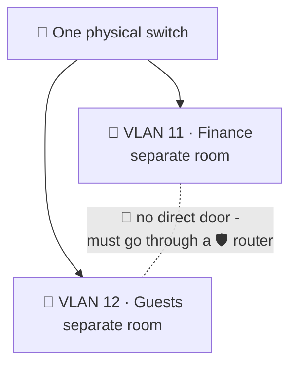
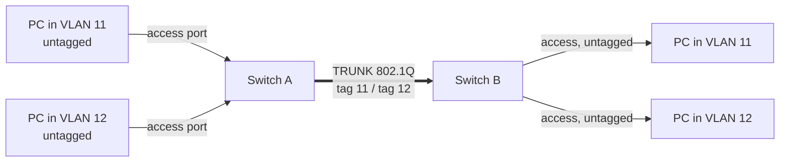
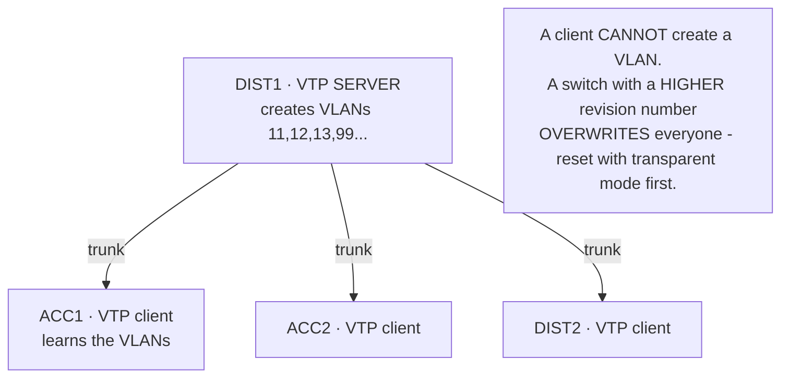

<div dir="rtl" align="right">

# חלק ⁦1⁩ · פרק ⁦3⁩ – מיתוג, ⁦VLAN⁩-ים ו-⁦Trunk⁩

_~⁦7⁩ שעות · הפרק הראשון שבו מקלידים פקודות_

> 📘 **איך לקרוא את הפרק הזה**
>
> בפרק ⁦1⁩ למדנו מה מתג עושה. הפרק הזה לוקח את המתג ומחלק אותו לכמה מתגים לוגיים – ⁦VLAN⁩-ים – ואז מחבר מתגים זה לזה כך שה-⁦VLAN⁩-ים ימשיכו להתקיים גם על כבל אחד. זה הפרק הראשון עם קונפיגורציה אמיתית, ולכן חשוב לא רק לקרוא את הפקודות אלא **להבין למה כל שורה קיימת**. הסעיף האחרון בונה בניין שלם, ארבעה מתגים, שורה-שורה. פתחו ⁦Packet Tracer⁩ ובנו אותו במקביל.

## ⁦3.1⁩ הבעיה: תחום שידור אחד גדול מדי

נזכיר מפרק ⁦1⁩: מתג לא מוגדר הוא **תחום שידור אחד**. כל ⁦ARP⁩, כל ⁦DHCP Discover⁩, כל "מי נמצא כאן?" מגיע לכל פורט.

בחדר עם עשרה מחשבים זה בסדר. בבניין עם ⁦300⁩ מחשבים זה אומר:

- **רעש** – כל מחשב מעבד מאות שידורים בשנייה שלא נועדו לו. הרשת מבזבזת קיבולת על כלום.
- **אפס אבטחה** – מחשב של אורח בלובי נמצא באותו תחום שידור כמו שרת הכספים. הוא רואה את ה-⁦ARP⁩ שלו, יכול לענות עליו בשקר (⁦ARP Spoofing⁩, חלק ⁦2)⁩, ואין שום גבול ביניהם.
- **תקלה אחת = כולם** – כרטיס רשת תקול שמשדר ללא הפסקה מפיל את כל הבניין.

הפתרון: לחתוך את תחום השידור הגדול לכמה קטנים. פעם עשו את זה עם מתג פיזי נפרד לכל מחלקה. היום עושים את זה בתוכנה.

## ⁦3.2 VLAN⁩ – מתג לוגי בתוך מתג פיזי

**⁦VLAN (Virtual LAN)⁩** מחלק מתג פיזי אחד לכמה מתגים לוגיים. פורטים ב-⁦VLAN 11⁩ ופורטים ב-⁦VLAN 12⁩ מתנהגים **כאילו הם בשני מתגים נפרדים שאין ביניהם כבל**:

<div dir="ltr" align="left">

```
One physical switch:                   Behaves exactly like:

+-----------------------------+        +-------------+   +-------------+
|  Fa0/1-10   |  Fa0/11-20    |        |  VLAN 11    |   |  VLAN 12    |
|  VLAN 11    |  VLAN 12      |   =    |  Fa0/1-10   |   |  Fa0/11-20  |
|  (Admin)    |  (Finance)    |        |             |   |             |
+-----------------------------+        +-------------+   +-------------+
                                          no cable between them!
```

</div>

תוצאות מיידיות:

- שידור ב-⁦VLAN 11⁩ **לא מגיע** ל-⁦VLAN 12.⁩ שני תחומי שידור.
- מחשב ב-⁦VLAN 11⁩ שרוצה להגיע ל-⁦VLAN 12⁩ חייב לעבור דרך **נתב** – בדיוק כמו בין שתי רשתות פיזיות. (לפי הכלל מפרק ⁦1⁩: היעד ברשת אחרת → ⁦ARP⁩ על שער ברירת המחדל.) זה יגיע בפרק ⁦5.⁩
- וזה בדיוק היתרון: בנקודה שבה חייבים לעבור נתב, אפשר להציב **מדיניות** – רשימת גישה, חומת אש. ⁦VLAN⁩ הוא לא רק חלוקה – הוא **גבול שאפשר לשמור עליו**.

### פורט ⁦Access⁩ – פורט ששייך ל-⁦VLAN⁩ אחד

הפורט שאליו מחובר מחשב נקרא **פורט ⁦Access**.⁩ הוא שייך ל-⁦VLAN⁩ אחד בדיוק, והמסגרות עליו **לא מתויגות** – המחשב לא יודע בכלל ש-⁦VLAN⁩-ים קיימים. כל החוכמה אצל המתג.

```
Switch(config)# vlan 11
Switch(config-vlan)# name ADMINISTRATION
Switch(config-vlan)# exit
Switch(config)# interface FastEthernet0/1
Switch(config-if)# switchport mode access
Switch(config-if)# switchport access vlan 11
```

| שורה | מה היא עושה |
|---|---|
| `⁦vlan 11⁩` + `⁦name⁩` | יוצרת את ה-⁦VLAN⁩ ונותנת לו שם קריא. השם רק לבני אדם; המספר הוא מה שמשנה. |
| `⁦switchport mode access⁩` | "הפורט הזה נושא ⁦VLAN⁩ אחד, לא מתויג" |
| `⁦switchport access vlan 11⁩` | "וה-⁦VLAN⁩ הזה הוא ⁦11"⁩ |

> 💡 **מספרי ⁦VLAN⁩ – מה מותר**
>
> ⁦1⁩–⁦4094. VLAN 1⁩ קיים תמיד וכל הפורטים בו כברירת מחדל. ⁦1002⁩–⁦1005⁩ שמורים לטכנולוגיות ישנות. בפועל משתמשים ב-⁦2⁩–⁦1001.⁩ למה המקסימום ⁦4094⁩? התשובה בסעיף הבא – והיא ניתנת לחישוב, לא לשינון.

### 🖼️ איור: ⁦VLAN⁩ מחלק מתג אחד לרשתות מבודדות



_כמו לחלק בניין אחד לחדרים נפרדים עם דלתות נעולות. מעבר בין חדרים מחייב לעבור דרך הנתב — ושם אפשר לבדוק מי עובר._

## ⁦3.3 Trunk⁩ ותיוג ⁦802.1Q⁩ – איך ⁦VLAN⁩-ים עוברים על כבל אחד

עכשיו יש לנו שני מתגים, ובכל אחד ⁦VLAN 11⁩ ו-⁦VLAN 12.⁩ מחשב ב-⁦VLAN 11⁩ במתג ⁦A⁩ רוצה להגיע למחשב ב-⁦VLAN 11⁩ במתג ⁦B.⁩ איך? אפשר למתוח כבל נפרד לכל ⁦VLAN⁩ – שני כבלים, ארבעה, שישה... לא מעשי.

הפתרון: כבל אחד שנושא **את כל ה-⁦VLAN⁩-ים**, ועל כל מסגרת מודבקת **תווית (⁦Tag)⁩** שאומרת לאיזה ⁦VLAN⁩ היא שייכת. הכבל הזה נקרא **⁦Trunk⁩**, והתקן של התווית נקרא **⁦802.1Q⁩** (מבטאים "דוט-וואן-קיו").

<div dir="ltr" align="left">

```
Normal Ethernet frame (on an access port):

+----------+----------+------+-----------------------+-----+
| DST MAC  | SRC MAC  | TYPE |        PAYLOAD        | FCS |
+----------+----------+------+-----------------------+-----+


802.1Q tagged frame (on a trunk):

+----------+----------+============+------+-----------------------+-----+
| DST MAC  | SRC MAC  | 802.1Q TAG | TYPE |        PAYLOAD        | FCS |
+----------+----------+============+------+-----------------------+-----+
                       ^^^^ 4 bytes inserted after the source MAC

The tag itself:
+------------------+-----+-----+--------------+
| TPID = 0x8100    | PCP | DEI |   VLAN ID    |
|    16 bits       | 3 b | 1 b |   12 bits    |
+------------------+-----+-----+--------------+
  "this is a tag"   prio  drop   1 ... 4094
```

</div>

**עכשיו התשובה לשאלה מלמעלה:** שדה ה-⁦VLAN ID⁩ הוא **⁦12⁩ ביט** → ⁦2⁩^⁦12 = 4096⁩ ערכים → ⁦0⁩ ו-⁦4095⁩ שמורים → **⁦4094** VLAN⁩-ים אפשריים. זו שאלת בחינה טובה כי התשובה נגזרת, לא נזכרת.

המתג המקבל קורא את התווית, **מסיר אותה**, ומכניס את המסגרת ל-⁦VLAN⁩ הנכון. המחשבים בקצוות לא רואים תוויות לעולם – הן קיימות רק על ה-⁦Trunk.⁩

<div dir="ltr" align="left">

```
  PC-A (VLAN 11)                                              PC-B (VLAN 11)
      |  untagged                                        untagged  |
   +--+---------+         TRUNK (all VLANs, tagged)       +---------+--+
   |  SWITCH A  |=========================================|  SWITCH B  |
   +--+---------+   [tag 11][frame]  [tag 12][frame]...   +---------+--+
      |  untagged                                        untagged  |
  PC-C (VLAN 12)                                              PC-D (VLAN 12)

  SWITCH A adds the tag as the frame leaves on the trunk.
  SWITCH B removes it and delivers into the right VLAN.
```

</div>

### הגדרת ⁦Trunk⁩

```
Switch(config)# interface GigabitEthernet0/1
Switch(config-if)# switchport mode trunk
Switch(config-if)# switchport trunk allowed vlan 11,12,13,99,110,120,999
Switch(config-if)# switchport trunk native vlan 999
```

| שורה | מה היא עושה |
|---|---|
| `⁦switchport mode trunk⁩` | "הפורט נושא הרבה ⁦VLAN⁩-ים, מתויגים" |
| `⁦switchport trunk allowed vlan ...⁩` | רשימה מפורשת של מה מותר לעבור. **בלי השורה הזאת – עוברים כל ה-⁦VLAN⁩-ים**, כולל כאלה שלא רציתם. |
| `⁦switchport trunk native vlan 999⁩` | ראו סעיף ⁦3.4⁩ |

> ⚠️ **טעות נפוצה: לשכוח את ⁦allowed vlan⁩**
>
> ⁦Trunk⁩ בלי `⁦allowed vlan⁩` מעביר את כל ⁦4094⁩ ה-⁦VLAN⁩-ים. זה עובד – ולכן אף אחד לא שם לב. אבל זה אומר ש-⁦VLAN⁩ שנוצר בטעות במתג אחד מיד "זולג" לכל הרשת. רשימה מפורשת הופכת הוספת ⁦VLAN⁩ לפעולה מכוונת. בפרויקט, בוחן שרואה ⁦Trunk⁩ בלי רשימה מבין שלא חשבתם על זה.

### 📊 תרשים: פורט ⁦Access⁩ לעומת ⁦Trunk⁩



_התווית קיימת רק על ה-⁦Trunk.⁩ המתג מוסיף אותה ביציאה ומסיר אותה בכניסה; המחשבים לא רואים תוויות._

## ⁦3.4 Native VLAN⁩ – ה-⁦VLAN⁩ שנוסע בלי תווית

ב-⁦802.1Q⁩ יש חריג אחד: ⁦VLAN⁩ אחד על כל ⁦Trunk⁩ עובר **בלי תווית** – ה-**⁦Native VLAN**.⁩ כברירת מחדל זה ⁦VLAN 1.⁩ הסיבה היסטורית (תאימות לציוד ישן), אבל התוצאה היא **חור אבטחה**:

מסגרת שמגיעה ל-⁦Trunk⁩ **בלי תווית** נכנסת אוטומטית ל-⁦Native VLAN.⁩ תוקף שיודע לנצל את זה יכול "לקפוץ" ל-⁦VLAN⁩ אחר – זה נקרא **⁦VLAN Hopping⁩**, ונלמד עליו לעומק בחלק ⁦2⁩ (פרק ⁦6).⁩ ההגנה מתחילה כאן:

<div dir="ltr" align="left">

```
switchport trunk native vlan 999        <- native = a VLAN nobody uses
switchport access vlan 999 + shutdown   <- every unused port parked there, and shut
```

</div>

**⁦VLAN 999⁩ – "⁦VLAN⁩ חניה" (⁦Parking VLAN)⁩**: אין בו מחשבים, אין לו כתובת ⁦IP⁩, אין לו שער. מסגרת שנוחתת שם לא מגיעה לשום מקום. כל פורט שלא בשימוש נכנס לשם ומכובה. ככה גם שקע קיר לא מחובר בחדר ישיבות לא נותן לאורח גישה לרשת.

> ⚠️ **⁦Native VLAN⁩ חייב להיות זהה בשני הצדדים**
>
> אם צד אחד מוגדר ⁦Native 999⁩ והשני ⁦Native 1⁩, המתגים מזהים את זה (דרך ⁦CDP)⁩ ומדפיסים כל דקה: `%⁦CDP-4-NATIVE_VLAN_MISMATCH⁩`. תלמידים מתעלמים מההודעה. המתג אומר לכם בדיוק מה הבעיה – קראו את הלוג.

### למה ⁦VLAN 1⁩ הוא "רדיואקטיבי"

תלמידים שואלים למה מתייחסים ל-⁦VLAN 1⁩ כאל מסוכן כשהוא עובד מצוין. ארבע סיבות שמצטברות:

⁦1.⁩ כל פורט שייך אליו **כברירת מחדל** – מתג חדש שמחברים בלי הגדרות מצטרף אליו אוטומטית.
⁦2.⁩ הוא ה-**⁦Native VLAN⁩** כברירת מחדל על כל ⁦Trunk.⁩
⁦3.⁩ הוא נושא **תעבורת בקרה** של המתגים – ⁦CDP, VTP, DTP.⁩ מי שיושב בו שומע את הרשת מתארת את עצמה.
⁦4.⁩ תוקף יכול **להניח שהוא קיים** בכל רשת ⁦Cisco⁩ בלי שום איסוף מידע.

בפרויקט שלנו ל-⁦VLAN 1⁩ אין כתובת, אין פורטים, אין תפקיד. וחשוב **לכתוב את זה במפורש** בספר הפרויקט – כי "לא עשיתי כלום עם ⁦VLAN 1"⁩ נראה בדיוק כמו "לא חשבתי על ⁦VLAN 1".⁩

## ⁦3.5⁩ המלכודת: ⁦2960⁩ לעומת ⁦3560⁩

בפרויקט משתמשים בשני דגמי מתגים, ויש ביניהם הבדל **בפקודה אחת** שמפיל חצי כיתה בשבוע הראשון:

<div dir="ltr" align="left">

```
! On a 3560 (Layer 3 switch) - the encapsulation MUST be set first:
Switch(config-if)# switchport trunk encapsulation dot1q
Switch(config-if)# switchport mode trunk

! On a 2960 (Layer 2 switch) - the encapsulation command DOES NOT EXIST:
Switch(config-if)# switchport mode trunk
```

</div>

**למה?** ה-⁦3560⁩ תמך היסטורית בשני תקני תיוג – ⁦802.1Q⁩ ו-⁦ISL⁩ (תקן ישן של ⁦Cisco).⁩ לכן חייבים להגיד לו באיזה להשתמש. ה-⁦2960⁩ מעולם לא תמך ב-⁦ISL⁩, אז הפקודה הוסרה ממנו.

- תקלידו את ה-⁦encapsulation⁩ ב-⁦2960⁩ → `% ⁦Invalid input⁩`.
- תשמיטו אותו ב-⁦3560⁩ → `⁦Command rejected: An interface whose trunk encapsulation is "Auto" can not be configured to "trunk" mode⁩`.

שתי ההודעות אומרות בדיוק מה הבעיה. מי שקורא אותן פותר תוך דקה.

## ⁦3.6 VTP⁩ – סנכרון ⁦VLAN⁩-ים בין מתגים, וגם סכנה

יצרנו ⁦VLAN 11⁩ במתג ⁦A.⁩ עכשיו צריך ליצור אותו גם ב-⁦B, C, D...⁩ בעשרים מתגים. **⁦VTP (VLAN Trunking Protocol)⁩** עושה את זה אוטומטית: יוצרים ⁦VLAN⁩ ב**שרת**, וכל ה**לקוחות** באותו **דומיין** לומדים אותו דרך ה-⁦Trunk⁩-ים.

```
Switch(config)# vtp domain NIMBUS-A
Switch(config)# vtp version 2
Switch(config)# vtp mode server        ! on ONE switch only
Switch(config)# vtp password Nimb!VTP2026
```

| מצב | מה מותר לו |
|---|---|
| **⁦Server⁩** | ליצור, לשנות ולמחוק ⁦VLAN⁩-ים. מפיץ לכולם. |
| **⁦Client⁩** | **לא יכול ליצור ⁦VLAN.⁩** רק מקבל מהשרת. |
| **⁦Transparent⁩** | לא משתתף – שומר ⁦VLAN⁩-ים מקומיים, מעביר הודעות ⁦VTP⁩ הלאה בלי לגעת. |

### שלושה דברים שחייבים לדעת על ⁦VTP⁩

**⁦1.⁩ הסדר חובה.** לקוח ⁦VTP⁩ לא יכול ליצור ⁦VLAN.⁩ אם תגדירו קודם את מתג הגישה (לקוח) ותקלידו `⁦interface vlan 99⁩` – תקבלו שגיאה, כי ⁦VLAN 99⁩ עוד לא קיים בשום מקום. **תמיד שרת קודם.**

**⁦2.⁩ אסון מספר הגרסה (⁦Revision Number).⁩** כל שינוי ב-⁦VLAN⁩-ים מעלה מונה ב-⁦1.⁩ מתג שמצטרף לדומיין עם מספר גרסה **גבוה יותר** – **דורס את כולם**. כולל מתג שחזר ממעבדה עם רשימת ⁦VLAN⁩-ים ריקה ומספר גרסה גבוה: הוא מוחק את כל ה-⁦VLAN⁩-ים בכל הבניין תוך שניות. זה קרה בחברות אמיתיות.

<div dir="ltr" align="left">

```
Before attaching ANY switch to a live VTP domain:

Switch(config)# vtp mode transparent     <- resets revision to 0
Switch(config)# vtp mode client          <- now safe to join
```

</div>

**⁦3.⁩ דומיין לכל בניין, לא לכל הקמפוס.** בפרויקט הדומיין הוא `⁦NIMBUS-A⁩` לבניין ⁦A⁩, `⁦NIMBUS-B⁩` לבניין ⁦B.⁩ למה? כי ה-⁦VLAN⁩-ים לא יוצאים מהבניין ממילא (הניתוב עוצר אותם), וכי ככה תאונת ⁦VTP⁩ בבניין אחד **לא יכולה** להגיע לבניין אחר. הגבלת רדיוס נזק.

> 🔐 **מבט קדימה לאבטחה**
>
> הרבה רשתות ייצור היום מריצות ⁦VTP⁩ במצב ⁦Transparent⁩ בכולם, או מבטלות אותו לגמרי – בדיוק בגלל סעיף ⁦2.⁩ הדרישה בפרויקט היא להגדיר ⁦VTP⁩, אז מגדירים. אבל תלמיד שיכול להסביר למה רשת אמיתית אולי **תוותר** עליו – מפגין בדיוק את שיקול הדעת שפרק "בחירות וחלופות" בספר הפרויקט מבקש.

### 📊 תרשים: ⁦VTP⁩ — שרת מפיץ ⁦VLAN⁩-ים ללקוחות



_יוצרים ⁦VLAN⁩ במקום אחד (השרת), וכולם לומדים. הסיכון: מספר גרסה גבוה דורס את כולם._

## ⁦3.7 EtherChannel⁩ – למה ארבעה כבלים נותנים מהירות של אחד

שאלה מבנק השאלות של הפרויקט: **"שני מתגים מחוברים ב-⁦4⁩ כבלים של ⁦100Mbps.⁩ המהירות בפועל היא ⁦100⁩ ולא ⁦400.⁩ למה?"**

התשובה: **⁦Spanning Tree⁩ חוסם את הכבלים העודפים.** ארבעה כבלים בין אותם שני מתגים = לולאה. ⁦STP⁩ (פרק ⁦4)⁩ מזהה את זה ומכבה שלושה מהם כדי למנוע סערת שידורים. שילמתם על ארבעה, משתמשים באחד.

**⁦EtherChannel⁩** פותר את זה: מאגד את הכבלים ל**ממשק לוגי אחד**. ⁦STP⁩ רואה קו אחד, אין לולאה, לא חוסם כלום. התעבורה מתפזרת על כל הכבלים. ואם כבל אחד נופל, השאר ממשיכים – תוך אלפית שנייה.

```
Switch(config)# interface range FastEthernet0/23-24
Switch(config-if-range)# channel-protocol lacp
Switch(config-if-range)# channel-group 1 mode active
```

זה יוצר ממשק `⁦Port-channel1⁩` (או `⁦Po1⁩`). מכאן והלאה מגדירים את ה-⁦Trunk⁩ **על ה-⁦Po1⁩**, לא על הפורטים הפיזיים.

### שני הפרוטוקולים

| | ⁦LACP | PAgP⁩ |
|---|---|---|
| **תקן** | ⁦IEEE 802.3ad⁩ – פתוח, כל יצרן | קנייני של ⁦Cisco⁩ |
| **מצבים** | `⁦active⁩` / `⁦passive⁩` | `⁦desirable⁩` / `⁦auto⁩` |
| **נוצר איגוד כש...** | ⁦active⁩↔⁦active, active⁩↔⁦passive | desirable⁩↔⁦desirable, desirable⁩↔⁦auto⁩ |
| **לא נוצר לעולם** | ⁦passive⁩↔⁦passive | auto⁩↔⁦auto⁩ |

השורה האחרונה חשובה: המצבים ה"פסיביים" **מחכים שיבקשו מהם**. שני צדדים שמחכים – מחכים לנצח. לכן משתמשים ב-`⁦active⁩` בשני הצדדים.

> ⚠️ **טעות נפוצה מספר ⁦1⁩ ב-⁦EtherChannel⁩**
>
> הפורטים החברים חייבים להיות מוגדרים **זהה לחלוטין** – אותו מצב, אותה רשימת ⁦VLAN⁩-ים, אותו ⁦Native VLAN⁩, אותה מהירות. שורה אחת שונה בין ⁦Fa0/23⁩ ל-⁦Fa0/24⁩ והאיגוד לא נוצר, או נוצר בלי אחד החברים. הפקודה `⁦show etherchannel summary⁩` מראה את זה (סעיף ⁦3.9).⁩ לכן בקונפיגורציה מגדירים את כל פרמטרי ה-⁦Trunk⁩ על הפורטים הפיזיים **לפני** `⁦channel-group⁩`, וזהה בשני המתגים.

## ⁦3.8⁩ בניין ⁦A⁩ – הדוגמה המלאה, שורה-שורה

עכשיו בונים משהו אמיתי: בניין ⁦A⁩ של סניף תל אביב, ארבעה מתגים. זה הבניין שנמשיך לפתח בפרקים ⁦4⁩ ו-⁦5.⁩

### הציוד והחיווט

| שם | דגם | תפקיד |
|---|---|---|
| ⁦SWL3-TLV-A-DIST1 | 3560⁩ | הפצה (⁦Distribution)⁩, ראשי – **שרת ⁦VTP⁩** |
| ⁦SWL3-TLV-A-DIST2 | 3560⁩ | הפצה, משני – לקוח ⁦VTP⁩ |
| ⁦SW-TLV-A-ACC1 | 2960⁩ | גישה (⁦Access)⁩ – לקוח ⁦VTP⁩ |
| ⁦SW-TLV-A-ACC2 | 2960⁩ | גישה – לקוח ⁦VTP⁩ |

<div dir="ltr" align="left">

```
        +------------------+  Po1 (Fa0/23-24, LACP)  +------------------+
        | SWL3-TLV-A-DIST1 |=========================| SWL3-TLV-A-DIST2 |
        |  VTP server      |                         |  VTP client      |
        +--+-----------+---+                         +---+-----------+--+
       Gi0/1        Gi0/2                            Gi0/1        Gi0/2
           |           \                              /            |
           |            \                            /             |
           |             \                          /              |
           |              \                        /               |
        Gi0/1              \  Gi0/1        Gi0/2  /              Gi0/2
        +--+-------------------+           +--------------------+--+
        |   SW-TLV-A-ACC1      |           |   SW-TLV-A-ACC2       |
        |   VTP client         |           |   VTP client          |
        +----------------------+           +-----------------------+
         Fa0/1-10  VLAN 11 (Admin)          (identical port layout)
         Fa0/11-20 VLAN 12 (Finance)
         Fa0/21    VLAN 13 (Printer)
         Fa0/22    trunk -> AP (VLANs 110,120)
         Fa0/23-24 VLAN 999, shutdown

  Every access switch has TWO uplinks -> this is a LOOP on purpose.
  Chapter 4 (STP) makes the loop safe. Without it, the building melts.
```

</div>

| ⁦VLAN⁩ | שם | רשת |
|---|---|---|
| ⁦11 | ADMINISTRATION | 10.1.16.0/24⁩ |
| ⁦12 | FINANCE | 10.1.17.0/24⁩ |
| ⁦13 | PRINTERS-A | 10.1.18.0/24⁩ |
| ⁦99 | MGMT-A | 10.1.19.0/24⁩ |
| ⁦110 | WIFI-EMPLOYEE | 10.1.20.0/24⁩ |
| ⁦120 | WIFI-GUEST | 10.1.21.0/24⁩ |
| ⁦999 | PARKING⁩ | – (אין כתובת) |

### סדר ההגדרה – חובה

⁦1. **DIST1⁩** – השרת. יוצר את ה-⁦VLAN⁩-ים.
⁦2. **DIST2⁩** – לקוח. מקבל אותם דרך ה-⁦Trunk.⁩
⁦3. **ACC1, ACC2⁩** – לקוחות.

### ⁦DIST1⁩ – שרת ה-⁦VTP⁩, מוסבר שורה-שורה

```
enable
configure terminal
hostname SWL3-TLV-A-DIST1
no ip domain-lookup
enable secret Nimbus#Ena2026
service password-encryption
banner motd $ Nimbus Industries - Building A - AUTHORIZED ACCESS ONLY $
line console 0
 logging synchronous
 exec-timeout 15 0
 password Nimbus#Con2026
 login
exit
```

| שורה | למה |
|---|---|
| `⁦hostname⁩` | שם לפי המוסכמה: תפקיד-אתר-בניין-מספר. חובה בפרויקט (סעיף ⁦22.1).⁩ |
| `⁦no ip domain-lookup⁩` | בלי זה, כל פקודה עם שגיאת הקלדה גורמת למתג לנסות "לפתור" אותה כשם, ולהקפיא את המסך ל-⁦30⁩ שניות. השורה הכי מוערכת בקובץ. |
| `⁦enable secret⁩` | סיסמת מצב מנהל, **מגובבת**. תמיד `⁦secret⁩`, אף פעם לא `⁦password⁩`. |
| `⁦service password-encryption⁩` | מסתיר סיסמאות גלויות בקונפיג. הצפנה חלשה (⁦Type 7)⁩ – רק נגד הצצה מעבר לכתף. |
| `⁦logging synchronous⁩` | הודעות לוג לא יקטעו אתכם באמצע הקלדה. |
| `⁦exec-timeout 15 0⁩` | ניתוק אחרי ⁦15⁩ דקות של חוסר פעילות. |

```
vtp domain NIMBUS-A
vtp version 2
vtp mode server
vtp password Nimb!VTP2026
!
vlan 11
 name ADMINISTRATION
vlan 12
 name FINANCE
vlan 13
 name PRINTERS-A
vlan 99
 name MGMT-A
vlan 110
 name WIFI-EMPLOYEE
vlan 120
 name WIFI-GUEST
vlan 999
 name PARKING
exit
```

זה הבלוק שיוצר את ה-⁦VLAN⁩-ים. **רק כאן**, כי רק ⁦DIST1⁩ הוא שרת. שאר המתגים ילמדו אותם.

```
interface range FastEthernet0/23-24
 description ### EtherChannel to DIST2 ###
 switchport trunk encapsulation dot1q
 switchport mode trunk
 switchport nonegotiate
 switchport trunk native vlan 999
 switchport trunk allowed vlan 11,12,13,99,110,120,999
 channel-protocol lacp
 channel-group 1 mode active
 no shutdown
exit
!
interface Port-channel1
 switchport trunk encapsulation dot1q
 switchport mode trunk
 switchport trunk native vlan 999
 switchport trunk allowed vlan 11,12,13,99,110,120,999
exit
```

| שורה | למה |
|---|---|
| `⁦interface range Fa0/23-24⁩` | שני הפורטים יחד, כדי שיהיו **זהים** – התנאי של ⁦EtherChannel.⁩ |
| `⁦encapsulation dot1q⁩` | זה ⁦3560.⁩ חובה לפני `⁦mode trunk⁩`. |
| `⁦switchport nonegotiate⁩` | לא לשלוח הודעות ⁦DTP⁩ (ניסיון "לנהל משא ומתן" על ⁦Trunk).⁩ הגנה – חלק ⁦2.⁩ |
| `⁦channel-group 1 mode active⁩` | "הצטרף ל-⁦Po1⁩, בקש באופן פעיל". |
| `⁦interface Port-channel1⁩` | הממשק הלוגי. מגדירים עליו את אותו ⁦Trunk.⁩ |

```
interface GigabitEthernet0/1
 description ### Trunk to SW-TLV-A-ACC1 ###
 switchport trunk encapsulation dot1q
 switchport mode trunk
 switchport nonegotiate
 switchport trunk native vlan 999
 switchport trunk allowed vlan 11,12,13,99,110,120,999
 no shutdown
exit
!
interface GigabitEthernet0/2
 description ### Trunk to SW-TLV-A-ACC2 ###
 (identical)
!
interface Vlan99
 ip address 10.1.19.2 255.255.255.0
 no shutdown
exit
!
interface range FastEthernet0/1-22
 switchport mode access
 switchport access vlan 999
 shutdown
exit
!
end
write memory
```

| שורה | למה |
|---|---|
| `⁦interface Vlan99⁩` + `⁦ip address⁩` | כתובת ניהול למתג, ב-⁦VLAN⁩ הניהול. דרכה נתחבר ב-⁦SSH⁩ (חלק ⁦2).⁩ |
| `⁦range Fa0/1-22 ... vlan 999 ... shutdown⁩` | **כל פורט לא בשימוש – חניה וכיבוי.** |
| `⁦write memory⁩` | **שומר.** בלי זה, כיבוי-הדלקה מוחק הכול. פרק ⁦8⁩ מסביר. |

### ⁦ACC1⁩ – מתג גישה ⁦2960⁩

```
hostname SW-TLV-A-ACC1
(same base config as above)
!
vtp domain NIMBUS-A
vtp version 2
vtp mode client
vtp password Nimb!VTP2026
!
interface GigabitEthernet0/1
 description ### Uplink to DIST1 ###
 switchport mode trunk
 switchport nonegotiate
 switchport trunk native vlan 999
 switchport trunk allowed vlan 11,12,13,99,110,120,999
 no shutdown
exit
interface GigabitEthernet0/2
 description ### Uplink to DIST2 ###
 (identical)
!
interface range FastEthernet0/1-10
 description ### ADMINISTRATION ###
 switchport mode access
 switchport nonegotiate
 switchport access vlan 11
 no shutdown
exit
interface range FastEthernet0/11-20
 description ### FINANCE ###
 switchport mode access
 switchport nonegotiate
 switchport access vlan 12
 no shutdown
exit
interface FastEthernet0/21
 switchport mode access
 switchport access vlan 13
exit
interface FastEthernet0/22
 description ### Wireless AP - needs both WiFi VLANs ###
 switchport mode trunk
 switchport trunk native vlan 999
 switchport trunk allowed vlan 110,120
exit
interface range FastEthernet0/23-24
 switchport mode access
 switchport access vlan 999
 shutdown
exit
!
interface Vlan99
 ip address 10.1.19.11 255.255.255.0
 no shutdown
exit
ip default-gateway 10.1.19.1
!
end
write memory
```

שימו לב לשלושה הבדלים מ-⁦DIST1⁩:

⁦1.⁩ **אין `⁦encapsulation dot1q⁩`** – זה ⁦2960.⁩
⁦2.⁩ **`⁦vtp mode client⁩`** – לומד ⁦VLAN⁩-ים, לא יוצר.
⁦3.⁩ **`⁦ip default-gateway⁩`** – מתג שכבה ⁦2⁩ לא מנתב, אז הוא צריך שער כמו מחשב. הכתובת ⁦10.1.19.1⁩ עוד לא קיימת – היא תהיה הכתובת הווירטואלית של ⁦HSRP⁩ בפרק ⁦5.⁩ עד אז זה בסדר שהיא לא עונה.

**⁦ACC2⁩** זהה ל-⁦ACC1⁩ חוץ מהשם והכתובת (⁦10.1.19.12).⁩

> ✏️ **בנו את זה עכשיו ב-⁦Packet Tracer⁩**
>
> ארבעה מתגים, שישה כבלים לפי הציור, ארבע הדבקות. אחר כך: חברו שני מחשבים ל-⁦VLAN 11⁩ – אחד ב-⁦ACC1⁩ ואחד ב-⁦ACC2⁩ – ותנו להם כתובות ⁦10.1.16.10⁩ ו-⁦10.1.16.20.⁩ **הפינג ביניהם חייב להצליח** (הוכחה שה-⁦Trunk⁩-ים עובדים). חברו מחשב שלישי ל-⁦VLAN 12⁩ עם ⁦10.1.17.10⁩ – **הפינג אליו חייב להיכשל** (אין נתב עדיין – זה נכון, וזה המניע לפרק ⁦5).⁩

## ⁦3.9⁩ אימות – הפקודות והפלט שלהן

חמש פקודות. תריצו את כולן אחרי כל שינוי, ותדעו להגיד מה כל אחת מוכיחה.

### `⁦show vlan brief⁩` – על ⁦ACC1⁩

<div dir="ltr" align="left">

```
VLAN Name                     Status    Ports
---- ------------------------ --------- -------------------------------
1    default                  active
11   ADMINISTRATION           active    Fa0/1, Fa0/2, Fa0/3, Fa0/4
                                        Fa0/5, Fa0/6, Fa0/7, Fa0/8
                                        Fa0/9, Fa0/10
12   FINANCE                  active    Fa0/11, Fa0/12, ... Fa0/20
13   PRINTERS-A               active    Fa0/21
99   MGMT-A                   active
110  WIFI-EMPLOYEE            active
120  WIFI-GUEST               active
999  PARKING                  active    Fa0/23, Fa0/24
```

</div>

**מה לחפש:** ⁦Gi0/1, Gi0/2⁩ ו-⁦Fa0/22⁩ **לא מופיעים** בשום שורה – ונכון שכך, כי הפקודה מציגה פורטי ⁦Access⁩ בלבד, והם ⁦Trunk⁩-ים. תלמידים מדווחים על זה כתקלה כל שנה. ⁦VLAN 99⁩ ו-⁦110/120⁩ בלי פורטים – נכון, אין להם פורטי ⁦Access.⁩

### `⁦show interfaces trunk⁩`

<div dir="ltr" align="left">

```
Port      Mode    Encapsulation  Status     Native vlan
Gig0/1    on      802.1q         trunking   999
Gig0/2    on      802.1q         trunking   999
Fa0/22    on      802.1q         trunking   999

Port      Vlans allowed on trunk
Gig0/1    11-13,99,110,120,999
Gig0/2    11-13,99,110,120,999
Fa0/22    110,120

Port      Vlans in spanning tree forwarding state and not pruned
Gig0/1    11,13,110,999
Gig0/2    12,99,120
```

</div>

**מה לחפש:** ⁦Native 999⁩ בכל שורה. רשימת ⁦allowed⁩ זהה בשני ה-⁦uplinks.⁩ והבלוק האחרון – **הכי חשוב ורוב התלמידים מתעלמים ממנו** – מראה איזה ⁦VLAN⁩-ים מועברים בפועל בכל ⁦Trunk.⁩ הוא יקבל משמעות בפרק ⁦4.⁩

### `⁦show vtp status⁩`

<div dir="ltr" align="left">

```
VTP Version capable             : 1 to 2
VTP version running             : 2
VTP Domain Name                 : NIMBUS-A
Configuration Revision          : 7
Number of existing VLANs        : 12
VTP Operating Mode              : Client
```

</div>

**מה לחפש:** **⁦Operating Mode** = Client⁩ בכולם חוץ מ-⁦DIST1. **Number of existing VLANs** = 12 (7⁩ שלנו + ⁦VLAN 1 + 4⁩ ברירת מחדל). אם זה ⁦5⁩ – המתג לא למד כלום; הדומיין או הסיסמה שגויים. **⁦Configuration Revision⁩** זהה בכל המתגים – מתג עם מספר שונה מנותק או עומד לדרוס את כולם.

### `⁦show etherchannel summary⁩`

<div dir="ltr" align="left">

```
Flags:  D - down     P - in port-channel    I - stand-alone
        s - suspended  S - Layer2   U - in use

Group  Port-channel  Protocol    Ports
------+-------------+-----------+-----------------------------
1      Po1(SU)       LACP        Fa0/23(P)  Fa0/24(P)
```

</div>

| דגל | משמעות |
|---|---|
| `⁦SU⁩` | שכבה ⁦2⁩, **בשימוש** – המצב הרצוי |
| `(⁦P)⁩` | הפורט **באיגוד** |
| `(⁦I)⁩` | ⁦Stand-alone⁩ – הפורט **לא הצטרף**. משהו לא זהה בין החברים. |
| `⁦Po1(SD)⁩` | ⁦Down⁩ – כלום לא נוצר |

**`(⁦I)⁩` הוא הוראה:** לכו להשוות את שני הפורטים שורה-שורה.

## ⁦3.10⁩ סיכום

⁦1. VLAN⁩ חותך תחום שידור אחד לכמה. בין ⁦VLAN⁩-ים חייבים נתב – וזה יתרון, כי שם שמים מדיניות.
⁦2.⁩ פורט ⁦Access = VLAN⁩ אחד, לא מתויג. פורט ⁦Trunk⁩ = הרבה ⁦VLAN⁩-ים, מתויגים ב-⁦802.1Q.⁩
⁦3.⁩ התווית: ⁦4⁩ בתים, ⁦12⁩ ביט ל-⁦VLAN ID⁩ → מקסימום ⁦4094.⁩
⁦4. Native VLAN⁩ עובר בלי תווית. שמים אותו על ⁦VLAN⁩ ריק (⁦999)⁩ – הגנה מפני ⁦VLAN Hopping.⁩
⁦5. VLAN 1⁩: אין בו כלום, ואומרים את זה בספר.
⁦6. 3560⁩ צריך `⁦encapsulation dot1q⁩`; ⁦2960⁩ לא.
⁦7. VTP⁩: שרת קודם; מספר גרסה גבוה דורס; ⁦Transparent⁩ מאפס; דומיין לכל בניין.
⁦8. EtherChannel: STP⁩ רואה קו אחד; ⁦LACP active⁩ בשני הצדדים; חברים זהים לחלוטין.
⁦9.⁩ `⁦allowed vlan⁩` תמיד. פורטים לא בשימוש – ⁦999⁩ וכיבוי.

---

## ✏️ תרגילים

**תרגיל ⁦1.⁩** מסגרת נכנסת לפורט ⁦Access⁩ ב-⁦VLAN 12⁩, יוצאת דרך ⁦Trunk⁩, ומגיעה למתג השני. באילו נקודות בדרך יש עליה תווית ⁦802.1Q⁩ ובאילו אין?

<details><summary>פתרון</summary>

- על פורט ה-⁦Access⁩ הנכנס: **אין** תווית (המחשב לא יודע על ⁦VLAN⁩-ים).
- המתג הראשון **מוסיף** תווית ⁦12⁩ כשהמסגרת יוצאת ל-⁦Trunk.⁩
- על ה-⁦Trunk⁩: **יש** תווית.
- המתג השני **מסיר** אותה ומכניס ל-⁦VLAN 12.⁩
- על פורט ה-⁦Access⁩ היוצא: **אין** תווית.
תוויות חיות רק על ⁦Trunk⁩-ים.

</details>

**תרגיל ⁦2.⁩** למה מספר ה-⁦VLAN⁩ המקסימלי הוא ⁦4094⁩ ולא ⁦4096⁩ או ⁦4095⁩?

<details><summary>פתרון</summary>

שדה ⁦VLAN ID⁩ הוא ⁦12⁩ ביט → ⁦2⁩^⁦12 = 4096⁩ ערכים (⁦0⁩–⁦4095).⁩ הערך ⁦0⁩ שמור (אומר "אין ⁦VLAN⁩, רק עדיפות") ו-⁦4095⁩ שמור לשימוש פנימי. נשארים ⁦1⁩–⁦4094.⁩

</details>

**תרגיל ⁦3.⁩** מתג לקוח ⁦VTP⁩ מציג `⁦Number of existing VLANs: 5⁩` בזמן שהשרת מציג ⁦12.⁩ מה שתי הסיבות הסבירות, ואיזו פקודה בודקת כל אחת?

<details><summary>פתרון</summary>

⁦5⁩ = רק ברירות המחדל → המתג לא למד כלום. סיבות:
⁦1.⁩ **שם דומיין שונה** – `⁦show vtp status⁩`, להשוות את השורה ⁦Domain Name.⁩
⁦2.⁩ **סיסמה שגויה** – גם `⁦show vtp status⁩` (מציג ⁦MD5 digest⁩ שונה), או `⁦show vtp password⁩`. סיסמה שגויה היא כשל **שקט** – אין הודעת שגיאה.
סיבה שלישית אפשרית: אין ⁦Trunk⁩ בין המתגים (`⁦show interfaces trunk⁩`).

</details>

**תרגיל ⁦4.⁩** ב-`⁦show etherchannel summary⁩` רואים `⁦Po1(SU) Fa0/23(P) Fa0/24(I)⁩`. מה המצב ומה עושים?

<details><summary>פתרון</summary>

⁦Po1⁩ פעיל, אבל רק ⁦Fa0/23⁩ הצטרף. ⁦Fa0/24⁩ הוא **⁦Stand-alone⁩** – לא זהה לאחיו. משווים את הקונפיגורציה של שני הפורטים שורה-שורה: `⁦show running-config interface Fa0/23⁩` מול `⁦Fa0/24⁩`. בדרך כלל: רשימת ⁦allowed vlan⁩ שונה, ⁦Native VLAN⁩ שונה, או מצב (⁦trunk/access)⁩ שונה.

</details>

**תרגיל ⁦5.⁩** מנהל רשת מחבר מתג ישן מהמחסן לרשת. תוך דקה כל ה-⁦VLAN⁩-ים בבניין נעלמים. מה קרה, ומה הוא היה צריך לעשות קודם?

<details><summary>פתרון</summary>

המתג הישן היה באותו דומיין ⁦VTP⁩, עם מספר גרסה **גבוה יותר** (מהפעם האחרונה שהיה בשימוש) ורשימת ⁦VLAN⁩-ים ריקה או ישנה. הוא דרס את כל השרתים. לפני החיבור היה צריך: `⁦vtp mode transparent⁩` ואז חזרה ל-`⁦client⁩` – זה מאפס את מספר הגרסה ל-⁦0.⁩

</details>

**תרגיל ⁦6.⁩** למה בקונפיגורציה של ⁦DIST1⁩ מגדירים `⁦encapsulation dot1q⁩` פעמיים – גם על ⁦Fa0/23-24⁩ וגם על ⁦Port-channel1⁩?

<details><summary>פתרון</summary>

הפורטים הפיזיים חייבים להיות מוגדרים זהה (תנאי ל-⁦EtherChannel)⁩, וה-⁦Port-channel⁩ הוא ממשק לוגי נפרד שגם הוא צריך את הגדרות ה-⁦Trunk.⁩ בפועל, אחרי שהאיגוד נוצר, הגדרות ה-⁦Po1 "⁩יורדות" לחברים – אבל הגדרה מפורשת בשני המקומות מונעת מצב שבו הם לא מסונכרנים.

</details>

---

## ❓ חידון

**⁦1.⁩** מה עושה `⁦switchport mode access⁩`?
- א. מאפשר לכל ה-⁦VLAN⁩-ים לעבור · ב. הפורט נושא ⁦VLAN⁩ אחד לא מתויג · ג. מכבה את הפורט · ד. יוצר ⁦VLAN⁩

<details><summary>תשובה</summary>**ב**</details>

**⁦2.⁩** כמה בתים מוסיף תיוג ⁦802.1Q⁩ למסגרת?
- א. ⁦2⁩ · ב. ⁦4⁩ · ג. ⁦8⁩ · ד. ⁦12⁩

<details><summary>תשובה</summary>**ב** – ⁦4⁩ בתים: ⁦TPID (2) + TCI (2).⁩</details>

**⁦3.⁩** מסגרת מגיעה ל-⁦Trunk⁩ בלי תווית. לאיזה ⁦VLAN⁩ היא נכנסת?
- א. ⁦VLAN 1⁩ תמיד · ב. ה-⁦Native VLAN⁩ של ה-⁦Trunk⁩ · ג. היא נזרקת · ד. לכל ה-⁦VLAN⁩-ים

<details><summary>תשובה</summary>**ב** – ולכן ה-⁦Native VLAN⁩ צריך להיות ריק.</details>

**⁦4.⁩** איזו פקודה קיימת ב-⁦3560⁩ ולא ב-⁦2960⁩?
- א. `⁦switchport mode trunk⁩` · ב. `⁦switchport trunk encapsulation dot1q⁩` · ג. `⁦switchport access vlan⁩` · ד. `⁦vtp mode client⁩`

<details><summary>תשובה</summary>**ב** – כי רק ה-⁦3560⁩ תמך אי פעם ב-⁦ISL.⁩</details>

**⁦5.⁩** מה **לא** יכול לעשות מתג במצב ⁦VTP Client⁩?
- א. ללמוד ⁦VLAN⁩-ים · ב. להעביר תעבורה · ג. ליצור ⁦VLAN⁩ · ד. להיות ⁦Trunk⁩

<details><summary>תשובה</summary>**ג**</details>

**⁦6.⁩** באיזו קומבינציית ⁦LACP⁩ **לא** ייווצר איגוד?
- א. ⁦active⁩–⁦active⁩ · ב. ⁦active⁩–⁦passive⁩ · ג. ⁦passive⁩–⁦passive⁩ · ד. כולן יוצרות

<details><summary>תשובה</summary>**ג** – שני צדדים שמחכים שיבקשו מהם.</details>

**⁦7.⁩** למה ⁦4⁩ כבלים בין שני מתגים נותנים מהירות של כבל אחד (בלי ⁦EtherChannel)⁩?
- א. מגבלת חומרה · ב. ⁦STP⁩ חוסם שלושה מהם · ג. הכבלים מתנגשים · ד. ⁦VTP⁩ מגביל

<details><summary>תשובה</summary>**ב**</details>

**⁦8.⁩** מה קורה למסגרת שנוחתת ב-⁦VLAN 999⁩ (חניה) בפרויקט?
- א. מנותבת לאינטרנט · ב. לא מגיעה לשום מקום – אין שם מחשבים ואין שער · ג. נשלחת למנהל · ד. מוצפת לכולם

<details><summary>תשובה</summary>**ב**</details>

**⁦9.⁩** `%⁦CDP-4-NATIVE_VLAN_MISMATCH⁩` אומר:
- א. ⁦VTP⁩ לא מסונכרן · ב. ⁦Native VLAN⁩ שונה בשני צדי ⁦Trunk⁩ · ג. ⁦EtherChannel⁩ נכשל · ד. פורט בחניה

<details><summary>תשובה</summary>**ב** – והמתג אמר לכם בדיוק מה לתקן.</details>

**⁦10.** Trunk⁩ בלי `⁦switchport trunk allowed vlan⁩`:
- א. לא עובד · ב. מעביר רק ⁦VLAN 1⁩ · ג. מעביר את כל ה-⁦VLAN⁩-ים · ד. מעביר רק ⁦Native⁩

<details><summary>תשובה</summary>**ג** – ולכן תמיד כותבים רשימה.</details>

---

## 📝 שאלות בסגנון בחינה

**שאלה ⁦1.⁩** הסבירו מהו ⁦VLAN⁩, איזו בעיה הוא פותר, ומדוע תקשורת בין שני ⁦VLAN⁩-ים דורשת נתב. התייחסו לכלל ה-⁦ARP⁩ מפרק ⁦1.⁩

<details><summary>תשובה לדוגמה</summary>

**⁦VLAN⁩** – חלוקה של מתג פיזי אחד לכמה מתגים לוגיים; כל ⁦VLAN⁩ הוא **תחום שידור נפרד**. **הבעיה:** מתג לא מוגדר = תחום שידור אחד ענק: רעש (כל ⁦ARP/DHCP⁩ מגיע לכולם), אפס אבטחה (אורח ושרת הכספים באותו תחום), ותקלה אחת מפילה את כל הבניין. ⁦VLAN⁩ חותך את זה לתחומים קטנים לפי מחלקה/תפקיד.
**למה צריך נתב:** ל-⁦VLAN⁩-ים שונים נותנים רשתות ⁦IP⁩ שונות. מחשב ב-⁦VLAN 11 (10.1.16.x)⁩ שרוצה להגיע ל-⁦VLAN 12 (10.1.17.x)⁩ מחשב לפי המסכה שלו שהיעד **ברשת אחרת** → לפי כלל ה-⁦ARP⁩ הוא **לא** שואל ⁦ARP⁩ על היעד אלא על **שער ברירת המחדל** → צריך מכשיר עם כתובת בשתי הרשתות שיקבל ויעביר = נתב (או מתג שכבה ⁦3).⁩ המתג לא חוסם – המחשב פשוט לא מנסה בלי שער. וזה יתרון: בנקודת המעבר אפשר להציב מדיניות (⁦ACL).⁩

</details>
**שאלה ⁦2.⁩** תארו את מבנה תווית ⁦802.1Q.⁩ הסבירו מדוע המקסימום הוא ⁦4094 VLAN⁩-ים, ומה ההבדל בין פורט ⁦Access⁩ לפורט ⁦Trunk⁩ מבחינת התיוג.

<details><summary>תשובה לדוגמה</summary>

**מבנה התווית:** ⁦4⁩ בתים שמוכנסים אחרי כתובת ה-⁦MAC⁩ של המקור: **⁦TPID** (16⁩ ביט, תמיד ⁦0x8100⁩ – "זו תווית"), **⁦PCP** (3⁩ ביט, עדיפות), **⁦DEI** (1⁩ ביט), **⁦VLAN ID** (12⁩ ביט).
**למה ⁦4094⁩:** שדה ⁦VLAN ID⁩ הוא **⁦12⁩ ביט** → ⁦2⁩¹² = ⁦4096⁩ ערכים (⁦0⁩–⁦4095). 0⁩ שמור (אומר "אין ⁦VLAN⁩, רק עדיפות") ו-⁦4095⁩ שמור לשימוש פנימי → נשארים **⁦1⁩–⁦4094**.⁩
**⁦Access⁩ לעומת ⁦Trunk⁩:** פורט **⁦Access⁩** שייך ל-⁦VLAN⁩ אחד, והמסגרות עליו **לא מתויגות** – המחשב לא יודע על ⁦VLAN⁩-ים; המתג מוסיף/מסיר את התווית. פורט **⁦Trunk⁩** נושא הרבה ⁦VLAN⁩-ים, וכל מסגרת עליו **מתויגת** (חוץ מה-⁦Native VLAN).⁩ התוויות קיימות **רק על ⁦Trunk⁩-ים** – נוצרות ביציאה ל-⁦Trunk⁩ ונמחקות בכניסה ממנו.

</details>
**שאלה ⁦3.⁩** מהו ⁦Native VLAN⁩? מדוע השארתו ב-⁦VLAN 1⁩ מהווה סיכון, ומה עושים במקום?

<details><summary>תשובה לדוגמה</summary>

**⁦Native VLAN⁩** – ה-⁦VLAN⁩ היחיד שעובר על ⁦Trunk⁩ **בלי תווית**. מסגרת שמגיעה ל-⁦Trunk⁩ לא מתויגת נכנסת אוטומטית אליו. ברירת המחדל: ⁦VLAN 1.⁩
**הסיכון:** (⁦1) **VLAN Hopping⁩** – תוקף ב-⁦Native VLAN⁩ שולח מסגרת עם תווית מזויפת ל-⁦VLAN⁩ אחר; המתג הראשון מעביר אותה ללא תיוג (כי היא ב-⁦Native)⁩, והמתג השני קורא את התווית המזויפת ומכניס ל-⁦VLAN⁩ היעד – בלי לעבור נתב ובלי ⁦ACL. (2) VLAN 1⁩ הוא גם ברירת המחדל לכל הפורטים ונושא תעבורת בקרה (⁦CDP, VTP, DTP)⁩ – מי שיושב בו שומע הרבה.
**מה עושים:** `⁦switchport trunk native vlan 999⁩` – ⁦Native⁩ על **⁦VLAN⁩ ריק** ("חניה") בלי מחשבים, בלי כתובת, בלי שער – מסגרת שנוחתת שם לא מגיעה לשום מקום. בנוסף: כל פורט לא בשימוש ב-⁦VLAN 999⁩ ומכובה, ו-`⁦allowed vlan⁩` מפורש. ⁦Native⁩ חייב להיות זהה בשני צדי הקו.

</details>
**שאלה ⁦4.⁩** הסבירו את מנגנון מספר הגרסה ב-⁦VTP⁩, את הסכנה שבו, ואת הנוהל שמונע אותה. מדוע בפרויקט הדומיין הוא לכל בניין ולא לכל הקמפוס?

<details><summary>תשובה לדוגמה</summary>

**מנגנון:** כל שינוי ב-⁦VLAN⁩-ים בשרת ⁦VTP⁩ מעלה מונה – **⁦Configuration Revision⁩** – ב-⁦1⁩, והשינוי מופץ ללקוחות. מתג שמקבל הודעה עם מספר **גבוה** ממה שיש לו – **מאמין לה ודורס** את הטבלה שלו.
**הסכנה:** מתג שהיה בעבר בדומיין (למשל חזר ממחסן) עם מספר גרסה **גבוה** ורשימת ⁦VLAN⁩-ים ישנה/ריקה מתחבר → כל המתגים מקבלים את הרשימה שלו → **כל ה-⁦VLAN⁩-ים בבניין נמחקים תוך שניות**. גם מתג במצב ⁦Client⁩ יכול לגרום לזה.
**הנוהל:** לפני חיבור **כל** מתג לדומיין חי: `⁦vtp mode transparent⁩` ואז `⁦vtp mode client⁩` – המעבר ל-⁦Transparent⁩ **מאפס** את מספר הגרסה ל-⁦0.⁩ וגם: סיסמת ⁦VTP.⁩
**למה דומיין לכל בניין:** (⁦1)⁩ ה-⁦VLAN⁩-ים ממילא לא יוצאים מהבניין – הניתוב עוצר אותם בשכבת ההפצה. (⁦2)⁩ **הגבלת רדיוס נזק** – תאונת ⁦VTP⁩ בבניין ⁦A⁩ לא יכולה להגיע לבניין ⁦B.⁩ דומיין אחד לכל הקמפוס = תאונה אחת מוחקת הכול.

</details>
**שאלה ⁦5.⁩** שני מתגים מחוברים בארבעה כבלים. הסבירו מדוע הרוחב הפועל הוא של כבל אחד, איזה פתרון קיים, ואילו שני פרוטוקולים יכולים ליישם אותו.

<details><summary>תשובה לדוגמה</summary>

**למה כבל אחד:** ארבעה כבלים בין אותם שני מתגים = **לולאה** (⁦4⁩ דרכים בין אותן נקודות). **⁦Spanning Tree⁩** מזהה את זה ומעביר שלושה מהפורטים למצב **⁦Blocking⁩** כדי למנוע סערת שידורים. נשאר כבל פעיל אחד – ⁦100Mbps.⁩
**הפתרון: ⁦EtherChannel⁩** – איגוד הכבלים ל**ממשק לוגי אחד** (⁦Port-channel). STP⁩ רואה קו **אחד**, אין לולאה, לא חוסם כלום. התעבורה מתפזרת על כל הכבלים (⁦400Mbps)⁩, ואם כבל נופל השאר ממשיכים מיד.
**שני הפרוטוקולים:** **⁦LACP** (IEEE 802.3ad⁩, פתוח, מצבים ⁦active/passive)⁩ ו-**⁦PAgP** (Cisco⁩, מצבים ⁦desirable/auto).⁩ איגוד נוצר ב-⁦active⁩–⁦active, active⁩–⁦passive, desirable⁩–⁦desirable, desirable⁩–⁦auto.⁩ **לא** נוצר ב-⁦passive⁩–⁦passive⁩ או ⁦auto⁩–⁦auto⁩ (שני צדדים שמחכים). תנאי: הפורטים החברים חייבים להיות מוגדרים **זהה** (מצב, ⁦VLAN⁩-ים, ⁦Native⁩, מהירות).

</details>
---

## 📖 מילון מונחים

| מונח | הסבר |
|---|---|
| **⁦VLAN⁩** | רשת מקומית וירטואלית – מתג לוגי בתוך מתג פיזי. תחום שידור נפרד. |
| **⁦Access Port⁩** | פורט ששייך ל-⁦VLAN⁩ אחד. המסגרות עליו לא מתויגות. |
| **⁦Trunk⁩** | קו שנושא כמה ⁦VLAN⁩-ים, עם תווית על כל מסגרת. |
| **⁦802.1Q⁩** | תקן התיוג. ⁦4⁩ בתים אחרי כתובת המקור, ⁦12⁩ ביט ל-⁦VLAN ID.⁩ |
| **⁦Native VLAN⁩** | ה-⁦VLAN⁩ היחיד שעובר על ⁦Trunk⁩ בלי תווית. ברירת מחדל ⁦1⁩ – משנים ל-⁦VLAN⁩ ריק. |
| **⁦Parking VLAN** | VLAN (999⁩ בפרויקט) בלי כתובת ובלי מחשבים, לפורטים לא בשימוש ול-⁦Native.⁩ |
| **⁦DTP⁩** | פרוטוקול שמנהל משא ומתן על ⁦Trunk.⁩ מכבים עם `⁦nonegotiate⁩`. |
| **⁦VTP⁩** | סנכרון רשימת ⁦VLAN⁩-ים בין מתגים באותו דומיין. |
| **⁦VTP Revision⁩** | מונה שינויים. הגבוה דורס. מאופס דרך מצב ⁦Transparent.⁩ |
| **⁦EtherChannel⁩** | איגוד כמה כבלים לממשק לוגי אחד (⁦Port-channel).⁩ |
| **⁦LACP / PAgP⁩** | פרוטוקולי משא ומתן ל-⁦EtherChannel. LACP⁩ פתוח, ⁦PAgP⁩ של ⁦Cisco.⁩ |
| **⁦CDP⁩** | פרוטוקול גילוי שכנים של ⁦Cisco.⁩ מדווח על ⁦Native mismatch.⁩ |

</div>
